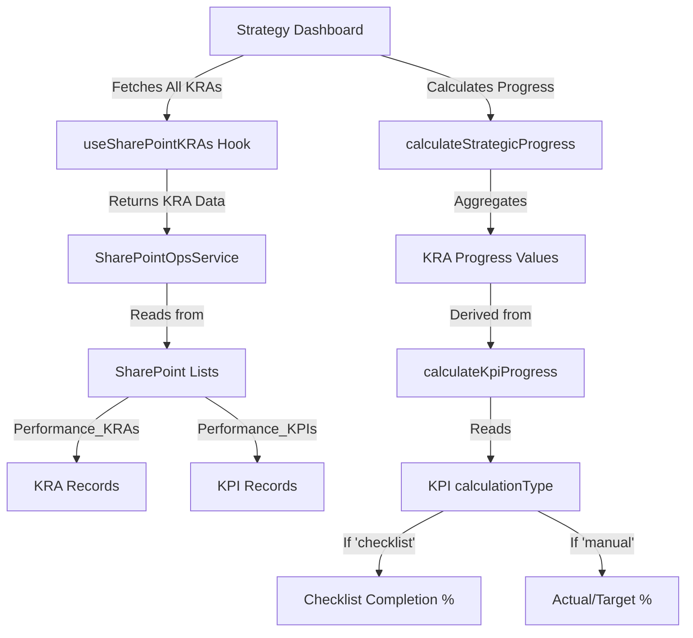

# Hybrid KPI & Dynamic Strategic Progress Feature

## Overview

This document provides a comprehensive technical reference for the **Hybrid KPI System** and **Dynamic Strategic Progress Calculation** implemented in the SCPNG Intranet application. This feature allows Key Performance Indicators (KPIs) to be measured using either **manual input** (target vs actual) or **checklist-based progress tracking**, and automatically calculates Strategic Objective progress by aggregating the progress of all linked Key Result Areas (KRAs).

---

## Table of Contents

1. [Feature Summary](#feature-summary)
2. [Architecture & Data Flow](#architecture--data-flow)
3. [Implementation Details](#implementation-details)
4. [SharePoint Backend Configuration](#sharepoint-backend-configuration)
5. [Code Changes](#code-changes)
6. [Troubleshooting & Errors](#troubleshooting--errors)
7. [Testing Guide](#testing-guide)
8. [Future Enhancements](#future-enhancements)

---

## Feature Summary

### What Was Implemented

#### 1. Hybrid KPI Calculation Types
KPIs can now be measured in two ways:

- **Manual**: Traditional target vs actual input (e.g., "Target: 100, Actual: 85")
- **Checklist**: Items are checked off, but progress remains 0% until Status is 'Completed'.

#### 2. Dynamic Strategic Objective Progress
Strategic Objectives on the Strategy Dashboard now display **real-time calculated progress** based on the average progress of all linked KRAs across the organization, replacing the previous manual progress updates.

#### 3. Dynamic KRA Progress & Manual Overrides
KRA progress is primarily calculated from its linked KPIs. However, to support flexibility, users can **manually override** a KRA's progress to 100% by setting its status to 'Completed', 'Done', or 'Closed'. This ensures that strategic completion can be tracked even when individual KPIs are still being finalized.

#### 4. Read-Only Strategic Objective Progress
The progress slider in the "Edit Strategic Objective" modal is now **read-only** to prevent manual overrides of auto-calculated values.

#### 5. Editable Key Deliverables
Key Deliverables/Milestones in Strategic Objectives can now be **edited inline** with a simple click-to-edit interface.

#### 6. Automated Objective Status
Objective status is now **automatically updated to 'Completed'** when all linked KPIs across all KRAs are marked as completed. If any KPI is incomplete, the Manual status is favored.

### Business Value

- **Flexibility**: Teams can choose the measurement method that best suits each KPI
- **Automation**: Reduces manual data entry and calculation errors
- **Real-time Insights**: Leadership sees live progress without waiting for manual updates
- **Transparency**: Clear visibility into how organizational goals cascade to individual KRAs

---

## Architecture & Data Flow

### System Components



### Data Hierarchy

```
Strategic Objective (Unit_Objectives)
    └── KRA 1 (Performance_KRAs)
        ├── KPI 1.1 (Performance_KPIs) - Manual Type
        ├── KPI 1.2 (Performance_KPIs) - Checklist Type
        └── KPI 1.3 (Performance_KPIs) - Manual Type
    └── KRA 2 (Performance_KRAs)
        └── KPI 2.1 (Performance_KPIs) - Checklist Type
```

**Progress Calculation Flow:**
1. Each KPI calculates its own progress (0-100%) using `calculateKpiProgress()`
   - Manual KPIs: `(actual / target) * 100`
   - Checklist KPIs: `(completed items / total items) * 100`
2. Each KRA's progress = average of its KPIs (0 or 100%) using `calculateKraProgress()`
3. Strategic Objective progress = average of all linked KRAs using `calculateStrategicProgress()`
4. Strategic Objective Status = 'Completed' if ALL linked KPIs are completed; otherwise Manual.

> **Important:** All progress values are calculated **client-side** in real-time. The stored `progress` field in SharePoint is only used as a fallback when no KPIs are linked.

---

## Implementation Details

### 1. Type Definitions

#### Location: `src/types/index.ts`

**Changes Made:**
- Added `calculationType?: 'manual' | 'checklist'` to both `Kpi` and `KPI` interfaces
- Added `checklist?: ChecklistItem[]` to `Kpi` interface

```typescript
export interface Kpi {
  // ... existing fields
  calculationType?: 'manual' | 'checklist';
  checklist?: ChecklistItem[];
}

export interface KPI {
  // ... existing fields
  calculationType?: 'manual' | 'checklist';
}
```

**Why Both Interfaces?**
- `Kpi` (lowercase) is used in the Operations/Performance module
- `KPI` (uppercase) is used in the Strategy module
- Both needed updates for consistency across the application

---

### 2. Calculation Utilities

#### Location: `src/utils/kpiUtils.ts`

**New File Created** - Contains all calculation logic for KPI and Strategic progress.

#### Function: `calculateKpiProgress(kpi: Kpi): number`

**Purpose:** Calculates binary progress (0 or 100) based on completion status.

**Logic:**
```typescript
if (kpi.status === 'Completed' || kpi.status === 'Achieved' || kpi.status === 'Done') {
  return 100;
} else {
  return 0; // Partial progress is not counted
}
```

**Key Features:**
- **Binary Outcome:** Eliminates ambiguity of partial completion.
- **Status Driven:** Progress is strictly tied to the Status field.

#### Function: `calculateKraProgress(kra: any, kpis: Partial<Kpi>[]): number`

**Purpose:** Calculates the progress of a KRA by averaging the progress of all its linked KPIs.

**Logic:**
```typescript
export const calculateKraProgress = (kra: any, kpis: Partial<Kpi>[]): number => {
  // Filter KPIs that belong to this KRA
  const kraKpis = kpis.filter(kpi => 
    String(kpi.kra_id) === String(kra.id) || 
    String(kpi.kra_id) === String(kra.ID)
  );

  if (!kraKpis || kraKpis.length === 0) {
    // No KPIs, fall back to stored progress
    return kra.progress || 0;
  }

  // Calculate average progress of all KPIs
  const totalProgress = kraKpis.reduce((sum, kpi) => {
    return sum + calculateKpiProgress(kpi);
  }, 0);

  return Math.round(totalProgress / kraKpis.length);
};
```

**Key Features (Refined 2026-02-24):**
- **Manual Status Override**: If KRA Status is **'Completed'**, **'Done'**, or **'Closed'**, progress is forced to **100%** regardless of KPI counts.
- **Dynamic Context**: Falls back to the average of linked KPIs if the KRA is still in an active/open status.
- **Data Persistence**: Status and Progress are now explicitly persisted to SharePoint to ensure the dashboard reflects the same state as the backend.
- **Rounded Display**: Returns a clean percentage for UI components and strategy roll-ups.

#### Function: `calculateStrategicProgress(kras: any[], kpis: Partial<Kpi>[] = []): number`

**Purpose:** Aggregates progress from multiple KRAs to calculate Strategic Objective progress.

**Logic:**
```typescript
export const calculateStrategicProgress = (kras: any[], kpis: Partial<Kpi>[] = []): number => {
  if (!kras || kras.length === 0) return 0;

  const totalProgress = kras.reduce((sum, kra) => {
    // Calculate dynamic progress from KPIs if available
    const kraProgress = kpis.length > 0
      ? calculateKraProgress(kra, kpis)
      : (kra.progress || 0);

    return sum + kraProgress;
  }, 0);

  return Math.round(totalProgress / kras.length);
};
```

**Why Simple Average?**
- Treats all KRAs as equally important
- Easy to understand and explain to stakeholders
- Can be enhanced later with weighted averages if needed

**New in v1.1:**
- Now accepts optional `kpis` parameter for dynamic KRA progress calculation
- Falls back to stored KRA progress if KPIs array is empty

#### Function: `calculateObjectiveStatus(objective: any, kras: any[]): string`

**Purpose:** Determines if an Objective should be auto-marked as 'Completed'.

**Logic:**
- Finds all KRAs linked to the objective.
- Checks `status` of ALL KPIs within those KRAs.
- Returns 'Completed' **only if 100% of KPIs are Completed**.
- Returns existing `objective.status` otherwise.

---

### 3. UI Component Updates

#### Location: `src/components/kpi/KpiInputBlock.tsx`

**Major Changes:**

##### A. New Imports
```typescript
import { ToggleGroup, ToggleGroupItem } from "@/components/ui/toggle-group";
import ChecklistSection, { ChecklistItem } from '@/components/ChecklistSection';
import { calculateKpiProgress } from '@/utils/kpiUtils';
import { ListChecks, Calculator } from 'lucide-react';
```

##### B. Calculation Type Toggle
Added a toggle group to switch between Manual and Checklist modes:

```typescript
<ToggleGroup
  type="single"
  value={formData.calculationType || 'manual'}
  onValueChange={handleTypeChange}
>
  <ToggleGroupItem value="manual">
    <Calculator className="h-4 w-4" />
    Manual Input
  </ToggleGroupItem>
  <ToggleGroupItem value="checklist">
    <ListChecks className="h-4 w-4" />
    Checklist
  </ToggleGroupItem>
</ToggleGroup>
```

##### C. Conditional Rendering
The component now shows different inputs based on the selected calculation type:

```typescript
{formData.calculationType === 'checklist' ? (
  // Show ChecklistSection component
  <ChecklistSection
    items={formData.checklist || []}
    onChange={handleChecklistChange}
  />
) : (
  // Show traditional Target and Actual inputs
  <div className="grid grid-cols-1 sm:grid-cols-2 gap-4">
    {/* Target Input */}
    {/* Actual Input */}
  </div>
)}
```

##### D. Auto-Calculation Handler
When checklist items change, the actual value is automatically updated:

```typescript
const handleChecklistChange = (items: ChecklistItem[]) => {
  onChange('checklist', items);
  
  // Auto-calculate progress
  if (items.length > 0) {
    const progress = calculateKpiProgress({ 
      ...formData, 
      checklist: items, 
      calculationType: 'checklist' 
    } as any);
    onChange('actual', progress);
    
    // Set target to 100 for checklist mode
    if (formData.target !== 100) {
      onChange('target', 100);
    }
  }
};
```

**Why Set Target to 100?**
- Checklist progress is always a percentage (0-100%)
- Standardizing target to 100 makes the progress bar intuitive
- Users don't need to think about what the "target" should be

##### E. Syntax Error Fix
**Error Encountered:**
```
× Unexpected token `Card`. Expected jsx identifier
```

**Root Cause:** An extra closing `</div>` tag was accidentally added during the multi-replacement operation, breaking the JSX structure.

**Fix Applied:** Removed the duplicate closing tag at line 135.

---

### 4. Strategy Dashboard Updates

#### Location: `src/pages/Strategy.tsx`

**Major Changes:**

##### A. New Imports
```typescript
import { useSharePointKRAs } from '@/hooks/useSharePointOps';
import { calculateStrategicProgress } from '@/utils/kpiUtils';
```

##### B. Fetch All KRAs
Added a hook call to fetch KRAs from all units/divisions:

```typescript
const { data: allKras } = useSharePointKRAs(undefined, 'All', undefined);
```

**Why 'All' Scope?**
- Strategic Objectives are organization-wide
- Need to aggregate progress from KRAs across all divisions
- Using 'Unit' or 'Division' scope would only show partial data

##### C. Fetch All KPIs (New)
Added KPI fetching to enable dynamic KRA progress calculation:

```typescript
const { data: allKpis } = useSharePointKPIs(undefined, 'All', undefined);
```

##### D. Dynamic Progress Calculation
Replaced static progress with calculated values:

```typescript
const effectiveObjectives = baseObjectives.map((obj: any) => {
  // Find linked KRAs for this objective
  const linkedKras = allKras.filter(kra => 
    String(kra.objective_id) === String(obj.id) || 
    String(kra.objectiveId) === String(obj.id)
  );

  // If KRAs exist, calculate dynamic progress
  if (linkedKras.length > 0) {
    const calculated = calculateStrategicProgress(linkedKras, allKpis || []);
    return { ...obj, progress: calculated };
  }
  
  // Fallback to manual/stored progress
  return obj;
});
```

**Field Mapping Explanation:**
- KRAs store the objective reference in either `objective_id` or `objectiveId`
- Both fields are checked for compatibility with different data sources
- String conversion ensures numeric and string IDs are matched correctly

**Key Points:**
- Passes both KRAs and KPIs to `calculateStrategicProgress()`
- Falls back to stored progress if no KRAs are linked
- Updates happen in real-time whenever KPIs change

---

### 5. Edit Strategic Objective Modal Enhancements

#### Location: `src/components/strategy/EditStrategicObjectiveModal.tsx`

**Major Changes:**

##### A. Read-Only Progress Slider

**Problem:** Users could manually override auto-calculated progress, causing data inconsistency.

**Solution:** Made the progress slider read-only with visual indicators.

**Implementation:**
```typescript
<Slider
  value={[progress]}
  max={100}
  step={5}
  disabled={true}  // Always disabled
  className="py-2 opacity-60 cursor-not-allowed"
/>
<p className="text-xs text-muted-foreground italic">
  Progress is automatically calculated from linked KRAs and KPIs.
</p>
```

**Changes Made:**
- Set `disabled={true}` permanently
- Added visual feedback with `opacity-60 cursor-not-allowed`
- Added helper text explaining auto-calculation
- **Removed `progress` from update payload** to prevent saving manual values

##### B. Editable Key Deliverables

**Problem:** Users could only add or delete deliverables, not edit existing ones.

**Solution:** Implemented inline editing with click-to-edit interface.

**New State:**
```typescript
const [editingIndex, setEditingIndex] = useState<number | null>(null);
const [editText, setEditText] = useState('');
```

**Key Features:**
- Hover-to-reveal edit/delete buttons
- Keyboard shortcuts (Enter to save, Escape to cancel)
- Auto-focus input field when editing
- Visual feedback with green check (save) and red X (cancel)

---

### 6. SharePoint Service Updates

#### Location: `src/services/sharePointOpsService.ts`

**Changes Made:**

##### A. Add KPI - Payload Construction
Added new fields to the payload when creating KPIs:

```typescript
const payload: any = {
  fields: {
    // ... existing fields
    CalculationType: kpi.calculationType || 'manual',
    ChecklistJSON: kpi.checklist ? JSON.stringify(kpi.checklist) : undefined
  }
};
```

**Why JSON.stringify?**
- SharePoint's "Multiple lines of text" column stores plain text
- Checklist is an array of objects, needs serialization
- JSON is human-readable in SharePoint if manual inspection is needed

##### B. Update KPI - Conditional Field Updates
Added conditional updates for the new fields:

```typescript
if (kpi.calculationType !== undefined) fields.CalculationType = kpi.calculationType;
if (kpi.checklist !== undefined) fields.ChecklistJSON = JSON.stringify(kpi.checklist);
```

**Why Conditional?**
- Partial updates should only modify fields that are explicitly provided
- Prevents accidentally clearing fields when updating other properties

##### C. Map KPI - Data Deserialization
Added parsing logic when reading KPIs from SharePoint:

```typescript
return {
  // ... existing fields
  calculationType: (f.CalculationType as any) || 'manual',
  checklist: f.ChecklistJSON ? JSON.parse(f.ChecklistJSON) : [],
};
```

**Error Handling:**
- If `ChecklistJSON` is empty/null, returns empty array instead of throwing error
- Default `calculationType` to 'manual' for backward compatibility with existing KPIs

##### D. Duplicate Code Cleanup
**Issue:** The multi-replacement operation accidentally duplicated some lines:
- `StartDate` and `EndDate` appeared twice in `addKPI`
- `startDate` and `targetDate` appeared twice in `mapKPI`

**Fix:** Removed duplicate lines to clean up the code.

---

## SharePoint Backend Configuration

### Required SharePoint List: `Performance_KPIs`

**Location:** `https://scpng1.sharepoint.com/sites/scpngintranet`

#### New Columns Added

| Column Name | Type | Settings | Required | Purpose |
|------------|------|----------|----------|---------|
| `CalculationType` | Single line of text | Default: "manual" | No | Stores whether KPI uses 'manual' or 'checklist' calculation |
| `ChecklistJSON` | Multiple lines of text | Plain text (not rich text) | No | Stores serialized checklist items as JSON |

#### Complete Column Schema

The full `Performance_KPIs` list now contains:

| Column | Type | Required | Notes |
|--------|------|----------|-------|
| Title | Single line of text | Yes | KPI name |
| Metric | Single line of text | No | Unit of measurement |
| TargetValue | Number | No | Target value for manual KPIs |
| ActualValue | Number | No | Actual value (auto-calculated for checklist) |
| Status | Choice | No | on-track, at-risk, behind, completed |
| CostAssociated | Currency | No | Budget allocation |
| Description | Multiple lines of text | No | KPI details |
| StartDate | Date and Time | No | When KPI tracking begins |
| EndDate | Date and Time | No | Target completion date |
| Assignees | Multiple lines of text | No | JSON array of assigned users |
| RelatedKRA | Lookup | No | Links to Performance_KRAs list |
| **CalculationType** | **Single line of text** | **No** | **'manual' or 'checklist'** |
| **ChecklistJSON** | **Multiple lines of text** | **No** | **Serialized checklist data** |

### No Changes Required for `Unit_Objectives`

The Strategic Objectives list already has all necessary fields:
- `Progress` (Number) - Used for fallback when no KRAs are linked
- `GoalType` (Choice) - Distinguishes Strategic vs Unit objectives
- `ParentGoalId` (Lookup) - For hierarchical objectives

The dynamic calculation happens **client-side only** and does not write back to SharePoint.

---

## Code Changes

### Files Modified

1. ✅ `src/types/index.ts` - Added `calculationType` and `checklist` fields
2. ✅ `src/utils/kpiUtils.ts` - **NEW FILE** - Calculation logic including `calculateKraProgress()`
3. ✅ `src/components/kpi/KpiInputBlock.tsx` - Added toggle and checklist UI
4. ✅ `src/pages/Strategy.tsx` - Added dynamic progress calculation with KPI fetching
5. ✅ `src/services/sharePointOpsService.ts` - Added field mapping for persistence
6. ✅ `src/components/strategy/EditStrategicObjectiveModal.tsx` - Read-only progress slider and editable deliverables

### Files NOT Modified

- `src/services/strategyService.ts` - Not used for KPI operations
- `src/hooks/useStrategySharePoint.ts` - No changes needed
- `src/components/ChecklistSection.tsx` - Already existed, reused as-is

### 7. KPI Status Mapping Logic

**Location:** `src/components/unit-tabs/KRAsTab.tsx`

**Challenge:** 
SharePoint stores statuses in specific formats (e.g., "On Track", "Completed") or standardizes them in a way that might differ from UI input (e.g., lowercase "completed"). If the mapping is case-sensitive, valid updates can be rejected or defaulted to a fallback status like "Behind".

**Solution:**
Implemented a robust, **case-insensitive** mapping function `mapStatusToDbFormat` that normalizes inputs before mapping to the required SharePoint format.

```typescript
const mapStatusToDbFormat = (status: string): string => {
  const normalizedStatus = status?.toLowerCase();
  
  const statusMap: Record<string, string> = {
    'on track': 'on-track',
    'on-track': 'on-track', 
    'at risk': 'at-risk',
    'at-risk': 'at-risk',
    'completed': 'completed',
    'behind': 'behind',
    'off track': 'behind',
    'in progress': 'behind',
    'not started': 'behind',
    'on hold': 'behind'
  };

  return statusMap[normalizedStatus] || 'behind';
};
```

**Key Features:**
- **Normalization:** Converts all inputs to lowercase first.
- **Redundancy:** Maps multiple variations (e.g., "on track" and "on-track") to the same valid output.
- **Fallback:** Defaults to 'behind' only if the status is truly unrecognized.

---

## Troubleshooting & Errors

### Error 1: Syntax Error in KpiInputBlock.tsx

**Error Message:**
```
× Unexpected token `Card`. Expected jsx identifier
   ╭─[KpiInputBlock.tsx:107:1]
```

**Cause:** Extra closing `</div>` tag at line 135 broke JSX structure.

**Resolution:** Removed the duplicate closing tag.

**Prevention:** When using `multi_replace_file_content`, ensure replacement chunks don't overlap or create structural issues.

---

### Error 2: Field 'CalculationType' is not recognized

**Symptom:** When attempting to add a KPI, you receive the error:
```
❌ [SP Ops] Failed to add KPI: _GraphError: Field 'CalculationType' is not recognized
```

**Cause:** The `Performance_KPIs` SharePoint list was created before the Hybrid KPI feature was implemented, and is missing the required `CalculationType` and `ChecklistJSON` columns.

**Root Cause Analysis:**
- The `SharePointListSetupService.ts` file's `createKpisList()` method was updated to include these fields
- However, if the list was already created in SharePoint before this update, it won't have these columns
- The service attempts to write to non-existent columns, causing the Graph API to reject the request

**Resolution:**
1. **Update Schema Definition** (Already completed in latest code):
   - Verify `SharePointListSetupService.ts` includes both fields in `createKpisList()`:
     ```typescript
     { name: 'CalculationType', text: {} },
     { name: 'ChecklistJSON', text: { allowMultipleLines: true } }
     ```

2. **Recreate the List**:
   - Navigate to the application's "System Setup & Diagnostics" page (usually TestGround)
   - Click **"Purge & Reset Operations"**
   - This will delete and recreate all operational lists with the correct schema

3. **Verify the Fix**:
   - After reset, try adding a new KPI
   - Check browser console - you should see successful POST request
   - The error should no longer appear

**Prevention:**
- Always run "Purge & Reset Operations" after pulling schema changes from version control
- Document schema migrations in release notes
- Consider adding schema version tracking to detect mismatches

**Related Documentation:** See [SharePoint Backend Configuration](#sharepoint-backend-configuration) for the complete column schema.

---

### Error 3: Data Not Persisting to SharePoint

**Symptom:** Checklist data disappears after page refresh.

**Cause:** SharePoint columns `CalculationType` and `ChecklistJSON` were not created (see Error 2 above).

**Resolution:** Follow the steps in Error 2 to recreate the list with the correct schema.

**Verification:** Check browser network tab for successful PATCH requests with the new fields in the payload.

---

### Error 4: Strategic Objective Progress Not Updating

**Symptom:** Progress bars on Strategy Dashboard show old/static values.

**Possible Causes:**
1. No KRAs are linked to the objective (check `objective_id` field on KRAs)
2. `allKras` data is undefined (check network tab for failed API calls)
3. Field name mismatch (`objective_id` vs `objectiveId`)

**Resolution:**
- Verify KRAs have the correct `StrategyGoalLookupId` in SharePoint
- Check browser console for errors in `useSharePointKRAs` hook
- Ensure the `calculateStrategicProgress` function is being called with both KRAs and KPIs

---

### Error 5: KRA Progress Shows 0% Despite Completed KPIs

**Symptom:** KPIs are marked as complete (100%), but KRA progress remains at 0%.

**Possible Causes:**
1. KPIs are not properly linked to the KRA (check `RelatedKRALookupId` field)
2. `allKpis` data is not being fetched in `Strategy.tsx`
3. `calculateKraProgress()` is not being called

**Resolution:**
1. Verify KPI has correct `RelatedKRA` lookup value in SharePoint
2. Check that `useSharePointKPIs(undefined, 'All', undefined)` is called in `Strategy.tsx`
3. Verify `calculateStrategicProgress()` is receiving the `kpis` parameter
4. Check browser console for any errors in `calculateKraProgress()`

**Debug Steps:**
```javascript
// In browser console
console.log('All KPIs:', allKpis);
console.log('Linked KRAs:', linkedKras);
console.log('Calculated Progress:', calculateStrategicProgress(linkedKras, allKpis));
```

---

### Error 6: Progress Slider Still Editable in Edit Modal

**Symptom:** Users can still drag the progress slider in the "Edit Strategic Objective" modal.

**Cause:** The `disabled={true}` prop was not applied or was overridden.

**Resolution:**
1. Check that `EditStrategicObjectiveModal.tsx` has `disabled={true}` on the Slider component
2. Verify the `progress` field is commented out in the `updateObjective` payload
3. Clear browser cache and hard refresh (Ctrl+Shift+R)

---

### Error 7: Deliverable Edits Not Saving

**Symptom:** Changes to Key Deliverables disappear after clicking "Save Changes".

**Possible Causes:**
1. `handleSaveEdit()` not updating the `goals` state correctly
2. `goals` array not being passed to `updateObjective()`

**Resolution:**
1. Verify `handleSaveEdit()` is called when clicking the check icon
2. Check that `goals` is included in the update payload
3. Verify SharePoint `Deliverables` field is being updated correctly
- Ensure the filtering logic checks both field name variants

---

### Error 8: Checklist Progress Calculation Incorrect

**Symptom:** Progress shows 0% even when items are checked.

**Possible Causes:**
1. `handleChecklistChange` not firing
2. `calculateKpiProgress` receiving wrong data structure
3. `onChange('actual', progress)` not updating state

**Debugging Steps:**
```typescript
// Add console logs in handleChecklistChange
console.log('Checklist changed:', items);
console.log('Calculated progress:', progress);
console.log('FormData after update:', formData);
```

**Common Fix:** Ensure `ChecklistSection` component is calling `onChange` prop correctly.

---

## Testing Guide

### Test Case 1: Create Checklist KPI

**Steps:**
1. Navigate to Strategy Dashboard
2. Click "Setup Strategy" (if admin)
3. Add a new KRA or edit existing one
4. Add a KPI
5. Toggle to "Checklist" mode
6. Add 3 checklist items:
   - "Draft document"
   - "Review with team"
   - "Publish final version"
7. Check the first item
8. Save the KRA

**Expected Results:**
**Expected Results:**
- ✅ Target is automatically set to 100
- ✅ Actual shows 0% (despite 1 check)
- ✅ Progress bar shows 0%
- ✅ **Change Status to 'Completed'** -> Progress jumps to 100%
- ✅ Data persists after page refresh

---

### Test Case 2: Strategic Objective Auto-Calculation

**Setup:**
1. Create a Strategic Objective (e.g., "Expand Markets")
2. Create 2 KRAs linked to this objective:
   - KRA 1: 2 KPIs (one at 50%, one at 100%) → KRA progress = 75%
   - KRA 2: 1 KPI (at 60%) → KRA progress = 60%

**Expected Result:**
- Strategic Objective progress = (75 + 60) / 2 = **67.5%** (rounded to 68%)

**Verification:**
- Check Strategy Dashboard
- Objective card should show 68% progress
- Progress bar should be approximately 2/3 filled

---

### Test Case 3: Mixed Calculation Types

**Steps:**
1. Create a KRA with 3 KPIs:
   - KPI 1: Manual (Target: 100, Actual: 80) → 80%
   - KPI 2: Checklist (3 items, 2 completed) → 67%
   - KPI 3: Manual (Target: 50, Actual: 50) → 100%
2. Save and view KRA details

**Expected Results:**
- ✅ Each KPI shows correct individual progress
- ✅ KRA overall progress = (80 + 67 + 100) / 3 = **82%**
- ✅ No conflicts between calculation types

---

### Test Case 4: Edge Cases

#### A. Empty Checklist
- Create checklist KPI with 0 items
- **Expected:** Progress = 0%, no errors

#### B. Division by Zero
- Create manual KPI with Target = 0
- **Expected:** Progress = 0%, no NaN or Infinity

#### C. Actual > Target
- Create manual KPI with Target = 50, Actual = 75
- **Expected:** Progress capped at 100%

#### D. Objective with No KRAs
- View Strategic Objective with no linked KRAs
- **Expected:** Falls back to manual `Progress` field from SharePoint

---

## Future Enhancements

### 1. Weighted KRA Progress
Currently, all KRAs contribute equally to Strategic Objective progress. Future enhancement could add:

```typescript
interface KRA {
  weight?: number; // Default: 1
}

function calculateWeightedProgress(kras: KRA[]): number {
  const totalWeight = kras.reduce((sum, kra) => sum + (kra.weight || 1), 0);
  const weightedSum = kras.reduce((sum, kra) => {
    return sum + (kra.progress || 0) * (kra.weight || 1);
  }, 0);
  return Math.round(weightedSum / totalWeight);
}
```

### 2. Progress History Tracking
Store historical progress snapshots for trend analysis:

```typescript
interface ProgressSnapshot {
  date: Date;
  progress: number;
  calculatedBy: 'manual' | 'auto';
}
```

### 3. Checklist Item Dependencies
Allow checklist items to have prerequisites:

```typescript
interface ChecklistItem {
  id: string;
  label: string;
  completed: boolean;
  dependsOn?: string[]; // IDs of prerequisite items
}
```

---

## Troubleshooting & Errors

### Error 7: KPI Status Reverts to "Behind" After Update

**Symptom:** 
A user updates a KPI status to "Completed", saves it, and the UI briefly shows "Completed" but then reverts to "Behind" after a refresh or re-fetch.

**Cause:** 
The status mapping function was case-sensitive. It expected "Completed" (Title Case) but received "completed" (lowercase) from the form. Since "completed" wasn't in the map, it fell back to the default "behind".

**Resolution:** 
The `mapStatusToDbFormat` function was updated to be case-insensitive (as detailed in Section 7 above).

**Verification:** 
Update a KPI status to any value (Completed, At Risk, On Track) and verify it persists after a page refresh.

---

## Testing Guide

### Test Case 5: KPI Status Persistence

**Steps:**
1. Open a KRA with an existing KPI.
2. Edit the KPI.
3. Change status from "Not Started" to "Completed".
4. Save the KPI.
5. Refresh the page.

**Expected Results:**
- ✅ Status remains "Completed".
- ✅ Status badge color is green.
- ✅ No console errors.

### 4. Custom Calculation Formulas
Allow users to define custom progress formulas:

```typescript
interface KPI {
  calculationType: 'manual' | 'checklist' | 'custom';
  customFormula?: string; // e.g., "(actual / target) * weight + bonus"
}
```

### 5. Real-time Collaboration
Use SignalR or WebSockets to show live updates when team members check off items:

```typescript
// Broadcast checklist updates
signalR.invoke('UpdateChecklist', kpiId, checklistItems);

// Listen for updates
signalR.on('ChecklistUpdated', (kpiId, items) => {
  // Update UI in real-time
});
```

---

## Conclusion

This feature provides a flexible, automated approach to performance tracking that scales from individual KPIs to organization-wide strategic objectives. The implementation prioritizes:

- **User Experience**: Simple toggle between calculation methods
- **Data Integrity**: Proper serialization and validation
- **Performance**: Client-side calculations minimize server load
- **Maintainability**: Clear separation of concerns with utility functions

For questions or issues, refer to the troubleshooting section or contact the development team.

---

**Document Version:** 1.1  
**Last Updated:** 2026-02-15  
**Author:** Antigravity AI Assistant  
**Reviewed By:** IT Unit, SCPNG

**Changelog:**
- **v1.1 (2026-02-15)**: Added dynamic KRA progress calculation, read-only Strategic Objective progress slider, and editable Key Deliverables
- **v1.0 (2026-02-15)**: Initial implementation of Hybrid KPI system and dynamic Strategic Objective progress
