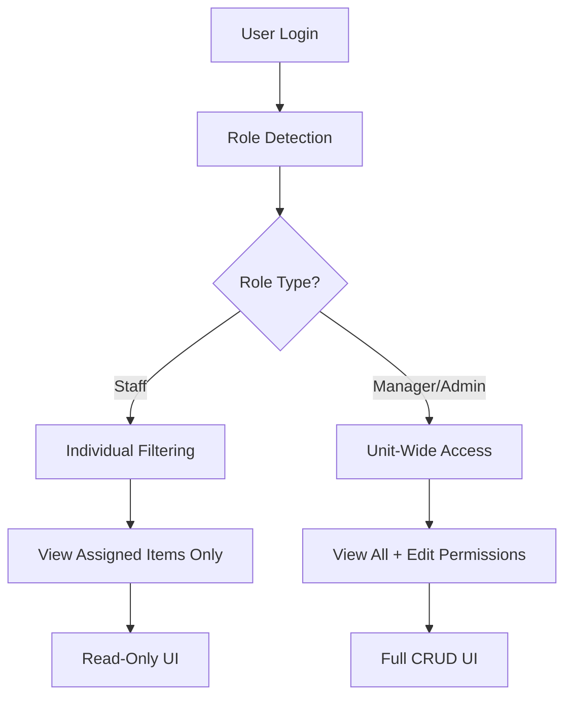

# KRA/KPI Role-Based Access Control (RBAC) Implementation

## Overview

This document describes the Role-Based Access Control (RBAC) system implemented for the Unit Strategy page, specifically for Key Result Areas (KRAs) and Key Performance Indicators (KPIs). The implementation ensures that:

1. **Staff Members** can only view KRAs and KPIs where they are the Owner or an Assignee
2. **Managers and Admins** can view all KRAs/KPIs within their Unit and have exclusive rights to Add, Edit, and Delete items

## Table of Contents

- [Architecture Overview](#architecture-overview)
- [Role Definitions](#role-definitions)
- [Visibility Logic](#visibility-logic)
- [Edit Permissions](#edit-permissions)
- [Implementation Details](#implementation-details)
- [SharePoint Backend Requirements](#sharepoint-backend-requirements)
- [Testing & Verification](#testing--verification)
- [Troubleshooting](#troubleshooting)

---

## Architecture Overview

The RBAC system operates on three layers:

1. **Data Layer** (`useSharePointOps.ts`): Filters data based on user role before it reaches the UI
2. **Permission Layer** (`Unit.tsx`): Determines edit capabilities and enforces guard clauses on CRUD operations
3. **UI Layer** (`KRAsTab.tsx`): Conditionally renders action buttons based on permissions



---

## Role Definitions

### Staff Member
- **Role Name**: `staff_member`
- **View Scope**: Individual (assigned/owned items only)
- **Edit Rights**: None (Read-Only)

### Manager
- **Role Names**: `manager`
- **View Scope**: Unit-Wide (all items in their unit)
- **Edit Rights**: Full CRUD (Create, Read, Update, Delete)

### Admin
- **Role Names**: `admin`, `super_admin`
- **View Scope**: Organization-Wide
- **Edit Rights**: Full CRUD across all units

---

## Visibility Logic

### Staff Visibility Rules

Staff members see a KRA if **ANY** of the following conditions are met:

```typescript
// KRA Visibility Check (Staff)
const isOwner = kra.owner?.email?.toLowerCase() === userEmail.toLowerCase();
const isAssigned = kra.assignees?.some(a => a.email?.toLowerCase() === userEmail.toLowerCase());
const canView = isOwner || isAssigned;
```

Staff members see a KPI if:

```typescript
// KPI Visibility Check (Staff)
const isAssigned = kpi.assignees?.some(a => a.email?.toLowerCase() === userEmail.toLowerCase());
const canView = isAssigned;
```

### Manager/Admin Visibility Rules

- **No filtering applied** - they see all items within their scope (Unit/Division/Organization)

### Co-Assignee Visibility

When a Staff member is assigned to a KRA or KPI, they see the **complete** item including:
- All other assignees
- Owner information
- Full KPI details
- Comments and metadata

**Example**: If a KRA is assigned to "John", "Sarah", and "Mike":
- When Sarah logs in, she sees the KRA with all three names: John, Sarah, Mike
- This allows team members to know who else is working on the same goals

---

## Edit Permissions

### Permission Check Logic

Defined in `Unit.tsx`:

```typescript
const canEditStrategy = useMemo(() => {
  const role = roleUser?.role_name?.toLowerCase();
  const isAdmin = roleUser?.is_admin || role === 'super_admin' || role === 'admin';
  const isManager = role === 'manager';
  return isAdmin || isManager;
}, [roleUser]);
```

### Permission Enforcement

#### Frontend Guards (UI Layer)

In `KRAsTab.tsx`, action buttons are conditionally rendered:

```typescript
{canEdit && (
  <Button onClick={handleAddKRA}>
    <Plus /> Add KRA
  </Button>
)}
```

#### Backend Guards (Function Layer)

In `Unit.tsx`, all CRUD handlers include permission checks:

```typescript
const handleSaveKra = async (kra: Partial<KRA>) => {
  if (!canEditStrategy) {
    toast({ 
      title: "Permission Denied", 
      description: "Only Managers can edit KRAs.", 
      variant: "destructive" 
    });
    throw new Error("Permission Denied");
  }
  // ... proceed with save
};
```

---

## Implementation Details

### Files Modified

#### 1. `src/hooks/useSharePointOps.ts`

**Purpose**: Data filtering based on role

**Changes**:
- Re-implemented individual filtering for Staff members
- Added role checks for Manager/Admin bypass

**Key Code**:

```typescript
// Lines 175-200: KRA Filtering
const isStaff = context?.role === 'staff_member';
const isManagerOrAdmin = context?.role === 'manager' || 
                         context?.role === 'admin' || 
                         context?.role === 'super_admin';

if (isStaff && !isManagerOrAdmin && context?.email) {
    krasWithKpis = krasWithKpis.filter(kra => {
        const isOwner = kra.owner?.email?.toLowerCase() === context.email.toLowerCase();
        const isAssigned = kra.assignees?.some(a => 
            a.email?.toLowerCase() === context.email.toLowerCase()
        );
        return isOwner || isAssigned;
    });
}
```

```typescript
// Lines 273-290: KPI Filtering
if (isStaff && !isManagerOrAdmin && context?.email) {
    data = data.filter(kpi => {
        const isAssigned = kpi.assignees?.some(assignee =>
            assignee.email?.toLowerCase() === context.email.toLowerCase()
        );
        return isAssigned;
    });
}
```

#### 2. `src/pages/Unit.tsx`

**Purpose**: Permission logic and guard clauses

**Changes**:
- Added `canEditStrategy` permission check
- Implemented guard clauses in all CRUD handlers
- Passed `canEdit` prop to `KRAsTab`

**Key Code**:

```typescript
// Lines 226-232: Permission Check
const canEditStrategy = useMemo(() => {
  const role = roleUser?.role_name?.toLowerCase();
  const isAdmin = roleUser?.is_admin || role === 'super_admin' || role === 'admin';
  const isManager = role === 'manager';
  return isAdmin || isManager;
}, [roleUser]);

// Lines 276-296: Guard Clause Example
const handleSaveKra = useCallback(async (kra: Partial<KRA>) => {
  if (!canEditStrategy) {
    toast({ 
      title: "Permission Denied", 
      description: "Only Managers can edit KRAs.", 
      variant: "destructive" 
    });
    throw new Error("Permission Denied");
  }
  // ... save logic
}, [kraState, canEditStrategy]);

// Prop passing (around line 805)
<KRAsTab
  canEdit={canEditStrategy}
  // ... other props
/>
```

#### 3. `src/components/unit-tabs/KRAsTab.tsx`

**Purpose**: UI conditional rendering

**Changes**:
- Added `canEdit` prop to component interface
- Wrapped action buttons in conditional checks
- Applied to KRA, KPI, and Objective actions

**Key Code**:

```typescript
// Lines 184-205: Props Interface
interface KRAsTabProps {
  // ... other props
  canEdit?: boolean;
}

export const KRAsTab: React.FC<KRAsTabProps> = ({
  // ... other props
  canEdit = false  // Default to read-only for safety
}) => {
  // ...
};

// Line 762: Add Button
{canEdit && (
  <Button onClick={handleAddButtonClick}>
    <Plus className="h-4 w-4" /> {addButtonLabel}
  </Button>
)}

// Lines 896-953: Action Icons
{canEdit && (
  <>
    {/* Edit KPI Button */}
    {kpi && kpi.id && kpi.name !== '-' && (
      <Button onClick={() => handleOpenEditKpiModal(row.originalKra.id, row.kpi)}>
        <Edit className="h-4 w-4" />
      </Button>
    )}
    {/* Edit KRA Button */}
    <Button onClick={() => handleOpenEditKraModal(row.originalKra)}>
      <Edit className="h-4 w-4" />
    </Button>
    {/* Delete KRA Button */}
    <Button onClick={() => handleDeleteKra(row.originalKra.id)}>
      <Trash2 className="h-4 w-4" />
    </Button>
  </>
)}
```

### Data Flow

```
1. User logs in
   ↓
2. useRoleBasedAuth.ts fetches role → roleUser object
   ↓
3. Unit.tsx computes canEditStrategy
   ↓
4. useSharePointOps.ts filters data based on role
   ↓
5. KRAsTab.tsx receives filtered data + canEdit prop
   ↓
6. UI renders based on canEdit (show/hide buttons)
   ↓
7. User attempts action → Guard clause in Unit.tsx validates permission
```

---

## SharePoint Backend Requirements

### Required Lists

The following SharePoint lists must exist:

1. **Performance_KRAs** - Stores Key Result Areas
2. **Performance_KPIs** - Stores Key Performance Indicators
3. **Unit_Objectives** - Stores Unit Objectives

### Required Columns

#### Performance_KRAs List

| Column Name | Type | Purpose |
|------------|------|---------|
| Title | Text | KRA name |
| Department | Text | Unit/Division filter |
| Owner | Person or Group | KRA owner |
| **Assignees** | **Multiple lines of text** | **JSON array of assignees** |
| Status | Choice | KRA status |
| Description | Text | KRA description |
| StartDate | Date | Start date |
| EndDate | Date | Target completion date |
| StrategyGoalLookupId | Lookup | Link to Objective |

#### Performance_KPIs List

| Column Name | Type | Purpose |
|------------|------|---------|
| Title/Name | Text | KPI name |
| **Assignees** | **Multiple lines of text** | **JSON array of assignees** |
| Status | Choice | KPI status |
| Target | Number | Target value |
| Actual | Number | Actual value |
| StartDate | Date | Start date |
| TargetDate | Date | Target completion date |
| RelatedKRALookupId | Lookup | Link to parent KRA |

### Important Notes

1. **Assignees Field Format**: The `Assignees` column is a **Multiple lines of text** field (not Person or Group) that stores a JSON string:
   ```json
   [
     {"id": "1", "name": "John Doe", "email": "john@example.com", "initials": "JD"},
     {"id": "2", "name": "Sarah Smith", "email": "sarah@example.com", "initials": "SS"}
   ]
   ```

2. **No Special Views Required**: All filtering is done in the React application code. You do not need to create custom SharePoint views or configure column-level permissions.

3. **Existing Schema Works**: If your SharePoint lists already have the `Assignees` column as text and you've been saving data successfully, no changes are needed.

---

## Testing & Verification

### As a Staff Member

1. **Login** as a user with role `staff_member`
2. **Navigate** to the Unit page
3. **Verify Visibility**:
   - You should ONLY see KRAs/KPIs where you are Owner or Assignee
   - You should NOT see colleagues' individual goals unless co-assigned
4. **Verify Read-Only State**:
   - You should NOT see "+ Add KRA" button
   - You should NOT see "+ Add Objective" button
   - You should NOT see Edit (pencil) icons in tables
   - You should NOT see Delete (trash) icons in tables
5. **Verify Co-Assignee Visibility**:
   - For items you CAN see, verify you can see all other assignees' names

### As a Manager

1. **Login** as a user with role `manager`
2. **Navigate** to the Unit page
3. **Verify Full Access**:
   - You should see ALL KRAs/KPIs in your unit
   - You should see "+ Add KRA" and "+ Add Objective" buttons
   - You should see Edit and Delete icons on all rows
4. **Verify CRUD Operations**:
   - Click "Add KRA" → Modal should open
   - Edit an existing KRA → Changes should save
   - Delete a KRA → Item should be removed

### Console Verification

Open browser DevTools Console and look for these log messages:

```
// Staff member viewing data:
🔒 [Individual Filter] Filtered KRAs for staff john@example.com: 3 items
✅ [Individual Filter] Staff john@example.com sees KRA: Q1 Revenue Target (Owner: false, Assigned: true)

// Manager viewing data:
✅ [useSharePointOps] Loaded 15 KRAs for Corporate Services/IT Unit
```

---

## Troubleshooting

### Issue: Staff can see too many items

**Symptom**: Staff member sees KRAs/KPIs they're not assigned to

**Possible Causes**:
1. User role is not correctly set to `staff_member`
2. Filtering logic was accidentally removed

**Solution**:
1. Check `console.log` output for role detection
2. Verify lines 175-200 and 273-290 in `useSharePointOps.ts` contain the filtering blocks
3. Confirm `context?.role === 'staff_member'` is evaluating correctly

### Issue: Staff can't see items they're assigned to

**Symptom**: Staff member sees fewer items than expected

**Possible Causes**:
1. `Assignees` field in SharePoint is not formatted correctly
2. Email mismatch (case sensitivity or different email)

**Solution**:
1. Check SharePoint list item directly - verify `Assignees` column contains JSON array
2. Verify email in `Assignees` matches user's login email exactly
3. Check console for log: `✅ [Individual Filter] Staff user@email.com sees KRA: ...`

### Issue: Manager sees "Permission Denied" error

**Symptom**: Manager cannot edit KRAs/KPIs

**Possible Causes**:
1. Role detection is not identifying user as `manager`
2. `canEditStrategy` logic is failing

**Solution**:
1. Add console log in `Unit.tsx`: `console.log('canEditStrategy:', canEditStrategy, 'roleUser:', roleUser);`
2. Verify `roleUser?.role_name` is exactly `'manager'` (case-sensitive)
3. Check if `roleUser?.is_admin` should be set for this user

### Issue: UI buttons visible but actions fail

**Symptom**: Edit button is visible but clicking shows "Permission Denied"

**Possible Causes**:
1. Mismatch between `canEdit` prop and `canEditStrategy` in parent

**Solution**:
1. Verify `canEdit={canEditStrategy}` is correctly passed in `Unit.tsx` around line 805
2. Check for typos or prop name mismatches

---

## Future Enhancements

### Potential Improvements

1. **SharePoint Person Field Migration**: Convert `Assignees` from text to native Person or Group field for better SharePoint UI integration

2. **Granular Permissions**: Add ability for Managers to delegate edit rights to specific Staff members

3. **Audit Logging**: Track who modified which KRA/KPI and when

4. **Batch Operations**: Allow Managers to bulk-assign KRAs to multiple staff members

5. **Notification System**: Notify staff when they're assigned to new KRAs/KPIs

---

## Related Documentation

- [STRATEGY_DATA_SOURCE.md](./STRATEGY_DATA_SOURCE.md) - Overall strategy data architecture
- [Role-Based Authentication](../src/hooks/useRoleBasedAuth.ts) - Role detection logic
- [SharePoint Operations Service](../src/services/sharePointOpsService.ts) - Backend integration

---

## Changelog

| Date | Version | Changes |
|------|---------|---------|
| 2026-02-10 | 1.0.0 | Initial RBAC implementation for KRA/KPI permissions |

---

## Support

For issues or questions regarding this implementation:
1. Check the [Troubleshooting](#troubleshooting) section above
2. Review console logs for filtering and permission messages
3. Verify SharePoint list schema matches requirements
4. Contact the development team for assistance
