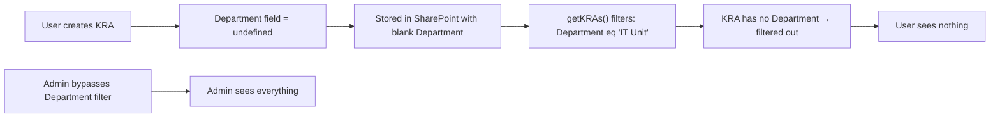

# KRA/KPI Visibility Bug Fix — Investigation & Resolution

> **Date**: 2026-02-22  
> **Issue**: KRAs and KPIs created by a user are saved to SharePoint but invisible in the UI. Only admins can see them.

---

## Table of Contents

- [Problem Statement](#problem-statement)
- [Investigation Steps](#investigation-steps)
- [Root Cause Analysis](#root-cause-analysis)
- [Fixes Applied](#fixes-applied)
- [Files Changed](#files-changed)
- [Verification](#verification)
- [Related Documentation](#related-documentation)

---

## Problem Statement

When a user creates a Key Result Area (KRA) and links a KPI to it via the **Key Areas & KPIs** sub-menu on the **Unit** page:

- ✅ SharePoint shows a "successfully saved" toast
- ✅ The data _does_ appear in the SharePoint list
- ❌ The UI shows nothing for the user who created it
- ✅ Admins can see all items

This indicated a **client-side filtering bug**, not a SharePoint write problem.

---

## Investigation Steps

### 1. Traced the Data Fetch Pipeline

| Layer | File | Finding |
|-------|------|---------|
| **Service** | `sharePointOpsService.ts` → `getKRAs()` | Uses OData filter: `fields/Department eq '${division}'` to scope KRAs to the user's division |
| **Hook** | `useSharePointOps.ts` → staff filter | Applies additional per-user filtering: checks `kra.owner.email` and `kra.assignees` array |
| **UI** | `KRAsTab.tsx` | Renders whatever data the hook returns — no extra filtering |

### 2. Checked What Is Written on Save

In `KRAsTab.tsx` → `handleKpiFormSubmit()`, the payload sent to `addKRA()` was:

```typescript
// ❌ BEFORE FIX — missing department
kraPayload = {
  title,
  objective_id,
  unit_id,
  description,
  ownerId,
  assignees
};
// No 'department' key → SharePoint stores Department as undefined
```

### 3. Checked the Staff Member Filter

In `useSharePointOps.ts`, the per-user visibility check was:

```typescript
// ❌ BEFORE FIX — broken comparisons
const isOwner = String(kra.ownerId) === String(context.email);
//               ^^^^^^^^^^^^^^^^     ^^^^^^^^^^^^^^^^^^
//               numeric ID (e.g. 15)   email string → NEVER matches

const isAssigned = kra.assignees?.some(a =>
  a.email?.toLowerCase() === context.email.toLowerCase()
);
```

And in `sharePointOpsService.ts` → `mapKRA()`:

```typescript
// ❌ BEFORE FIX — hardcoded empty email
owner: {
  id: f.ResponsibleLookupId,
  name: 'Loading...',
  email: ''  // ← always empty, so owner check always fails
}
```

---

## Root Cause Analysis

Two bugs worked together to hide KRAs from their creators:

### Bug 1 — Missing `Department` Field (Primary Cause)



**Root cause**: The `handleKpiFormSubmit` function in `KRAsTab.tsx` never included `department` in the KRA payload. When `getKRAs()` later queried SharePoint with `fields/Department eq '${user's division}'`, items without a Department value were excluded. Admins bypass this filter entirely.

### Bug 2 — Broken Owner Email Matching (Secondary Cause)

Even if the Department filter was fixed, the per-user staff filter would still fail because:

1. **`mapKRA()` hardcodes `email: ''`** — SharePoint Person fields only return a Lookup ID, not an email address, so the mapper set `email: ''` as a placeholder.
2. **`ownerId` vs `email` comparison** — The filter compared `kra.ownerId` (a numeric SharePoint ID like `"15"`) against `context.email` (a string like `"john@scpng.gov.pg"`) — these can never match.

---

## Fixes Applied

### Fix 1 — Include `department` in KRA Payload

**File**: `src/components/unit-tabs/KRAsTab.tsx`

```diff
 kraPayload = {
   title,
   objective_id,
   unit_id,
   description,
   ownerId,
-  assignees
+  assignees,
+  department: userContext?.division || userContext?.unit || ''
 };
```

This ensures every new KRA is tagged with the correct Department, so `getKRAs()` returns it for the user's division.

### Fix 2 — Add `createdByEmail` to the KRA Type

**File**: `src/types/index.ts`

```diff
 // Added to both KRA and Kra interfaces:
+  createdByEmail?: string;
```

### Fix 3 — Populate `createdByEmail` from the Graph API

**File**: `src/services/sharePointOpsService.ts` → `mapKRA()`

The Microsoft Graph API natively includes `createdBy.user.email` on every list item. The mapper now reads this field:

```diff
-  owner: { id: f.ResponsibleLookupId, name: 'Loading...', email: '' },
+  owner: { id: f.ResponsibleLookupId, name: 'Loading...', email: '' },
+  createdByEmail: item.createdBy?.user?.email || '',
```

### Fix 4 — Fix the Staff Member Filter

**File**: `src/hooks/useSharePointOps.ts`

```diff
-  const isOwner = String(kra.ownerId) === String(context.email);
+  const isCreator = kra.createdByEmail?.toLowerCase() === context.email.toLowerCase();
   const isAssigned = kra.assignees?.some(a =>
     a.email?.toLowerCase() === context.email.toLowerCase()
   );
-  return isOwner || isAssigned;
+  return isCreator || isAssigned;
```

---

## Files Changed

| File | Change | Purpose |
|------|--------|---------|
| `src/components/unit-tabs/KRAsTab.tsx` | Added `department` to `kraPayload` | Ensures KRAs are tagged with the correct division for OData filtering |
| `src/types/index.ts` | Added `createdByEmail` to `KRA` and `Kra` interfaces | New field to track creator's email reliably |
| `src/services/sharePointOpsService.ts` | Read `item.createdBy?.user?.email` in `mapKRA()` | Populates `createdByEmail` from Graph API response |
| `src/hooks/useSharePointOps.ts` | Replaced broken `ownerId` check with `createdByEmail` | Fixes staff member visibility — creators can now see their own KRAs |

---

## Verification

### Expected Behavior After Fix

| Scenario | Before Fix | After Fix |
|----------|-----------|-----------|
| Staff creates KRA → reloads page | KRA invisible | KRA visible |
| Staff creates KRA → admin views | Admin sees it | Admin sees it |
| Staff sees own KRAs in SharePoint list | ✅ Present | ✅ Present |
| Staff sees own KRAs in UI | ❌ Missing | ✅ Visible |
| Staff sees co-worker's KRAs (not assigned) | ❌ Hidden | ❌ Hidden (correct) |

### Console Log Verification

Open DevTools Console and look for these messages when a staff member loads the page:

```
🔒 [Individual Filter] Filtering KRAs for staff user@scpng.gov.pg
✅ Staff user@scpng.gov.pg sees KRA: "Revenue Target" (Creator: true, Assigned: false)
```

### Manual Test Steps

1. **Login** as a `staff_member` role user
2. **Navigate** to the Unit page → Key Areas & KPIs tab
3. **Create** a new KRA with a linked KPI
4. **Reload** the page
5. **Verify** the new KRA and KPI appear in the table
6. **Login** as a different staff member
7. **Verify** they do **not** see the other user's KRA (unless assigned)

---

## Related Documentation

- [KRA_KPI_RBAC_IMPLEMENTATION.md](./KRA_KPI_RBAC_IMPLEMENTATION.md) — Full RBAC architecture for KRAs/KPIs
- [INDIVIDUAL_DATA_FILTERING.md](./INDIVIDUAL_DATA_FILTERING.md) — Individual data filtering patterns
- [STRATEGY_HIERARCHY_ARCHITECTURE.md](./STRATEGY_HIERARCHY_ARCHITECTURE.md) — Overall strategy hierarchy

---

## Changelog

| Date | Description |
|------|-------------|
| 2026-02-22 | Initial fix — resolved missing `department` field and broken owner email matching |
