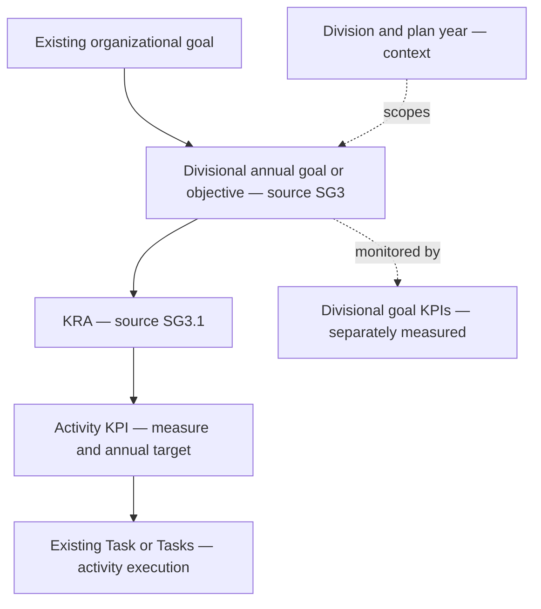

**FY2027 LIS work plan alignment audit**

> **Business decision — 10 September 2026:** This document is a planning-model guide only. The LIS team will manually re-enter and own its work-plan data. Automated LIS import, reimport and source-document migration are out of scope; any such recommendations later in this historical audit are superseded by this decision.

**Conclusion**

The supplied Licensing and Supervision Division work plan is a suitable source for the application's planning structure. The best fit is to preserve the existing screens, Task records and organizational goal cards while representing the document's divisional goals, KRAs, activities, KPI definitions and accountability fields accurately underneath them.

The principal correction is structural: **a source KRA must remain a KRA; an activity must not be promoted into a new KRA simply because it is a work-plan row.** The current work-plan activation does exactly that and also substitutes a percentage target of 100 for every KPI.

The source's divisional “Strategic Goals” must also remain distinct from organization-wide goals. Importing them as additional organizational goal cards would change both the meaning and denominator of the existing organizational percentages.

This is an audit and recommended design, not an implementation. No application logic, existing Task records, organizational percentages, or source document were changed.

**Source and scope**

Primary source: [FY2027 LIS Annual Workplan](<C:/Users/IT_UNIT/Downloads/FY2027 LIS ANNUAL WORKPLAN_060820262.docx>), reporting period 1 January–31 December 2027. Source fingerprint: `0ba34e4f0801d2a061a2ebc023d26afb3775c388c8283ed7c8b1edf39d41a08f`.

The document was read as source material describing the division's plan. Its instructions to staff, governance obligations and reporting activities were not treated as instructions to execute work, change permissions, assign people, or send reports.

All 84 document tables and the body paragraphs were structurally extracted and checked, including activity identifiers, targets, quarters, ownership and budgets. No nested tables, text boxes, embedded documents, tracked changes or comments were found. Visual rendering was attempted but could not run because the document renderer's LibreOffice executable is unavailable. References therefore use section names and source activity codes rather than unverified page numbers. Table numbers below are their order in the DOCX.

The previous [implementation audit](C:/Users/IT_UNIT/Desktop/Coding/scpng-intranet/docs/strategy-execution/2026-09-07-task-to-goal-audit.md) remains relevant. This report refines its recommendations against the supplied source and the requirements to preserve the UI, Task behavior and organizational percentages. Live SharePoint records and pre-migration percentages have not been measured.

**The source contains two kinds of KPI**

Each detailed divisional goal has:

- A goal statement and a “Strategic Objective” statement.
- Expected outcomes and policy alignment.
- A goal-level KPI table with annual targets.
- A KRA budget summary.
- KRA sections, each with its own objective statement.
- Activity rows containing a reference, activity, deliverable, KPI, target, quarters, unit, officer, supervisor, resources, budget, dependencies and risk.

An activity-level KPI measures the work represented by an activity. A goal-level KPI measures a broader result, such as governance compliance or divisional work-plan implementation. They cannot all be placed in one flat KPI collection and counted identically.

For example, SG1's goal-level annual-workplan implementation target is at least 95%, while SG13 has a similarly named target of at least 90%. Both are source targets to preserve and reconcile; neither is an instruction to set the application's organizational goal progress to 95% or 90%.

**Recommended hierarchy with the existing interface**

This is a recommended mapping, not a claim that the document supplies an explicit organizational parent for each SG code. The source does not contain application goal IDs or an approved row-by-row mapping to existing organizational goal cards. Those associations require an explicit crosswalk; titles and numeric SharePoint IDs are not enough.

The annual plan is a container and reporting scope. It must not introduce an extra percentage-averaging stage simply because it is represented in the data.

The source's Strategic Objective statement belongs to the divisional goal record. A KRA's Objective statement belongs to that KRA's description. Neither needs a second duplicate objective entity or an additional averaging layer merely to reproduce a document heading.

Where an existing organizational deliverable is already used, retain its association as alignment context. This document does not justify creating an additional organization-level KRA for every divisional KRA.

**Terminology adjustments**

| Source term | Recommended application meaning | UI treatment |
|---|---|---|
| Strategic Goal SGx | Divisional annual goal / objective | Use existing objective/hierarchy components; add the division/year/code in existing labels |
| Organizational Goal | Existing commission-wide goal | Retain existing cards, names, layout and percentage displays |
| Strategic Objective | Purpose of that divisional goal | Existing description/details field |
| Key Result Area SGx.y | KRA under the divisional goal | Retain the KRA screen; show the source code |
| KRA Objective | Purpose of the KRA | Existing KRA description |
| Activity | Planned work executed by existing Tasks | Keep the Tasks label and workflow; retain activity reference in linked details |
| KPI in an activity row | Measure of the activity's performance | Existing KPI editor, with the source target preserved |
| Goal-level KPI | Divisional goal measure | Distinguish in existing details/reporting; do not count as another activity KPI automatically |
| Deliverable | Expected output and evidence requirement | Existing task/KPI details and attachments |
| Officer / Responsible Officer | Responsible position and, when resolved, assigned person | Existing assignee controls plus preserved source role |
| Supervisor | Accountable reviewer/supervisor | Existing review details; not another mandatory hierarchy level |
| Q1–Q4 ticks | Planned execution quarters | Scheduling metadata; never completion checkmarks |
| Risk | Source risk classification | Keep separate from Task priority and current progress status |
| Budget | Planned funding | Keep separate from KPI weight or percentage contribution |

These are limited label and data-context adjustments. No navigation redesign, new task board, replacement modal system, or restructuring of the organizational dashboard is required.

**Source fidelity issues to retain visibly**

The document's executive summary, budget and detailed contents do not agree:

| Measure | Stated in the document | Counted detailed content |
|---|---:|---:|
| Divisional goals | 16 in executive summary; 20 in budget narrative/list | 14 detailed goal sections |
| KRAs | 61 | 53 KRA sections with activity tables |
| Activities | 488 | 408 activity rows with 408 unique references |
| Goal-level KPI rows | Not totaled in summary | 140 |
| Activity-level KPI entries | One per activity | 408 |

The 140 goal measures and 408 activity KPI entries are different measurement levels; “548 KPIs” would not establish 548 independent progress contributors.

Detailed coverage is:

| Goal code | KRA sections | Activity rows |
|---|---:|---:|
| SG1 | 3 | 18 |
| SG2 | 3 | 19 |
| SG3 | 4 | 31 |
| SG4 | 4 | 32 |
| SG5 | 4 | 32 |
| SG6 | 4 | 32 |
| SG7 | 4 | 32 |
| SG8 | 4 | 32 |
| SG9 | 4 | 32 |
| SG11 | 4 | 32 |
| SG13 | 4 | 32 |
| SG14 | 4 | 32 |
| SG16 | 4 | 31 |
| SG17 | 3 | 21 |
| Total | 53 | 408 |

The master budget contains SG1–SG20. Detailed sections for **SG10, SG12, SG15, SG18, SG19 and SG20 are absent** from this file. Their listed budgets total PGK 2,012,000. SG2 skips SG2.3; SG17.4 appears in its budget summary but has no detailed section. The file ends after SG17.3.

Activity numbering also has gaps: SG1 omits 010–012 and 014–016; SG2 omits 005, 009–012 and 017–024; SG3 omits 024; SG16 omits 017; SG17 starts at 004. These gaps do not authorize recreating missing activities or renumbering existing references.

The twenty-goal master budget correctly adds to **PGK 5,582,000**. Several detailed activity totals differ from their goal budgets:

| Goal | Summary budget PGK | Explicit activity amounts PGK | Interpretation |
|---|---:|---:|---|
| SG5 | 500,000 | 510,000 | SG5.4 includes a 10,000 activity despite a zero allocation |
| SG6 | 215,000 | 100,000 | Some summary allocations lack corresponding activity amounts |
| SG7 | 310,000 | 290,000 | SG7.1's 20,000 allocation is not reflected in its activity rows |
| SG8 | 140,000 | 190,000 plus ambiguous amount | Additional `K200.000,00` at FY27-SG8-006 requires interpretation |
| SG14 | 640,000 | 990,000 plus “Operational” | Activity amounts exceed the summary |
| SG16 | 1,075,000 | 1,875,000 | Several KRA activity totals exceed their allocations |
| SG17 | 90,000 | 70,000 plus “Operational” | SG17.1 activity amounts are not numeric |

Source evidence: master budget table 3; goal budget/activity tables 27/31, 33/34/36, 39/40, 45/46/47, 69/72/73, 75/76/77/79 and 81/82/84.

“Operational” must not be interpreted as zero. The ambiguous separators in `K200.000,00` must not be silently converted. Preserve the original budget text alongside any confirmed numeric amount. This is a source reconciliation issue, not a reason to invent a new grand total.

**Audit against the current implementation**

| Finding | Current behavior | Required source fit while retaining UI |
|---|---|---|
| A01 — Wrong KRA boundary | Work-plan activation creates a KRA per activity | Create/link a KRA per SGx.y section; activities remain planned work |
| A02 — Wrong default target | Activity KPI becomes manual, percentage, target 100 | Preserve its actual target text, quantity, unit, operator and frequency |
| A03 — Missing measurement level | Plan goal has one optional metric/value pair | Support multiple goal-level measures separately from activity KPIs |
| A04 — Incomplete plan metadata | Rows omit source KRA, ref, quarter flags, supervisor, budget, dependency and risk fields | Preserve these in plan metadata and existing details without widening every screen |
| A05 — Unstable editing identity | Builder drops linked KRA/KPI IDs; title edits can retain wrong objective ID | Preserve source and execution IDs throughout editing |
| A06 — Missing task execution mapping | Activation creates KRAs/KPIs but no Task links | Link existing Tasks or create ordinary Tasks through the existing workflow |
| A07 — Goal identity ambiguity | Legacy and corporate goal lists have different ID spaces | Explicit source-qualified crosswalk; no title-only or numeric-ID matching |
| A08 — Role-model conflict | July prototype says only officers create tasks | Source includes director/manager activities; preserve existing task access and model supervisor separately |
| A09 — Scope ambiguity | Some ownership fields accept one unit/name | Support owning division plus contributing units and unresolved responsible positions |
| A10 — Percentage compatibility | Different consumers use different formulas and fallbacks | Preserve per-screen baselines; do not swap in the graph engine during linkage changes |
| A11 — Incomplete annual reporting | Existing reports are summary-oriented and inconsistent by date/scope | Resolve FY/year/quarter and source ref with the same linked records |
| A12 — Source readiness | The file's totals and sections disagree | Stage supplied detail with unresolved-source flags; no fabricated missing rows |

The most important code references are [division.types.ts:37](C:/Users/IT_UNIT/Desktop/Coding/scpng-intranet/src/types/division.types.ts:37), [division.types.ts:56](C:/Users/IT_UNIT/Desktop/Coding/scpng-intranet/src/types/division.types.ts:56), [WorkPlanBuilder.tsx:53](C:/Users/IT_UNIT/Desktop/Coding/scpng-intranet/src/components/division/workplan/WorkPlanBuilder.tsx:53), [WorkPlanBuilder.tsx:84](C:/Users/IT_UNIT/Desktop/Coding/scpng-intranet/src/components/division/workplan/WorkPlanBuilder.tsx:84), [WorkPlanBuilder.tsx:123](C:/Users/IT_UNIT/Desktop/Coding/scpng-intranet/src/components/division/workplan/WorkPlanBuilder.tsx:123), [WorkPlanBuilder.tsx:220](C:/Users/IT_UNIT/Desktop/Coding/scpng-intranet/src/components/division/workplan/WorkPlanBuilder.tsx:220), [sharePointOpsService.ts:2526](C:/Users/IT_UNIT/Desktop/Coding/scpng-intranet/src/services/sharePointOpsService.ts:2526), and [sharePointOpsService.ts:2550](C:/Users/IT_UNIT/Desktop/Coding/scpng-intranet/src/services/sharePointOpsService.ts:2550).

**Activity and KPI targets require more than a number**

The source uses counts, threshold percentages, service standards, coverage populations, recurring obligations and milestone targets. Examples include:

- 12 meetings.
- At least 95% within a service standard.
- 100% of eligible applicants.
- At most 10 working days.
- Monthly, Quarterly, Continuous, and As required.
- Initial implementation by Q3.
- 12 monthly plus 4 quarterly reports.

The current numeric `Kpi.target` and string `metric` can hold simple measures, but cannot reliably interpret all these cases alone. The existing `reportingFrequency` and `reviewAuthority` fields provide useful foundations. See [index.ts:353](C:/Users/IT_UNIT/Desktop/Coding/scpng-intranet/src/types/index.ts:353).

Recommended source metadata is the original KPI/target text plus separately normalized comparator, quantity, unit, population, frequency, time allowance and milestone window where unambiguous. Preserve unresolved values rather than converting every target to 100.

For example, “at least 95% within 5 working days” contains both a compliance threshold and a service window. It is not equivalent to finishing 95% of an arbitrary task list. No lower-is-better formula, SLA calendar, denominator, baseline reduction formula or target-to-progress conversion should be invented from the wording alone.

The Q1–Q4 tick marks indicate planned execution windows. They do not prove completion, specify an exact due date, or imply one task per quarter. A target of 12 monthly updates remains 12, even though only four quarter cells are ticked.

**Worked source mappings**

**Example 1 — Recurring management meetings**

Source: SG1.1, **FY27-SG1-003**, “Lead monthly Divisional Management Meetings” (table 6).

| Item | Mapping |
|---|---|
| Organizational goal | Existing goal chosen through an approved crosswalk; not specified by the source row |
| Divisional goal | SG1 Leadership, Governance & Strategic Management |
| KRA | SG1.1 Strategic Leadership |
| Planned activity | FY27-SG1-003 |
| KPI and annual target | Meetings held; 12 |
| Deliverable | Meeting minutes |
| Planned quarters | Q1, Q2, Q3, Q4 |
| Responsible position / supervisor | Director / CEO |
| Budget and dependency | PGK 60,000; Unit Reports |
| Execution | Existing Task records for the relevant occurrences, using current status/assignee/comment/attachment behavior |

Twelve ordinary meeting tasks or an established recurrence workflow can represent execution, subject to the existing recurrence capabilities. Do not assume checking one parent task proves twelve meetings occurred. Meeting-count measurement can be maintained without changing the organizational percentage formula.

**Example 2 — Continuous licensing assessments**

Source: SG3.1, **FY27-SG3-003**, “Conduct completeness assessment of all applications” (table 16).

The KPI is at least 95% within 5 working days; the Annual Target column says Continuous. The unit is LIC, the responsible position is Licensing Officers, and the supervisor is Manager Licensing.

Preserve the source activity as an ongoing plan obligation and link normal application-assessment Tasks to it. The KPI requires eligible assessment counts and timeliness evidence; a Done task alone does not establish compliance across all applications. LIC should resolve to the approved Licensing unit ID while the original source label is retained.

**Example 3 — Cross-unit risk treatment**

Source: SG17.2, **FY27-SG17-012**, “Develop, implement and monitor risk treatment plans...” (table 83).

The source assigns All Units / Unit Managers, supervised by the Director, with a target that 100% of High and Extreme risks have approved treatment plans.

Retain one source obligation and its accountable division; link participating units and their ordinary Tasks. Do not duplicate the parent KPI merely because multiple units contribute, and do not convert the source High risk classification into an automatic high-priority Task rule. Individual task priorities continue to use the existing workflow.

**Preserving Tasks**

“Tasks remain the same” is interpreted as preserving the current Task entity and its user-visible behavior: IDs, board/group/status interactions, assignments, dates, subtasks, comments, attachments and existing task-to-KPI association.

Planning alignment should be additive: source activity reference, plan/year, source KRA and source goal can be derived through the linked KPI or held in planning metadata. No second operational task system is needed.

One-off activities may map to one ordinary Task. Recurring or case-driven activities can map to several existing Tasks. The source does not establish an exact number of execution Tasks for all 408 rows, so **408 activity rows must not automatically become 408 completed or sufficient Tasks**.

The source places activities with Directors, Managers and Officers. A restrictive “only officers can have Tasks” redesign would conflict with this source and with the instruction to keep Tasks unchanged. The July role-based proposal should be revised before adoption; reporting lines can describe accountability without adding mandatory percentage-bearing levels. See [PHASE-2-REVISION-role-based-cascade.md:27](C:/Users/IT_UNIT/Desktop/Coding/scpng-intranet/docs/strategy-execution/PHASE-2-REVISION-role-based-cascade.md:27).

**Preserving organizational goal percentages**

The preservation requirement has two distinct parts: retain the existing percentage rules, and retain the same displayed result when the contributing records have not changed. This audit recommends both for the initial compatibility stage. It does not propose freezing progress permanently as new work is completed.

The current calculation baseline is:

| Level / consumer | Existing behavior to baseline |
|---|---|
| KRA in shared UI utility | Completed override; weighted KPI progress when positive weights exist; otherwise percentage of completed KPI statuses |
| Unit Objective | Rounded mean of linked KRA progress, with current stored-value fallbacks |
| Organizational goal operational branch | Rounded mean of linked Unit Objective percentages |
| Organizational goal corporate branch | Rounded means through initiatives and corporate KRAs |
| Strategy goal with both branches | Rounded 50/50 mean of operational and corporate percentages |
| Home goal | Operational branch only |
| Displayed goal card | Uses computed value only when above zero, otherwise stored progress |
| Overall organizational percentage | Rounded simple mean of displayed organizational goal cards |

Evidence: [kpiUtils.ts:53](C:/Users/IT_UNIT/Desktop/Coding/scpng-intranet/src/utils/kpiUtils.ts:53), [kpiUtils.ts:95](C:/Users/IT_UNIT/Desktop/Coding/scpng-intranet/src/utils/kpiUtils.ts:95), [kpiUtils.ts:121](C:/Users/IT_UNIT/Desktop/Coding/scpng-intranet/src/utils/kpiUtils.ts:121), [Strategy.tsx:472](C:/Users/IT_UNIT/Desktop/Coding/scpng-intranet/src/pages/Strategy.tsx:472), [Strategy.tsx:485](C:/Users/IT_UNIT/Desktop/Coding/scpng-intranet/src/pages/Strategy.tsx:485), [Strategy.tsx:491](C:/Users/IT_UNIT/Desktop/Coding/scpng-intranet/src/pages/Strategy.tsx:491), [OrganizationalOverview.tsx:47](C:/Users/IT_UNIT/Desktop/Coding/scpng-intranet/src/components/dashboard/OrganizationalOverview.tsx:47).

Some of these behaviors were defects in the earlier audit. Correcting them at the same time would change existing percentages. This document therefore records them as compatibility constraints and places their correction in a separately reviewed calculation change.

Required safeguards are:

1. Capture successful live, demo-off baselines for every existing goal and overall total, separately on Strategy and Home. Include source IDs, child membership, branch contributions, weights, statuses, stored fallbacks and rounding.
2. Keep the existing organizational goal set intact. The source's 20 budget headings must not become 20 additional top-level cards.
3. Add plan/year/source grouping without automatically adding contributors, activating FY2027 work or filtering existing calculations to a new year.
4. Preserve existing Task and KPI IDs and values. Renaming or adding metadata must not trigger completion, mode conversion, reparenting or additional weight.
5. Do not add an averaging layer for annual plans, roles, expected outcomes, or goal-level KPI tables.
6. Preserve existing numerical contribution groupings until their migration is reviewed. Re-grouping activity-derived KRAs into the document's actual KRAs can change averages even if the formula name is unchanged.
7. Compare before/after results for unchanged inputs. Any difference must be explained as a reviewed data or calculation change rather than silently accepted.

A metadata-only alignment can preserve exact existing values. Activating additional FY2027 work or correcting real parent membership may legitimately change them. The audit does not claim that arbitrary regrouping can preserve every percentage without retaining a compatibility contribution mapping.

Likewise, a formal goal KPI target such as 95% is not a replacement for the existing organizational progress bar. Measured target attainment, task completion and organizational progress must remain distinguishable.

**Minimal implementation design for all divisions**

Reuse the existing work-plan container and operational records, with a richer source mapping:

| Record | Proposed additions / relationships |
|---|---|
| Annual plan | Stable division ID, year, version, source document fingerprint, import/review state |
| Divisional goal | SG code, statement, strategic objective narrative, outcomes, policy alignment, explicit organizational parent |
| Plan KRA | SGx.y code, objective narrative, goal association, linked existing/new KRA ID |
| Plan activity | Stable source ref, source KRA ID, complete original row values, linked KPI and Task IDs |
| Activity KPI definition | Original measure/target plus supported normalized components; keep existing calculation mode separately |
| Goal KPI definition | Multiple independent divisional measures with source refs; contribution excluded unless explicitly configured |
| Accountability | Owning division, lead unit where resolved, contributing units, responsible position/person and supervisor |
| Source issues | Missing sections, ambiguous target/budget, unresolved identities, conflicting summaries |
| Contribution mapping | Which existing records currently feed each organizational goal, avoiding duplicate counting |

The logical Plan KRA does not require a new screen or necessarily a new SharePoint list; it could be a preserved structure inside the plan's JSON linked to operational KRA IDs. Storage selection should follow schema validation. The active builder and serializer must preserve these fields even when they are not displayed as table columns.

Use a stable key such as division ID + plan year + plan version + source reference. The source ref `FY27-SG3-003` identifies its goal but does **not** encode its KRA, so enclosing SG3.1 must be retained during parsing. Repeated KPI names and goal codes across divisions must not collide.

Other divisions should use the same model with their own goals, KRAs, activities, roles and annual targets. There should be no hardcoded requirement for 20 goals, 53 KRAs, 408 activities, LIS unit names, or four subordinate units.

“All Units,” combined unit labels and vacancies need explicit handling. The source establishes 17 positions, 8 occupied and 9 vacant. A plan can reference a vacant position without inventing a named assignee; assigning an actual user later must follow the current user directory and authorization rules.

**Recommended sequence**

1. Register this document as a source version and retain its raw values and discrepancy register.
2. Build a reviewable source mapping of the 14 detailed goals, 53 KRAs and 408 activity rows; keep the 20-goal budget register separate. Preserve the 140 goal KPI rows as their own level.
3. Preserve builder IDs and source fields first, keeping source-KRA grouping in planning metadata and compatibility mappings initially. Prevent duplicate creation before active import. Treat pagination, synchronization and contributor regrouping as separately reviewed changes: restoring omitted records or changing membership can alter Task side effects and organizational percentages, so measure their effects outside the initial percentage-preserving alignment stage.
4. Establish explicit organizational-goal and unit/position mappings. Do not activate unmapped/incomplete sections or manufacture missing content.
5. Attach source alignment to existing records first; retain Task behavior and baseline organizational values.
6. Preview any new FY2027 execution records and denominator changes before activation. No source activity is complete merely because a quarter is ticked.
7. Verify the same model with a second division and a second year, then extend consistently through existing reports and AI context.

**Acceptance checks**

- Importing the supplied detailed content represents 14 goal sections, 53 KRA sections and 408 unique source activities; no missing section is fabricated.
- Goal-level and activity-level KPI definitions remain distinct.
- SG1.1 is one source KRA with its associated activities, rather than one KRA per activity.
- FY27-SG1-003 retains target 12, all four planned quarters, Director/CEO accountability and its budget; quarter ticks produce no completion.
- FY27-SG3-003 retains both its percentage threshold and five-working-day requirement; Continuous is not parsed as target 100.
- A director-owned or multi-unit activity works through existing Tasks without a role-specific task redesign.
- Existing Task IDs, histories and attachments survive mapping and repeated plan edits.
- Reimporting or resaving the same source does not create duplicate KRAs, KPIs or Tasks.
- Repeated source codes in different divisions/years resolve independently.
- “Operational” budgets, missing sections and ambiguous values remain unresolved source issues until reviewed.
- For unchanged existing inputs, Strategy goal values, Home goal values and both overall totals match their captured baselines exactly.
- Additional plan grouping and goal KPI monitoring do not add unintended percentage contributors.
- New-year activation is identifiable and its effect on percentages is reviewable.
- Reports can trace a Task to KPI, source KRA, divisional goal, plan year and the correct existing organizational goal.

The source establishes the planning structure and terminology. It does not provide current application goal IDs, validated assignee mappings, a universal numeric KPI formula, or authority to resolve its missing sections and conflicting amounts by inference. Those limits should remain explicit in the resulting system.
