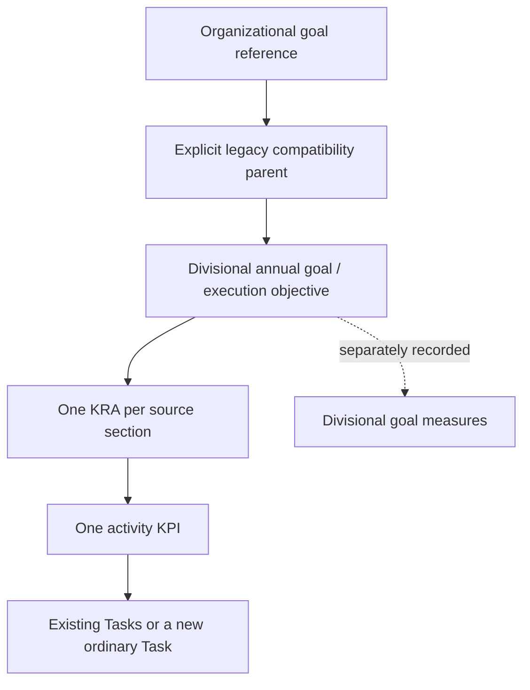

# Phase 2B — source-aware work-plan activation

Implemented locally following the user's confirmation to continue from Phase 2A. This phase changes activation and planning metadata while retaining the existing work-plan table, organizational screens and ordinary Tasks workflow. No tenant schema was prepared and no live work plan was activated during development.

## Result

The previous activation/synchronization loops have been replaced by `WorkPlanActivationService`. Activation now requires explicit organizational and execution mappings, KRA sections, activity KPI definitions, raw annual targets and an execution choice for Tasks. The old automatic activity-to-KRA promotion and universal target of 100 are no longer an activation fallback.

The hierarchy created by the engine is:

The legacy compatibility parent preserves the existing dashboard's lookup target. Corporate and legacy IDs remain distinct even when their numeric values match. The mapping dialog requires an explicit correspondence; existence, division and actual parent links are checked before writes. This verifies referential integrity, not the substantive correctness of a correspondence chosen by a user. The LIS source does not supply that application crosswalk.

## Editing and source fidelity

- The table layout remains in place. A row action opens a linkage/details dialog using the existing dialog and form components.
- Limited labels now distinguish **Organizational Alignment** from **Divisional Annual Goal**.
- Details cover the organizational parent, legacy compatibility parent, existing execution objective, source KRA sections and objectives, selected activity KRA, raw target, confirmed quantity/unit/operator, frequency, service level, planned quarters, positions, dependencies, risk, raw budget, Task choice and multiple goal measures.
- Existing source metadata not exposed by a control remains in the plan. No source reference is renumbered and no missing source activity, person, target or budget is invented.
- KRA grouping uses the source KRA identifier. Goal measures remain plan/objective metadata and are not inserted as additional activity KPI contributors.
- New ordinary Tasks use the existing Task schema. Existing Task updates only set consistent KPI/KRA links; status, title, assignees, comments and attachments are preserved. Existing conflicting links are rejected.
- Resolved responsible people are assigned to newly created Tasks and KPI ownership. Unresolved source positions remain metadata; no person is invented for a vacant role.
- Long labels are shortened for SharePoint's title field, while full source text remains in descriptions/metadata.

## Targets and percentages

Simple confirmed numeric targets can populate the existing manual actual/target fields. Composite targets, service levels, population-dependent obligations, and at-most targets retain their source wording and structured metadata without being forced into a misleading ratio or a target of 100.

This phase does **not** implement every specialized measurement calculation. Those definitions and evidence updates belong to Phase 3. Unsupported ratio targets initially have no numeric target rather than an invented one. An active numeric target change is stopped for a percentage-impact review.

Metadata synchronization preserves existing actual values, weights, statuses, stored objective/KRA progress and numeric targets. The organizational calculation utilities were not changed. Creating or linking genuinely new contributors can change calculated organizational results; a fixture-level compatibility test is not a tenant baseline. Live membership/percentage comparison remains required before rollout.

## Recovery and concurrency

- Each new objective, KRA, KPI and Task receives a deterministic `WorkPlanOperationKey`. The schema requires uniqueness and indexing.
- A failed/uncertain create response is reconciled by that key. The engine does not blindly repeat POSTs.
- Plan checkpoints record created IDs and activation state. Conditional writes use the plan's ETag. A running lease prevents another activation; stale writers stop when the version changes.
- A failed run can resume the same plan intent using persisted IDs even when the form is stale. A different intent must wait until recovery is resolved.
- The new draft's SharePoint ID is placed in the edit URL before activation begins, so refreshing after failure does not recreate the plan itself.
- Ordinary plan edits require a version and refuse to overwrite interrupted activation state. Version conflicts ask for a reload.
- Removal/reparenting of activated work and removal of linked Tasks are rejected for explicit reconciliation. No destructive cleanup or retirement migration has been applied. The movement/removal workflow and percentage-impact review remain Phase 3/5 work.

The implementation follows Microsoft Graph's documented [conditional list-item updates](https://learn.microsoft.com/en-us/graph/api/listitem-update?view=graph-rest-1.0) and [unique column constraints](https://learn.microsoft.com/en-us/graph/api/resources/columndefinition?view=graph-rest-1.0).

## Schema and large plans

Schema readiness is read-only. It checks required fields, numeric progress/target fields, status choices, lookup targets/cardinality, unique activation keys and payload storage. The explicit administrator action adds engine metadata/recovery fields and missing required status choices while retaining existing choices. Existing incompatible columns or lookup targets are reported rather than silently converted.

| Location | Added engine fields |
|---|---|
| Division_WorkPlans | ActivationJSON, LegacyImportKey; GoalsJSON if absent |
| Unit_Objectives, Performance_KRAs, Performance_KPIs, Operations_Tasks | WorkPlanOperationKey, WorkPlanMetadataJSON |
| Performance_KPIs | KpiOwner/Assignees if absent |
| Performance_KRAs | Unit/Division if absent |
| Operations_Tasks | Assignees if absent |
| New Division_WorkPlanPayloads list | PayloadKey (unique/indexed), Content |

Large plans use immutable, checksum-verified goal payload chunks and a small manifest in GoalsJSON. Smaller plans retain the original inline array format. The reader supports both formats. Missing/corrupt chunks fail visibly rather than returning an empty plan. Unicode boundaries are preserved. Unreferenced immutable versions are retained; a retention/cleanup policy belongs to deployment/data reconciliation, not this phase.

This avoids relying on a single multiline text field for the entire source document's metadata. Microsoft documents the multiline field limit in its [list/library column guidance](https://support.microsoft.com/en-us/office/list-and-library-column-types-and-options-0d8ddb7b-7dc7-414d-a283-ee9dca891df7).

## Other linkage corrections

- The KPI service now writes and reads `RelatedInitiativeLookupId`, including explicit clearing. It does not add that field to unrelated creates when no initiative is supplied. Update mapping refetches the record when the PATCH response omits fields.
- Saved local plans have an explicit import action. Import checks scope, uses a unique legacy import key, creates drafts, recovers uncertain creates and keeps local copies. Repeating import does not intentionally overwrite an already imported plan. Import is no longer a side effect of reading a list.
- Application authorization remains backed by authenticated Graph identity/role checks. Actual SharePoint permissions are the enforcement boundary; tenant permissions, schema preparation and authoritative source-to-goal mappings still need rollout verification.

## Validation and remaining phases

The focused Node test suites pass **37 checks**, including source KRA counts, separate goal measures, target preservation, ordinary Task creation, existing Task preservation, retry after a lost response, recovery after partial failure, conflicting leases, schema lookup mismatch, explicit corporate/legacy mapping, large-plan storage, Unicode/chunk integrity, metadata-only progress preservation, draft link protection, initiative linkage and new-plan retry identity. Tests use the actual TypeScript methods/callbacks with mocked Graph responses; they are not live tenant tests.

The final build/type-check/graph outcomes are recorded in the remediation tracker. No authenticated browser/tenant smoke test was performed.

Phase 3 remains necessary before production activation: the general Task/KPI synchronization path still has the audited pagination, calculation-mode and lifecycle issues. Phase 4 covers consumers/reporting. Phase 5 covers the actual LIS data, source discrepancies, tenant schema/permissions, compatibility baselines and approved migration/retirement. Source-aware activation is implemented; the document's 408 activities have not been imported or activated.
