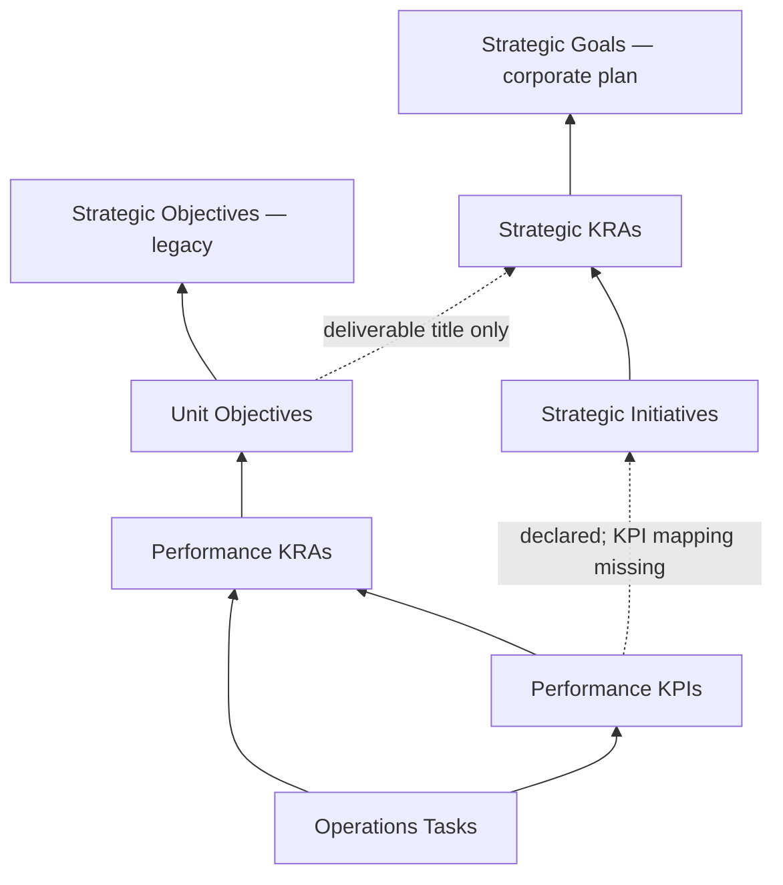

**Task → KPI → KRA → Objective → Organizational Goal: Full Implementation Audit**

Audit date: 7 September 2026. Repository baseline: `9f77716`, including the working-tree changes present during this audit.

**Overall assessment**

The application contains real task-to-strategy relationships, but it does **not currently provide one consistent, enforced, auditable cascade across the application**. A task may have a complete chain while its reported contribution is stale, calculated differently on another page, or associated with a different goal source.

The operational chain is the most developed part. The corporate-plan chain and the newer recursive strategy graph coexist with it. The graph is currently a Test Ground consumer, rather than the common source for Strategy, Task Registry, Division, and reports.

This report assesses the current implementation and includes controlled reproductions. It does **not** certify every live task as linked, give a live orphan count, or verify the tenant's current SharePoint schema and permissions. Those require a separate read-only reconciliation of actual list records.

No application code, live records, or existing local changes were modified. This audit document is the only deliverable added.

**Scope and method**

- Followed the required graphify report and wiki navigation, then checked current source. The graph report is dated 3 September, while the wiki reports a different graph size; both were used for navigation, not treated as proof of current behavior.
- Traced active routes, forms, hooks, SharePoint mappings, creation/update/deletion, work-plan activation, progress formulas, dashboards, reports, analytics, AI context, and the prototype graph.
- Executed seven graph/calculation probes against the current source in memory and six persistence probes with a mocked Graph client. Additional reporting fixtures reproduced calculation and alignment discrepancies.
- Attempted the existing graph and lookup test suites. They could not run because `vitest` is not installed/available in this checkout, despite the `npm test` script referencing it. No dependencies were installed.
- Did not execute authenticated browser workflows, query live SharePoint records, send reports, or inspect external scheduled flows.

**What the application actually connects**

| Relationship | Stored representation / behavior | Assessment |
|---|---|---|
| Task → KPI | `Operations_Tasks.RelatedKPILookupId` → `Performance_KPIs`; exposed as `task.kpi_id` | Implemented, optional |
| Task → KRA | `Operations_Tasks.RelatedKRALookupId` → `Performance_KRAs`; exposed as `task.kra_id` | Implemented separately from KPI parent; can disagree |
| KPI → Performance KRA | `Performance_KPIs.RelatedKRALookupId`; exposed as `kpi.kra_id` | Implemented; ordinary combined form supplies the parent |
| Performance KRA → Unit Objective | `Performance_KRAs.UnitObjectiveLookupId`; exposed as `objective_id` / `objectiveId` | Implemented, nullable |
| Unit Objective → strategic objective | `Unit_Objectives.ParentGoalId` is provisioned against `Strategic_Objectives` | Implemented legacy top-level chain |
| Unit Objective → organizational KRA / deliverable | `LinkedDeliverable` stores a title string | Display grouping, not a stable parent lookup |
| Strategic KRA → corporate goal | `Strategic_KRAs.ParentGoalId` → `Strategic_Goals` | Implemented in the separate corporate-plan lists |
| Strategic Initiative → Strategic KRA | `Strategic_Initiatives.ParentKRAId` | Implemented |
| KPI → Strategic Initiative | Setup attempts `RelatedInitiative`; types/utilities expose `initiative_id` | Operational KPI read/write mapping is missing |
| Recursive role record → parent | Prototype `PerformanceRecord.parentId`; legacy adapter infers roles/parents | Not the production persistence model |

Primary evidence: [sharePointOpsService.ts:623](C:/Users/IT_UNIT/Desktop/Coding/scpng-intranet/src/services/sharePointOpsService.ts:623), [sharePointOpsService.ts:1234](C:/Users/IT_UNIT/Desktop/Coding/scpng-intranet/src/services/sharePointOpsService.ts:1234), [sharePointOpsService.ts:1636](C:/Users/IT_UNIT/Desktop/Coding/scpng-intranet/src/services/sharePointOpsService.ts:1636), [sharePointListSetupService.ts:515](C:/Users/IT_UNIT/Desktop/Coding/scpng-intranet/src/services/sharePointListSetupService.ts:515), [sharePointListSetupService.ts:806](C:/Users/IT_UNIT/Desktop/Coding/scpng-intranet/src/services/sharePointListSetupService.ts:806), [sharePointListSetupService.ts:865](C:/Users/IT_UNIT/Desktop/Coding/scpng-intranet/src/services/sharePointListSetupService.ts:865).

Solid arrows represent implemented lookup paths; dotted arrows represent incomplete or text-only connections. `Strategic_Objectives` and `Strategic_Goals` are separate lists, not interchangeable ID spaces.

The repository also contains an authoritative **2 July role-based model revision**: a record is the owner's KPI and the assigning manager's KRA, with director → manager → officer relationships and tasks at the officer level. It supersedes the earlier fixed middle levels. Current production forms still use separate objective/KRA/KPI records; the prototype adapts them by inference. This audit distinguishes that planned model from the implemented chain. See [Role-based model revision](C:/Users/IT_UNIT/Desktop/Coding/scpng-intranet/docs/strategy-execution/PHASE-2-REVISION-role-based-cascade.md:1) and [Legacy adapter](C:/Users/IT_UNIT/Desktop/Coding/scpng-intranet/src/services/strategyExecutionGraphService.ts:337).

**Application coverage**

| Area | What works today | Principal limitation |
|---|---|---|
| Task Registry `/unit` — Tasks | KPI selection infers its parent KRA; task CRUD attempts KPI sync | Optional linkage; no full strategic breadcrumb; unlink/move inconsistencies |
| `/unit` — KRAs / Initiatives | Saves parent KRA, receives its ID, then saves linked KPIs | Parent validation, duplicate detection, and ancestor visibility gaps |
| `/unit` — Overview | Shows operational KPI/KRA/objective performance | Partial progress and cached progress use different rules |
| `/unit` — Reports | Generates summary metrics and CSV; schedule controls exist | No full lineage rows; period, status, scope, and snapshot limitations |
| `/strategy` — cards / hierarchy | Groups objectives by division, unit, deliverable; calculates child progress | Legacy/corporate goal identity mixing; stored-value fallback; no shared graph |
| `/strategy` — analytics / AI | Scorecards, comparisons, trend chart, contextual assistant | Different filters/formulas; trends are not historical snapshots; AI lacks full linkage |
| Home — organizational / personal KPI widgets | Operational rollups and personal quarterly metrics | Different calculation modes and completion-date semantics |
| `/division`, `/division/:divisionId` | Division/unit metrics, work plans, reports and analytics | Alignment proxy and risk/status errors; some synthetic comparison values |
| Work-plan create/edit routes | Activates a plan into objectives/KRAs/KPIs | Lost IDs, incorrect objective identity, duplicate creation, incomplete reconciliation |
| `/test-ground` | Recursive graph, lookup maps, linkage diagnostics | Prototype-only; omissions can produce a misleading clean graph |
| Admin / legacy components | Active Strategy wizard and role/structure settings exist | Older editors are not evidence of an active end-to-end workflow |

Active route references: [navItems.ts:49](C:/Users/IT_UNIT/Desktop/Coding/scpng-intranet/src/config/navItems.ts:49), [App.tsx:223](C:/Users/IT_UNIT/Desktop/Coding/scpng-intranet/src/App.tsx:223), [Unit.tsx:973](C:/Users/IT_UNIT/Desktop/Coding/scpng-intranet/src/pages/Unit.tsx:973), [WorkPlanBuilderPage.tsx:26](C:/Users/IT_UNIT/Desktop/Coding/scpng-intranet/src/pages/WorkPlanBuilderPage.tsx:26), [TestGround.tsx:2411](C:/Users/IT_UNIT/Desktop/Coding/scpng-intranet/src/pages/TestGround.tsx:2411).

No active render/call sites were found for legacy `OrganizationalStrategy`, `StrategicAlignmentTab`, `useTaskState`, or `useKraState`. `AddTaskModal` / `EditTaskModal` are imported in Unit but not rendered; the active task form is `TaskDialog`. Similarly, unmounted sample KPI widgets were not counted as live demo leakage.

**Findings**

P1 means a high-priority correctness or authorization issue to resolve before relying on the affected output. P2 means a material gap requiring correction or an explicit product rule. These priorities describe implementation risk, not a claim that every live record is affected.

**F01 — P1: Top-level goal identities are mixed across separate lists.**

Strategy cards use `strategyData.objectives` from `Strategic_Objectives`. Their IDs are then compared directly with `Strategic_KRAs.goalId`, which points to `Strategic_Goals`. Meanwhile the graph adapter takes a Unit Objective's legacy `parentGoalId` and resolves it against `Strategic_Goals`.

If the two lists contain unrelated items with the same numeric ID, branches can attach to the wrong goal. If the IDs differ, branches disappear or become unlinked. The migration creates new corporate goals but does not migrate Unit Objective parent lookups or create an explicit crosswalk.

Correction: select the canonical goal source, retain source-qualified IDs, and migrate links using an explicit old→new mapping before combining the lists.

Evidence: [Strategy.tsx:468](C:/Users/IT_UNIT/Desktop/Coding/scpng-intranet/src/pages/Strategy.tsx:468), [Strategy.tsx:475](C:/Users/IT_UNIT/Desktop/Coding/scpng-intranet/src/pages/Strategy.tsx:475), [strategyService.ts:199](C:/Users/IT_UNIT/Desktop/Coding/scpng-intranet/src/services/strategyService.ts:199), [strategyService.ts:277](C:/Users/IT_UNIT/Desktop/Coding/scpng-intranet/src/services/strategyService.ts:277), [strategyExecutionGraphService.ts:352](C:/Users/IT_UNIT/Desktop/Coding/scpng-intranet/src/services/strategyExecutionGraphService.ts:352), [strategyMigrationService.ts:96](C:/Users/IT_UNIT/Desktop/Coding/scpng-intranet/src/services/strategyMigrationService.ts:96).

**F02 — P1: The corporate initiative branch cannot receive operational KPI links through the current service.**

Types and calculation utilities support `kpi.initiative_id`, and setup creates a `RelatedInitiative` lookup. However, `addKPI`, `updateKPI`, and `mapKPI` neither persist nor read it. Thus KPIs fetched through the production service cannot contribute through this intended branch; corporate progress falls back to initiative status/stored progress.

There is a second confirmed calculation defect: the goal utility exits immediately when there are no Unit Objectives, even if the corporate branch has completed initiatives. A fixture returned **0% without Unit Objectives and 100% after adding one unrelated Unit Objective**.

Correction: complete the initiative mapping if this branch remains canonical, and calculate each track independently of the other track's existence.

Evidence: [sharePointListSetupService.ts:865](C:/Users/IT_UNIT/Desktop/Coding/scpng-intranet/src/services/sharePointListSetupService.ts:865), [sharePointOpsService.ts:1234](C:/Users/IT_UNIT/Desktop/Coding/scpng-intranet/src/services/sharePointOpsService.ts:1234), [sharePointOpsService.ts:1300](C:/Users/IT_UNIT/Desktop/Coding/scpng-intranet/src/services/sharePointOpsService.ts:1300), [sharePointOpsService.ts:1698](C:/Users/IT_UNIT/Desktop/Coding/scpng-intranet/src/services/sharePointOpsService.ts:1698), [kpiUtils.ts:135](C:/Users/IT_UNIT/Desktop/Coding/scpng-intranet/src/utils/kpiUtils.ts:135).

**F03 — P1: Progress has different meanings across the service, UI, graph, and reports.**

Persisted KRA progress is the percentage of KPI statuses that are completed. The shared UI utility uses that rule only when no positive weights exist; with weights it uses actual/target or checklist attainment. The recursive graph averages child progress. Personal KPI efficiency uses actual/target independently of checklist mode.

A 50/100 in-progress KPI yields **KRA 0% with no weight and 50% with weight 1** in the UI utility; persisted synchronization still uses completed status. Unweighted graph progress for the same child is 50%. Once any positive weight exists, unweighted siblings contribute zero weight.

The shared KRA utility also cannot receive tasks: it calls the KPI utility without them. A fixture with two completed tasks returned **direct KPI 100%, KRA 0%, objective 0%** when the KPI status/actual had not been synchronized. Task-driven progress therefore depends on successful side effects rather than the calculation traversing the source tasks.

Correction: choose one documented measurement rule per KPI mode and one aggregation policy; share it across persistence, UI, reports, and AI. Distinguish completion status from measured attainment.

Evidence: [kpiUtils.ts:10](C:/Users/IT_UNIT/Desktop/Coding/scpng-intranet/src/utils/kpiUtils.ts:10), [kpiUtils.ts:53](C:/Users/IT_UNIT/Desktop/Coding/scpng-intranet/src/utils/kpiUtils.ts:53), [sharePointOpsService.ts:1516](C:/Users/IT_UNIT/Desktop/Coding/scpng-intranet/src/services/sharePointOpsService.ts:1516), [strategyExecutionGraphService.ts:164](C:/Users/IT_UNIT/Desktop/Coding/scpng-intranet/src/services/strategyExecutionGraphService.ts:164), [strategyAnalyticsUtils.ts:207](C:/Users/IT_UNIT/Desktop/Coding/scpng-intranet/src/utils/strategyAnalyticsUtils.ts:207), [PersonalKPIStats.tsx:123](C:/Users/IT_UNIT/Desktop/Coding/scpng-intranet/src/components/dashboard/PersonalKPIStats.tsx:123).

**F04 — P1: Completed states and nonzero progress can survive removal or reopening of all contributing work.**

Four related cases exist:

- Removing the final linked task writes an empty checklist but leaves a completed KPI completed.
- Reopening the only completed KPI writes KRA Progress=0 but leaves its previous Closed status.
- An objective with no remaining KRAs returns from synchronization without clearing its previous progress.
- Strategy and Home discard a valid computed 0% and substitute the previously stored nonzero value.

Because the UI treats Closed/Completed as 100%, one surface can show completion while another shows 0%. The first two cases were reproduced with mocked persistence.

Correction: explicitly recalculate zero-child and reopened states; represent “no linked data” separately from 0% progress; remove truthiness-based cached fallbacks.

Evidence: [sharePointOpsService.ts:1453](C:/Users/IT_UNIT/Desktop/Coding/scpng-intranet/src/services/sharePointOpsService.ts:1453), [sharePointOpsService.ts:1530](C:/Users/IT_UNIT/Desktop/Coding/scpng-intranet/src/services/sharePointOpsService.ts:1530), [sharePointOpsService.ts:2409](C:/Users/IT_UNIT/Desktop/Coding/scpng-intranet/src/services/sharePointOpsService.ts:2409), [Strategy.tsx:485](C:/Users/IT_UNIT/Desktop/Coding/scpng-intranet/src/pages/Strategy.tsx:485), [OrganizationalOverview.tsx:49](C:/Users/IT_UNIT/Desktop/Coding/scpng-intranet/src/components/dashboard/OrganizationalOverview.tsx:49).

**F05 — P1: Linking a task silently changes a manual KPI's calculation method.**

Task synchronization converts every linked KPI except one already in task-completion mode to checklist mode. Checklist completion can also set its status to Completed without considering its numerical target.

A mocked probe used a manual KPI at **40/100** with one completed task. The service wrote **CalculationType=checklist and Status=Completed**. Linking work should not silently redefine a measure.

Correction: preserve manual calculation mode, and require an explicit mode change when users intend task/checklist completion to determine attainment.

Evidence: [sharePointOpsService.ts:1440](C:/Users/IT_UNIT/Desktop/Coding/scpng-intranet/src/services/sharePointOpsService.ts:1440), [sharePointOpsService.ts:1463](C:/Users/IT_UNIT/Desktop/Coding/scpng-intranet/src/services/sharePointOpsService.ts:1463).

**F06 — P1: Incomplete pagination can remove valid checklist associations and undercount the hierarchy.**

Normal task loading follows continuation pages. Task-to-KPI synchronization does not: it reads only the first page and removes checklist items whose task IDs are absent. A real linked task on a later page can therefore be treated as unlinked and removed from the KPI checklist.

Objective, KRA and KPI readers and the KRA/objective rollup readers also consume only the first response page. Several Strategy list readers do the same. This produces different totals between the task board and the rollup chain as data grows.

A mocked continuation-page probe confirmed that the later-page checklist item was removed and the continuation URL was never requested.

Correction: use one paginated fetch helper for all relevant list readers and reconciliation passes.

Evidence: [sharePointOpsService.ts:585](C:/Users/IT_UNIT/Desktop/Coding/scpng-intranet/src/services/sharePointOpsService.ts:585), [sharePointOpsService.ts:1383](C:/Users/IT_UNIT/Desktop/Coding/scpng-intranet/src/services/sharePointOpsService.ts:1383), [sharePointOpsService.ts:350](C:/Users/IT_UNIT/Desktop/Coding/scpng-intranet/src/services/sharePointOpsService.ts:350), [sharePointOpsService.ts:503](C:/Users/IT_UNIT/Desktop/Coding/scpng-intranet/src/services/sharePointOpsService.ts:503), [sharePointOpsService.ts:524](C:/Users/IT_UNIT/Desktop/Coding/scpng-intranet/src/services/sharePointOpsService.ts:524), [sharePointOpsService.ts:1506](C:/Users/IT_UNIT/Desktop/Coding/scpng-intranet/src/services/sharePointOpsService.ts:1506), [sharePointOpsService.ts:2399](C:/Users/IT_UNIT/Desktop/Coding/scpng-intranet/src/services/sharePointOpsService.ts:2399), [strategyService.ts:251](C:/Users/IT_UNIT/Desktop/Coding/scpng-intranet/src/services/strategyService.ts:251).

**F07 — P1: Creation, deletion, reparenting, and dual task links do not share a complete integrity contract.**

KPI/KRA/objective deletion performs a bare DELETE without application-level dependent handling or ancestor recalculation. KRA creation and update do not synchronize objective totals; moving a KRA does not refresh both old and new objectives. Actual delete restriction/cascade behavior depends on live lookup settings.

Task KRA and KPI IDs are written independently. Moving a KPI between KRAs does not repair its tasks' direct KRA IDs. In the task dialog, selecting KPI “None” retains the previous KRA ID. Consequently a task can have two contradictory ancestry paths, or remain KRA-linked after its KPI link is removed.

There are useful partial protections: task update attempts old/new KPI sync, and KPI update attempts old/new KRA sync. They do not complete the whole lifecycle.

Correction: derive or validate redundant task ancestry centrally; guard dependent deletion and reconcile all affected ancestors.

Evidence: [sharePointOpsService.ts:468](C:/Users/IT_UNIT/Desktop/Coding/scpng-intranet/src/services/sharePointOpsService.ts:468), [sharePointOpsService.ts:1158](C:/Users/IT_UNIT/Desktop/Coding/scpng-intranet/src/services/sharePointOpsService.ts:1158), [sharePointOpsService.ts:1216](C:/Users/IT_UNIT/Desktop/Coding/scpng-intranet/src/services/sharePointOpsService.ts:1216), [sharePointOpsService.ts:1349](C:/Users/IT_UNIT/Desktop/Coding/scpng-intranet/src/services/sharePointOpsService.ts:1349), [sharePointOpsService.ts:719](C:/Users/IT_UNIT/Desktop/Coding/scpng-intranet/src/services/sharePointOpsService.ts:719), [sharePointOpsService.ts:1319](C:/Users/IT_UNIT/Desktop/Coding/scpng-intranet/src/services/sharePointOpsService.ts:1319), [TaskDialog.tsx:354](C:/Users/IT_UNIT/Desktop/Coding/scpng-intranet/src/components/unit-tabs/TaskDialog.tsx:354).

**F08 — P1: Saving an active work plan loses linked IDs and creates replacement KRAs/KPIs.**

The plan-to-table conversion drops activity `linkedKraId` and `linkedKpiId`. Conversion back recreates activities without those IDs and resets `linkedTaskIds` to an empty array. Saving an already active plan invokes synchronization, whose missing-ID branches create records.

Existing tasks remain attached to the original records, while the work plan receives newly created KRA/KPI IDs. Subsequent edits can repeat the duplication.

Correction: preserve all persisted IDs and activity metadata through editing; distinguish new rows from existing records; make repeated saves idempotent.

Evidence: [WorkPlanBuilder.tsx:84](C:/Users/IT_UNIT/Desktop/Coding/scpng-intranet/src/components/division/workplan/WorkPlanBuilder.tsx:84), [WorkPlanBuilder.tsx:156](C:/Users/IT_UNIT/Desktop/Coding/scpng-intranet/src/components/division/workplan/WorkPlanBuilder.tsx:156), [WorkPlanBuilder.tsx:173](C:/Users/IT_UNIT/Desktop/Coding/scpng-intranet/src/components/division/workplan/WorkPlanBuilder.tsx:173), [WorkPlanBuilderPage.tsx:41](C:/Users/IT_UNIT/Desktop/Coding/scpng-intranet/src/pages/WorkPlanBuilderPage.tsx:41), [sharePointOpsService.ts:2622](C:/Users/IT_UNIT/Desktop/Coding/scpng-intranet/src/services/sharePointOpsService.ts:2622), [sharePointOpsService.ts:2653](C:/Users/IT_UNIT/Desktop/Coding/scpng-intranet/src/services/sharePointOpsService.ts:2653).

**F09 — P1: Work-plan objective labels and objective IDs can identify different records.**

A new row inherits the first selected objective ID. Choosing another objective changes the displayed title but not the linked ID. Conversion groups rows by that retained ID; active synchronization updates the objective identified by it. This can send objective A's ID with objective B's title.

There is also a source-identity problem: the builder receives strategic objectives, but activation/sync treats `linkedObjectiveId` as an existing operational Unit Objective ID. Numeric equality across those lists is not a reliable relationship.

Correction: distinguish the strategic parent ID from the work-plan-created Unit Objective ID, and update selected labels/IDs atomically.

Evidence: [WorkPlanBuilder.tsx:220](C:/Users/IT_UNIT/Desktop/Coding/scpng-intranet/src/components/division/workplan/WorkPlanBuilder.tsx:220), [WorkPlanBuilder.tsx:126](C:/Users/IT_UNIT/Desktop/Coding/scpng-intranet/src/components/division/workplan/WorkPlanBuilder.tsx:126), [WorkPlanBuilder.tsx:543](C:/Users/IT_UNIT/Desktop/Coding/scpng-intranet/src/components/division/workplan/WorkPlanBuilder.tsx:543), [WorkPlanBuilderPage.tsx:86](C:/Users/IT_UNIT/Desktop/Coding/scpng-intranet/src/pages/WorkPlanBuilderPage.tsx:86), [sharePointOpsService.ts:2504](C:/Users/IT_UNIT/Desktop/Coding/scpng-intranet/src/services/sharePointOpsService.ts:2504), [sharePointOpsService.ts:2592](C:/Users/IT_UNIT/Desktop/Coding/scpng-intranet/src/services/sharePointOpsService.ts:2592).

**F10 — P1: Title-only duplicate prevention can move an existing KRA and its descendants.**

When adding a KRA without an ID, the form searches visible KRAs only by normalized title. If it finds a match, it reuses that ID but keeps the new form's objective, owner, unit, and other values. Saving a same-named KRA under another initiative can therefore update/reparent the original KRA rather than create a distinct one.

Correction: reuse existing records only through explicit selection, or check identity within the intended parent and ownership scope. Never treat a title alone as a global identity.

Evidence: [KRAsTab.tsx:636](C:/Users/IT_UNIT/Desktop/Coding/scpng-intranet/src/components/unit-tabs/KRAsTab.tsx:636), [KRAsTab.tsx:665](C:/Users/IT_UNIT/Desktop/Coding/scpng-intranet/src/components/unit-tabs/KRAsTab.tsx:665), [KRAsTab.tsx:684](C:/Users/IT_UNIT/Desktop/Coding/scpng-intranet/src/components/unit-tabs/KRAsTab.tsx:684).

**F11 — P1: Direct routes do not apply the same authorization as the visible controls.**

The Division page hides work-plan creation according to `canEditStrategy`, but work-plan create/edit routes require only `divisions:read`. The builder page itself performs save/activate/sync without checking that edit capability.

The Test Ground navigation is marked admin-only, while its route uses generic authentication protection and mounts the corporate graph with a fabricated super-admin context. This is a frontend authorization inconsistency; it does not establish that the Graph API grants a user permissions they lack in SharePoint.

Correction: enforce the intended permission at both route and mutation boundaries; verify tenant-level access separately and avoid using a synthetic role as an authorization decision.

Evidence: [Division.tsx:99](C:/Users/IT_UNIT/Desktop/Coding/scpng-intranet/src/pages/Division.tsx:99), [App.tsx:239](C:/Users/IT_UNIT/Desktop/Coding/scpng-intranet/src/App.tsx:239), [WorkPlanBuilderPage.tsx:26](C:/Users/IT_UNIT/Desktop/Coding/scpng-intranet/src/pages/WorkPlanBuilderPage.tsx:26), [navItems.ts:71](C:/Users/IT_UNIT/Desktop/Coding/scpng-intranet/src/config/navItems.ts:71), [App.tsx:257](C:/Users/IT_UNIT/Desktop/Coding/scpng-intranet/src/App.tsx:257), [useStrategyExecutionGraph.ts:38](C:/Users/IT_UNIT/Desktop/Coding/scpng-intranet/src/hooks/useStrategyExecutionGraph.ts:38).

**F12 — P2: Full ancestry is optional, and visibility rules can hide valid parents.**

Task submission requires a title but allows no KPI. The KRA form visually marks its objective required but can save a null parent. Initiative creation allows “No Strategic Goal.” This may be reasonable for nonstrategic operational work, but the application does not distinguish approved unaligned work from a broken strategic chain.

Staff filtering independently selects owned objectives, assigned/created KRAs, and assigned KPIs. An officer can receive a KPI without receiving read-only context for its parent KRA/objective. The task form displays the KPI name without the complete strategic trace.

New Unit-type initiatives can also be created and then hidden by the initiative table's goal-type filter.

Correction: define when alignment is mandatory, add explicit exceptions, preserve authorized read-only ancestors, and show a source-backed trace before saving.

Evidence: [TaskDialog.tsx:345](C:/Users/IT_UNIT/Desktop/Coding/scpng-intranet/src/components/unit-tabs/TaskDialog.tsx:345), [KpiModal.tsx:229](C:/Users/IT_UNIT/Desktop/Coding/scpng-intranet/src/components/kpi/KpiModal.tsx:229), [KRAsTab.tsx:638](C:/Users/IT_UNIT/Desktop/Coding/scpng-intranet/src/components/unit-tabs/KRAsTab.tsx:638), [KRAsTab.tsx:1530](C:/Users/IT_UNIT/Desktop/Coding/scpng-intranet/src/components/unit-tabs/KRAsTab.tsx:1530), [useSharePointOps.ts:75](C:/Users/IT_UNIT/Desktop/Coding/scpng-intranet/src/hooks/useSharePointOps.ts:75), [useSharePointOps.ts:193](C:/Users/IT_UNIT/Desktop/Coding/scpng-intranet/src/hooks/useSharePointOps.ts:193), [useSharePointOps.ts:315](C:/Users/IT_UNIT/Desktop/Coding/scpng-intranet/src/hooks/useSharePointOps.ts:315), [KRAsTab.tsx:1346](C:/Users/IT_UNIT/Desktop/Coding/scpng-intranet/src/components/unit-tabs/KRAsTab.tsx:1346).

**F13 — P2: Loading failures, stale caches, and failed rollups can look like successful empty or completed operations.**

Operational query functions catch fetch failures and return empty arrays, so their exposed query error does not identify those failures. Strategy catches some failures as empty sections and its hook can substitute mock data.

All three persistence rollup stages catch and log errors without propagating a partial-success state. A task save can display success while parent updates failed. Task mutations refetch tasks, not every affected KPI/KRA/objective query; KRA queries have a five-minute stale period. The graph hook omits Strategy loading and all source errors from its result.

Correction: distinguish loading, empty, failed, partial, cached and demo states; return synchronization outcomes; invalidate dependent caches together.

Evidence: [useSharePointOps.ts:92](C:/Users/IT_UNIT/Desktop/Coding/scpng-intranet/src/hooks/useSharePointOps.ts:92), [useSharePointOps.ts:218](C:/Users/IT_UNIT/Desktop/Coding/scpng-intranet/src/hooks/useSharePointOps.ts:218), [useSharePointOps.ts:333](C:/Users/IT_UNIT/Desktop/Coding/scpng-intranet/src/hooks/useSharePointOps.ts:333), [useSharePointOps.ts:547](C:/Users/IT_UNIT/Desktop/Coding/scpng-intranet/src/hooks/useSharePointOps.ts:547), [useStrategySharePoint.ts:44](C:/Users/IT_UNIT/Desktop/Coding/scpng-intranet/src/hooks/useStrategySharePoint.ts:44), [sharePointOpsService.ts:1488](C:/Users/IT_UNIT/Desktop/Coding/scpng-intranet/src/services/sharePointOpsService.ts:1488), [sharePointOpsService.ts:1551](C:/Users/IT_UNIT/Desktop/Coding/scpng-intranet/src/services/sharePointOpsService.ts:1551), [sharePointOpsService.ts:2434](C:/Users/IT_UNIT/Desktop/Coding/scpng-intranet/src/services/sharePointOpsService.ts:2434), [useStrategyExecutionGraph.ts:86](C:/Users/IT_UNIT/Desktop/Coding/scpng-intranet/src/hooks/useStrategyExecutionGraph.ts:86).

**F14 — P1: Division report scope and period selections do not determine the reported numbers.**

Generation always sets a last-30-days date range regardless of the selected period. Preview and CSV receive unchanged division metrics. Weekly versus yearly, and individual/unit versus division selections, can change the report's configuration/title without changing its numerical population.

Correction: resolve scope and dates before computing metrics, and export the same immutable result shown in preview.

Evidence: [DivisionReportsTab.tsx:475](C:/Users/IT_UNIT/Desktop/Coding/scpng-intranet/src/components/division/tabs/DivisionReportsTab.tsx:475), [DivisionReportsTab.tsx:508](C:/Users/IT_UNIT/Desktop/Coding/scpng-intranet/src/components/division/tabs/DivisionReportsTab.tsx:508), [DivisionReportsTab.tsx:653](C:/Users/IT_UNIT/Desktop/Coding/scpng-intranet/src/components/division/tabs/DivisionReportsTab.tsx:653).

**F15 — P2: Unit reports cannot reproduce the complete cascade or a historical report reliably.**

Reports use stored KRA/objective progress instead of the linked calculation. Their date filters include records only if a start/end/selected timestamp lies inside the period. A January–December objective can be excluded from September despite being active throughout it. KPI completion dates are not used.

Scope is hardcoded as unit even though supplied tasks may have been personally filtered. Records are filtered independently, rather than retaining the parent chain of included tasks. Report history re-evaluates saved configurations against current data instead of loading a frozen metric snapshot. Exports are summary-oriented, not task-to-goal lineage reports.

Correction: specify whether the report measures activity, active plans, or completion in a period; use appropriate overlap/event filters; retain ancestry; save the dataset/version, formula, scope and result.

Evidence: [Unit.tsx:973](C:/Users/IT_UNIT/Desktop/Coding/scpng-intranet/src/pages/Unit.tsx:973), [ReportsTab.tsx:270](C:/Users/IT_UNIT/Desktop/Coding/scpng-intranet/src/components/unit-tabs/ReportsTab.tsx:270), [ReportsTab.tsx:310](C:/Users/IT_UNIT/Desktop/Coding/scpng-intranet/src/components/unit-tabs/ReportsTab.tsx:310), [ReportsTab.tsx:757](C:/Users/IT_UNIT/Desktop/Coding/scpng-intranet/src/components/unit-tabs/ReportsTab.tsx:757), [ReportsTab.tsx:894](C:/Users/IT_UNIT/Desktop/Coding/scpng-intranet/src/components/unit-tabs/ReportsTab.tsx:894), [ReportsTab.tsx:964](C:/Users/IT_UNIT/Desktop/Coding/scpng-intranet/src/components/unit-tabs/ReportsTab.tsx:964).

**F16 — P1: Division alignment and risk metrics overstate what has been verified.**

“Strategic Alignment” only checks that a KRA has a nonempty objective ID. It does not resolve that objective or any goal. A nonexistent objective ID produced **100% alignment** in a fixture.

The division mapper changes at-risk/off-track KRAs to in-progress; the metric then searches for the discarded statuses, producing **zero at-risk KRAs on that path**. Every in-progress KPI counts as on-track, so a 0/100 KPI can report 100% on-track.

Unit comparisons copy the division-wide KPI percentage into every unit, use fixed 75% project health, and can place unassigned KRAs into every unit through empty-string matching. Overall performance/efficiency also uses different project formulas between overview/report and analytics.

Correction: preserve source statuses, validate the entire ancestor path for alignment, calculate unit values from unit records, and disclose any deliberately estimated metric.

Evidence: [useDivisionMetrics.ts:24](C:/Users/IT_UNIT/Desktop/Coding/scpng-intranet/src/hooks/useDivisionMetrics.ts:24), [useDivisionMetrics.ts:31](C:/Users/IT_UNIT/Desktop/Coding/scpng-intranet/src/hooks/useDivisionMetrics.ts:31), [useDivisionMetrics.ts:48](C:/Users/IT_UNIT/Desktop/Coding/scpng-intranet/src/hooks/useDivisionMetrics.ts:48), [useDivisionMetrics.ts:72](C:/Users/IT_UNIT/Desktop/Coding/scpng-intranet/src/hooks/useDivisionMetrics.ts:72), [useDivisionMetrics.ts:87](C:/Users/IT_UNIT/Desktop/Coding/scpng-intranet/src/hooks/useDivisionMetrics.ts:87), [useDivisionData.ts:185](C:/Users/IT_UNIT/Desktop/Coding/scpng-intranet/src/hooks/useDivisionData.ts:185), [DivisionAnalyticsTab.tsx:273](C:/Users/IT_UNIT/Desktop/Coding/scpng-intranet/src/components/division/tabs/DivisionAnalyticsTab.tsx:273).

**F17 — P2: Trends and completion dates do not consistently represent historical events.**

Strategy Progress Trends applies today's progress to the objectives active at each historical or future reference date. It has no historical progress snapshots. A changing line can reflect changes in membership rather than actual past progress; its explanatory disclosure appears only when the line is flat.

Task trend widgets use `completedAt`, while personal quarterly stats use `completionDate`. The mapper derives `completedAt` from last modification and separately reads CompletionDate. Editing an already completed task can therefore shift the completion count into another period.

Correction: use immutable completion events and dated progress snapshots. Label modeled/planned series separately from historical actuals.

Evidence: [strategyAnalyticsUtils.ts:79](C:/Users/IT_UNIT/Desktop/Coding/scpng-intranet/src/utils/strategyAnalyticsUtils.ts:79), [strategyAnalyticsUtils.ts:105](C:/Users/IT_UNIT/Desktop/Coding/scpng-intranet/src/utils/strategyAnalyticsUtils.ts:105), [strategyAnalyticsUtils.ts:153](C:/Users/IT_UNIT/Desktop/Coding/scpng-intranet/src/utils/strategyAnalyticsUtils.ts:153), [ProgressTrends.tsx:50](C:/Users/IT_UNIT/Desktop/Coding/scpng-intranet/src/components/strategy/analytics/ProgressTrends.tsx:50), [dashboardUtils.ts:48](C:/Users/IT_UNIT/Desktop/Coding/scpng-intranet/src/utils/dashboardUtils.ts:48), [sharePointOpsService.ts:1846](C:/Users/IT_UNIT/Desktop/Coding/scpng-intranet/src/services/sharePointOpsService.ts:1846), [PersonalKPIStats.tsx:78](C:/Users/IT_UNIT/Desktop/Coding/scpng-intranet/src/components/dashboard/PersonalKPIStats.tsx:78).

**F18 — P2: AI, demo data, and analytics filters do not preserve the same evidence context.**

The Strategy period filter applies to some panels but not KPIs, unit objectives in comparison, or the data sent to AI. Risk definitions differ between the elapsed-schedule scorecard and fixed-threshold status distribution.

AI serialization omits critical record IDs, KPI→KRA links, tasks, calculation modes, checklists and weights. Its prompt says KPI progress is strictly completion-status based and actual/target never affects it, contradicting the UI utility. It cannot prove a task-to-goal lineage from the supplied context.

The explicit Strategy demo overlay is clearly bannered and does not write SharePoint, which is useful. However, downstream AI describes its inputs as real live data, and Strategy JSON export does not mark demo provenance. Mock fallback and a hardcoded “four goals on track” executive paragraph add further provenance problems.

Correction: send the same scoped graph/calculation results to all consumers, include source IDs and provenance, and generate narratives from those results.

Evidence: [StrategyAnalytics.tsx:98](C:/Users/IT_UNIT/Desktop/Coding/scpng-intranet/src/components/strategy/StrategyAnalytics.tsx:98), [StrategyAnalytics.tsx:121](C:/Users/IT_UNIT/Desktop/Coding/scpng-intranet/src/components/strategy/StrategyAnalytics.tsx:121), [strategyAnalyticsUtils.ts:334](C:/Users/IT_UNIT/Desktop/Coding/scpng-intranet/src/utils/strategyAnalyticsUtils.ts:334), [strategyCalculationLogic.txt:2](C:/Users/IT_UNIT/Desktop/Coding/scpng-intranet/src/prompts/strategyCalculationLogic.txt:2), [StrategyAIChat.tsx:35](C:/Users/IT_UNIT/Desktop/Coding/scpng-intranet/src/components/strategy/analytics/StrategyAIChat.tsx:35), [Strategy.tsx:406](C:/Users/IT_UNIT/Desktop/Coding/scpng-intranet/src/pages/Strategy.tsx:406), [Strategy.tsx:645](C:/Users/IT_UNIT/Desktop/Coding/scpng-intranet/src/pages/Strategy.tsx:645), [Strategy.tsx:1466](C:/Users/IT_UNIT/Desktop/Coding/scpng-intranet/src/pages/Strategy.tsx:1466).

**F19 — P2, prototype: The graph's diagnostics can omit the very records an audit needs to find.**

The graph only builds tasks attached to a resolvable performance record. An unlinked task is absent from the task lookup and produces no diagnostic. A two-record parent cycle has no root, so both records disappear without a cycle diagnostic. Both cases were reproduced.

The adapter excludes organizational objective types, omits corporate KRAs/initiatives as distinct nodes, infers role levels, and drops KRA/KPI owner emails. It uses objective parentage instead of the stored KRA `parentKpiId`. Task owner email is populated from creator metadata rather than necessarily the assignee.

The hook's scope option labels the graph but always fetches corporate data; it is not scope enforcement. A “clean graph” in Test Ground is therefore not proof of complete linkage, proper ownership or authorized scope.

Correction: require conservation of input IDs, include unmatched records in an exception collection, detect cycles/duplicates, preserve ownership/source metadata and implement actual scoped selectors.

Evidence: [strategyExecutionGraphService.ts:337](C:/Users/IT_UNIT/Desktop/Coding/scpng-intranet/src/services/strategyExecutionGraphService.ts:337), [strategyExecutionGraphService.ts:419](C:/Users/IT_UNIT/Desktop/Coding/scpng-intranet/src/services/strategyExecutionGraphService.ts:419), [strategyExecutionGraphService.ts:472](C:/Users/IT_UNIT/Desktop/Coding/scpng-intranet/src/services/strategyExecutionGraphService.ts:472), [strategyExecutionGraphService.ts:586](C:/Users/IT_UNIT/Desktop/Coding/scpng-intranet/src/services/strategyExecutionGraphService.ts:586), [useStrategyExecutionGraph.ts:49](C:/Users/IT_UNIT/Desktop/Coding/scpng-intranet/src/hooks/useStrategyExecutionGraph.ts:49), [StrategyGraphDebugPanel.tsx:228](C:/Users/IT_UNIT/Desktop/Coding/scpng-intranet/src/components/strategy/StrategyGraphDebugPanel.tsx:228).

**F20 — P2, prototype: The graph is not ready to become the universal progress engine unchanged.**

The graph's legacy adapter does not retain checklist items, and leaf calculation does not calculate checklist completion. A half-completed checklist returned **50% in the shared utility and 0% in the graph**.

An empty leaf correctly says no linked data, but its parent treats the leaf's numeric zero as linked data and loses that distinction. Direct tasks on a node with child records do not contribute to its rollup. Unit-root detection compares unit names without division identity: a completed child in another division with the same unit name produced **0% unit progress**.

Correction: implement all supported modes, distinguish evidence from cached values through every rollup, define direct-task treatment, and use compound organizational identities before migrating consumers.

Evidence: [strategyExecutionGraphService.ts:254](C:/Users/IT_UNIT/Desktop/Coding/scpng-intranet/src/services/strategyExecutionGraphService.ts:254), [strategyExecutionGraphService.ts:399](C:/Users/IT_UNIT/Desktop/Coding/scpng-intranet/src/services/strategyExecutionGraphService.ts:399), [strategyExecutionGraphService.ts:216](C:/Users/IT_UNIT/Desktop/Coding/scpng-intranet/src/services/strategyExecutionGraphService.ts:216), [strategyExecutionGraphService.ts:503](C:/Users/IT_UNIT/Desktop/Coding/scpng-intranet/src/services/strategyExecutionGraphService.ts:503), [strategyExecutionGraphService.ts:687](C:/Users/IT_UNIT/Desktop/Coding/scpng-intranet/src/services/strategyExecutionGraphService.ts:687).

**F21 — P2: Provisioning, status vocabulary, and runtime writes disagree.**

KPI UI types permit not-started/in-progress/on-hold, but the write mapper persists these as Behind. Task synchronization writes In Progress, which the basic KPI setup choices do not include.

KRA setup creates Responsible as a person/group column, whereas runtime writes a name string; runtime also writes Unit/Division beyond the basic setup definition. Lookup creation can swallow failures, and the schema verification routine does not comprehensively validate parent targets, types or status choices.

These are confirmed code contracts, not proof that the existing tenant still has the basic provisioned schema.

Correction: provide a versioned schema migration and readiness check that validates every required relationship and status before enabling writes.

Evidence: [sharePointOpsService.ts:1295](C:/Users/IT_UNIT/Desktop/Coding/scpng-intranet/src/services/sharePointOpsService.ts:1295), [sharePointOpsService.ts:1451](C:/Users/IT_UNIT/Desktop/Coding/scpng-intranet/src/services/sharePointOpsService.ts:1451), [sharePointListSetupService.ts:1499](C:/Users/IT_UNIT/Desktop/Coding/scpng-intranet/src/services/sharePointListSetupService.ts:1499), [sharePointListSetupService.ts:1527](C:/Users/IT_UNIT/Desktop/Coding/scpng-intranet/src/services/sharePointListSetupService.ts:1527), [sharePointOpsService.ts:1119](C:/Users/IT_UNIT/Desktop/Coding/scpng-intranet/src/services/sharePointOpsService.ts:1119), [sharePointListSetupService.ts:524](C:/Users/IT_UNIT/Desktop/Coding/scpng-intranet/src/services/sharePointListSetupService.ts:524), [sharePointListSetupService.ts:3497](C:/Users/IT_UNIT/Desktop/Coding/scpng-intranet/src/services/sharePointListSetupService.ts:3497).

**F22 — P2: Synchronization lacks durable retry, concurrency protection, and complete work-plan reconciliation.**

KPI synchronization reads an existing JSON checklist and overwrites it without conditional version checking. Concurrent updates or stale list responses can lose work; the recent-task override only helps if that task is already present in the returned page.

Work-plan activation saves newly created IDs only at the end. Partial failure can leave created records behind with no saved checkpoints, causing duplicates on retry. Sync does not reconcile deleted activities, and existing objective updates omit changed strategic parentage. Activation stops at optional manual KPIs and does not create task execution or transfer officer assignment to those KPIs. This is a workflow gap if activating a plan is expected to establish the complete cascade.

Correction: use durable operation IDs/checkpoints, version-aware writes, explicit retries, reconciliation of removed/moved records, and a defined activity→task mapping.

Evidence: [sharePointOpsService.ts:1370](C:/Users/IT_UNIT/Desktop/Coding/scpng-intranet/src/services/sharePointOpsService.ts:1370), [sharePointOpsService.ts:1477](C:/Users/IT_UNIT/Desktop/Coding/scpng-intranet/src/services/sharePointOpsService.ts:1477), [sharePointOpsService.ts:2498](C:/Users/IT_UNIT/Desktop/Coding/scpng-intranet/src/services/sharePointOpsService.ts:2498), [sharePointOpsService.ts:2569](C:/Users/IT_UNIT/Desktop/Coding/scpng-intranet/src/services/sharePointOpsService.ts:2569), [sharePointOpsService.ts:2594](C:/Users/IT_UNIT/Desktop/Coding/scpng-intranet/src/services/sharePointOpsService.ts:2594), [sharePointOpsService.ts:2549](C:/Users/IT_UNIT/Desktop/Coding/scpng-intranet/src/services/sharePointOpsService.ts:2549), [WorkPlanBuilder.tsx:164](C:/Users/IT_UNIT/Desktop/Coding/scpng-intranet/src/components/division/workplan/WorkPlanBuilder.tsx:164).

**Controlled verification results**

These checks reproduce current implementation behavior. They are not production-data measurements or a claim that the existing test suite passed.

| Check | Observed result |
|---|---|
| Graph given one unlinked task | 0 tasks in lookup; 0 diagnostics |
| Graph given two records forming a cycle | 0 records in lookup; 0 diagnostics |
| Checklist with one of two items checked | Utility 50%; graph 0% |
| Unweighted manual KPI at 50/100 | Utility KRA 0%; graph KRA 50% |
| Completed corporate initiative, no Unit Objectives | Goal 0%; adding an unrelated Unit Objective changes it to 100% |
| Empty task-completion leaf rolled to goal | Leaf hasLinkedData=false; goal hasLinkedData=true |
| Same unit name in two divisions, completed child | Child 100%; its unit 0% |
| Manual KPI 40/100 linked to one completed task | Writes checklist mode and Completed status |
| Linked task on continuation page during sync | Checklist entry removed; continuation not requested |
| Remove last linked completed task | Writes empty checklist; Completed status remains |
| Reopen only completed KPI | Writes KRA Progress=0; Closed status remains |
| Move KRA to another objective | KRA PATCH/GET only; no objective rollups |
| Delete KPI | One DELETE only |
| Direct task-driven KPI with 2/2 tasks complete | KPI 100%; utility KRA/objective 0% without synchronized status |
| KRA with nonexistent objective ID | Division alignment 100% |
| In-progress KPI at 0/100 | Division KPI on-track 100% |

The existing graph suite contains twelve test cases, but its July documentation that tests passed is historical. The current attempted command was `npm test -- src/tests/strategyExecutionGraphService.test.ts src/tests/sharePointLookupUtils.test.ts`; it failed because the Vitest executable was unavailable. The controlled checks above used the current TypeScript with existing local tooling, entirely in memory.

**Recommended correction sequence**

1. **Protect existing data first.** Fix active-plan ID loss and objective identity, title-only KRA reuse, route/mutation edit guards, and paginated sync. Preserve evidence of existing duplicates before any cleanup.
2. **Settle and implement the canonical hierarchy.** Apply the documented role-based decision or explicitly revise it. Define source-qualified identities and a tested migration between legacy objectives and corporate goals. Do not wire the current adapter into every page unchanged.
3. **Unify progress and lifecycle behavior.** Preserve manual/checklist/task modes; define weights and completion overrides; handle zero children, reopening, movement and deletion. Make failures visible and reconcile ancestor totals.
4. **Use the same result in every consumer.** Strategy, Unit, Division, Home, reports, exports and AI should receive the same scope, IDs, formula, evidence, timestamp and provenance.
5. **Add audit visibility and acceptance tests.** Display full ancestry and exception records, implement real report filters/snapshots, and cover the concrete failures reproduced here.

Acceptance should include a fixture with multiple goals, divisions and units, duplicate display titles, all KPI modes, unlinked work, broken parents, later-page records and reopened work. The same scope and reporting date must produce the same results in UI and exports. Repeated active-plan saves and retries must create no duplicates. Read-only users must remain read-only through direct URLs.

**Live-data reconciliation still required**

To quantify the actual tenant rather than just its implementation, read every page from Operations_Tasks, Performance_KPIs, Performance_KRAs, Unit_Objectives, Strategic_Objectives, Strategic_Goals, Strategic_KRAs, Strategic_Initiatives and relevant work plans, together with lookup definitions and permissions.

The reconciliation should report:

- Total tasks, tasks intentionally outside strategy, tasks with valid KPI links, and tasks with missing/nonexistent KPI parents.
- Tasks whose direct KRA disagrees with the KPI's KRA.
- KPIs without KRAs; KRAs without objectives; objectives without valid source-qualified strategic parents.
- Organizational deliverable title matches that are missing or ambiguous.
- Records lost from the graph, duplicate IDs/titles within scope, cycles, and role/ownership mismatches.
- Work-plan links that reference missing/wrong-list objectives, duplicated activities/KRAs/KPIs, or missing staff assignments.
- Stored versus recomputed progress/status at every level, including zero-child and reopened cases.
- Schema differences, deletion rules, and actual read/edit permissions.
- Report-to-UI differences for the same population and date range.

A useful alignment measure is **tasks with a fully resolved, source-qualified strategy path ÷ tasks required to be strategically aligned**. A nonempty objective field alone is not sufficient. Until this live reconciliation is run, no percentage of organizational linkage completeness can be asserted from this audit.
