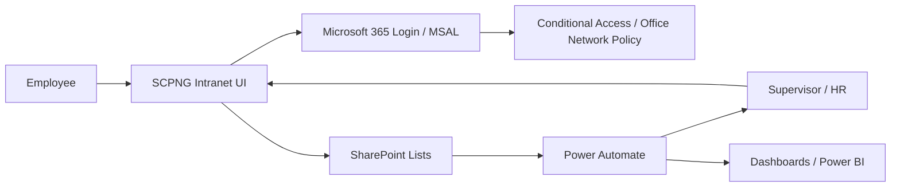

# Time and Attendance Module - Master TOC

> Status: Planning and design  
> Storage target: SharePoint Lists  
> Workflow target: Power Automate  
> UI target: Existing SCPNG Intranet React application  
> Authentication target: Existing Microsoft 365/MSAL login
> Network restriction target: Time and Attendance module only

## 1. Purpose

The Time and Attendance module will allow SCPNG staff to securely record daily attendance from inside the existing intranet. The module must follow the current system architecture: user interface in this React application, storage in SharePoint, workflow automation in Power Automate, and authentication through Microsoft 365.

The central control requirement is that employees must only be able to clock in or clock out when connected through the organization's approved office network.

This network restriction must not change access to any other intranet module. Dashboards, HR profiles, leave applications, approvals, documents, and other existing modules must continue to behave as they do today.

## 2. Recommended Solution Direction

Build the module natively inside the existing SCPNG Intranet rather than introducing a separate attendance product.

This approach is recommended because the current system already includes:

- Microsoft 365 authentication through MSAL.
- SharePoint-backed HR data services.
- Existing employee profile and leave management structures.
- Existing approval patterns for supervisor, director, and HR review.
- Existing email notification patterns.
- Existing Power Automate deployment/service concepts.
- Existing role-based navigation and protected routes.

## 3. Architecture Summary

## 4. Documentation Index

| Document | Purpose | Status |
| --- | --- | --- |
| [01-business-requirements.md](01-business-requirements.md) | Business objectives, scope, stakeholders, and success criteria | Drafted |
| [02-functional-requirements.md](02-functional-requirements.md) | User-facing features and workflow requirements | Drafted |
| [03-technical-architecture.md](03-technical-architecture.md) | System architecture, integration model, and security boundaries | Drafted |
| [04-solution-design.md](04-solution-design.md) | End-to-end process and module design | Drafted |
| [05-sharepoint-schema-design.md](05-sharepoint-schema-design.md) | SharePoint list schema and relationships | Drafted |
| [06-backend-services-and-logic.md](06-backend-services-and-logic.md) | Frontend service layer and SharePoint access logic | Drafted |
| [07-power-automate-workflows.md](07-power-automate-workflows.md) | Scheduled flows, approval flows, email flows, and escalations | Drafted |
| [08-ui-design.md](08-ui-design.md) | Page layout, components, states, and admin screens | Drafted |
| [09-ux-design.md](09-ux-design.md) | User journeys, error states, and accessibility | Drafted |
| [10-security-and-access-controls.md](10-security-and-access-controls.md) | Network, identity, permissions, and audit controls | Drafted |
| [11-notification-framework.md](11-notification-framework.md) | Email templates, trigger matrix, and escalation rules | Drafted |
| [12-reporting-and-analytics.md](12-reporting-and-analytics.md) | Attendance reports, dashboards, and Power BI model | Drafted |
| [13-testing-strategy.md](13-testing-strategy.md) | Test scenarios, internal testing plan, and security validation | Drafted |
| [14-deployment-plan.md](14-deployment-plan.md) | Rollout, migration, training, and release plan | Drafted |
| [15-maintenance-and-support.md](15-maintenance-and-support.md) | Operational ownership, support tasks, and future enhancements | Drafted |
| [16-phase-1-sharepoint-setup-build-checklist.md](16-phase-1-sharepoint-setup-build-checklist.md) | SharePoint setup implementation checklist, seed settings, indexes, and exit criteria | Ready |

## 5. Implementation Phases

### Phase 1 - Discovery and Requirements

Define business requirements, attendance policy rules, user roles, network restrictions, approval needs, and reporting requirements.

Deliverables:

- Business Requirements document.
- Functional Requirements document.
- Initial process maps.
- Initial risks and assumptions.

### Phase 2 - Architecture and Data Design

Design the SharePoint schema, Power Automate flow inventory, intranet service layer, security controls, and reporting structure.

Deliverables:

- Technical Architecture document.
- SharePoint Schema Design document.
- Security and Access Controls document.
- Reporting and Analytics design.

### Phase 3 - UI and UX Design

Design the employee clock-in/out screen, supervisor dashboard, HR dashboard, exception handling screens, and reporting views.

Deliverables:

- UI Design document.
- UX Design document.
- Wireframe-level component inventory.
- Accessibility and responsive behavior notes.

### Phase 4 - Build and Integration

Implement SharePoint lists, React UI, service layer, Power Automate flows, and role-based navigation.

Deliverables:

- SharePoint provisioning updates.
- Time Attendance service.
- Attendance page and admin views.
- Power Automate flows.
- Notification templates.

### Phase 5 - Testing

Validate clock-in/out behavior, network restriction enforcement, permissions, exception reviews, notifications, reports, and audit history.

Deliverables:

- Testing Strategy.
- Internal testing scripts.
- Issue log.
- Release readiness sign-off.

### Phase 6 - Deployment and Support

Roll out the module to pilot users, train staff, monitor issues, and move into production support.

Deliverables:

- Deployment Plan.
- Maintenance and Support Procedures.
- Training notes.
- Future enhancement backlog.

## 6. Key Decisions Required

The following decisions have been confirmed:

- Official workday: 8:30 AM to 4:00 PM.
- Grace period: none.
- Clock-out: mandatory every workday.
- Overtime: time recorded after 4:00 PM is treated as overtime.
- Lunch/break tracking: not required for the initial release.
- Late arrivals: recorded by the system without approval workflow.
- Remote access/VPN attendance: not allowed.
- Internal office LAN range: 192.168.7.1 to 192.168.7.255, with 192.168.7.1 as the firewall gateway.
- Office public/WAN IP: 124.240.199.154.
- Confirmed internal test group: John Sarwom, Thomas Mondaya, Regina Wai, Titus Angu, John Saki, Kylie Karis, Esther Alia, and Jacob Kom.
- HR daily summary recipient: Thomas Mondaya.
- ICT/Admin support copy: John Sarwom.
- Overtime notification: report-only in dashboard/summary, with a separate overtime email enabled.
- Missed clock-in review: employee submits reason, supervisor reviews, HR can view.
- Missed clock-out review: employee submits reason, supervisor reviews, HR can view.
- Employee history outside office: allowed; only clock-in and clock-out are office-network restricted.
- Record retention: 7 years.
- Power Automate owner/service account: admin@scpng.gov.pg.
- Phase 1 write path: React app writes attendance records directly to SharePoint using the existing Microsoft Graph service pattern.
- Permission key: use a new `attendance` resource key rather than reusing `hr`, so all employees can access attendance self-service without granting HR module access.
- No formal UAT period is required at this stage.
- Production go-live date will be set later after internal testing.

The following decisions still need confirmation before implementation:

- Whether production rollout should be all staff at once or by division/unit.

## 7. Current Recommendation

Proceed with a SharePoint-first native intranet module and use Power Automate for scheduled checks, notification workflows, escalations, and review routing. Use Microsoft 365/Entra/SharePoint access controls where they fit the existing architecture, supported by in-app network validation and full audit logging.

For the initial implementation, the office-network restriction should be module-level only. Use a React `OfficeNetworkOnly` gate around the Time and Attendance route or clock-in/clock-out action area. Do not apply global Microsoft Entra Conditional Access to the existing intranet app unless a later design proves it can be scoped without affecting unrelated modules.
