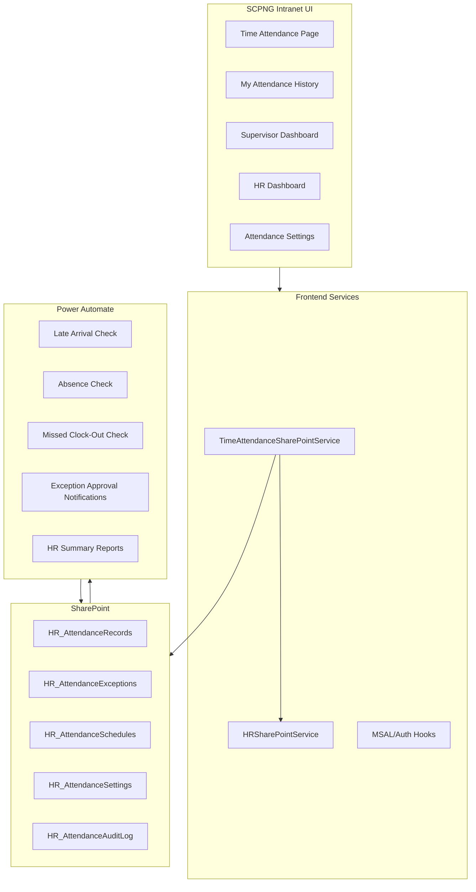

# Time and Attendance Module - Technical Architecture

## 1. Architecture Direction

The Time and Attendance module will use the existing SCPNG Intranet architecture:

- React/Vite frontend for all user interface screens.
- Microsoft 365/MSAL for authentication.
- Microsoft Graph for SharePoint access.
- SharePoint Lists as the storage layer.
- Power Automate for scheduled processing, notifications, approvals, and escalations.
- Existing role-based navigation and protected route patterns.

No separate custom backend or standalone database is planned for the initial release.

## 2. Existing System Alignment

The module should follow these existing patterns:

| Existing Area | Reuse Strategy |
| --- | --- |
| `HRSharePointService` | Model attendance SharePoint service structure after HR service patterns |
| `SharePointListSetupService` | Add attendance list provisioning using the established list setup style |
| Leave approval workflow | Reuse supervisor/HR review concepts and email action patterns |
| `PowerAutomateService` | Follow existing Power Automate integration approach for deployed or documented flows |
| Protected routes | Add a protected attendance route and navigation item |
| HR employee profile data | Use existing employee records as identity and organization source |

## 3. Logical Components



## 4. Authentication and Identity

Authentication must use the existing Microsoft 365/MSAL setup.

The module should use the authenticated account to determine:

- Employee email.
- Employee display name.
- Employee profile.
- Division and unit.
- Supervisor or approver relationship.
- Role-based access to employee, supervisor, HR, or admin views.

The attendance module should not allow users to manually select another employee for clock-in or clock-out.

## 5. Network Restriction Architecture

The office-network requirement applies only to the Time and Attendance module. It must not change access behavior for the rest of the SCPNG Intranet.

Recommended initial layers:

1. Keep the existing Microsoft 365/MSAL login and protected route behavior unchanged for the whole app.
2. Add a module-level `OfficeNetworkOnly` wrapper around the `/time-attendance` route or around the clock-in/clock-out action area only.
3. Use a public IP lookup check against the confirmed office public internet egress IP address/range.
4. When the network check fails, allow the rest of the intranet to work normally but disable attendance recording actions.
5. Store network validation metadata on attendance records and audit log entries.
6. Harden the SharePoint lists so ordinary users cannot manually create or edit attendance records outside the intended app or workflow path.
7. Use Power Automate as the attendance write layer if stronger enforcement is required.

Important design note:

Microsoft Entra Conditional Access typically applies at the app registration or cloud app level. If applied broadly to the existing intranet app, it may block users from the entire application when outside the office. That does not match the business requirement. Conditional Access should therefore be treated as an optional future hardening option only if it can be scoped safely without affecting other intranet modules.

SharePoint location-based controls can also affect service integrations such as Power Automate, Power Apps, and Power BI. They should not be used as the default solution for this module-level requirement without a pilot test.

Confirmed local network details:

- Internal office LAN range: 192.168.7.1 to 192.168.7.255.
- Firewall gateway: 192.168.7.1.
- Office public/WAN IP: 124.240.199.154.
- Remote/VPN attendance: not allowed.

Implementation note:

The `192.168.7.0/24` range is a private internal LAN range. Public IP checks must use the confirmed office firewall/WAN IP `124.240.199.154`. The internal LAN range can still be recorded in the design as the office network reference and may be useful for local infrastructure, but it should not be treated as the public value used by cloud services.

Initial UI implementation pattern:

```tsx
<ProtectedRoute>
  <OfficeNetworkOnly>
    <TimeAttendance />
  </OfficeNetworkOnly>
</ProtectedRoute>
```

This wrapper must be applied only to the Time and Attendance route or attendance action surface. Other routes must continue to use the current access behavior.

## 6. SharePoint Storage Architecture

The initial SharePoint list set should include:

| List | Purpose |
| --- | --- |
| `HR_AttendanceRecords` | One primary attendance record per employee per workday |
| `HR_AttendanceExceptions` | Late, missed clock-in, missed clock-out, and correction reasons |
| `HR_AttendanceSchedules` | Work schedules by employee, role, division, or policy group |
| `HR_AttendanceSettings` | Configurable thresholds and notification settings |
| `HR_AttendanceApprovals` | Supervisor/HR approval records if separated from exceptions |
| `HR_AttendanceAuditLog` | Append-only audit history |

Detailed columns will be defined in [05-sharepoint-schema-design.md](05-sharepoint-schema-design.md).

## 7. Power Automate Architecture

Power Automate should handle logic that must run outside a user's browser session:

- Scheduled late arrival reporting.
- Overtime reporting after 4:00 PM.
- Scheduled absence detection.
- Missed clock-out detection.
- Supervisor/HR approval emails for missed attendance or corrections where required.
- Escalation emails.
- Daily HR summaries.
- Weekly/monthly reporting summaries if required.

Flows should be designed to be idempotent, meaning reruns should not create duplicate records or duplicate emails for the same event.

## 8. Reporting Architecture

Reporting should support two levels:

- Intranet dashboards for operational views.
- Power BI reports for management analytics if required.

SharePoint list views may be useful for administrators, but the intranet should remain the primary user experience.

## 9. Security Model

The module must enforce:

- Authenticated access only.
- Employee self-service access only to own attendance records.
- Supervisor access only to team records.
- HR access to organization-wide attendance.
- Admin access to settings and technical configuration.
- Office-network validation only for attendance recording.
- No office-network restriction for unrelated intranet modules.
- No self-approval for attendance exceptions.
- No approval workflow for ordinary late arrivals.
- Audit logging for all create, update, approval, rejection, and correction events.

## 10. Scalability Considerations

SharePoint Lists can support the initial module if designed carefully:

- Use indexed columns for `EmployeeEmail`, `EmployeeID`, `AttendanceDate`, `Status`, `Division`, `Unit`, and `SupervisorEmail`.
- Query by bounded date ranges.
- Avoid loading full attendance history into the browser.
- Use pagination for HR reports.
- Archive old records if list volume becomes large.
- Consider Dataverse only if data volume, security complexity, or reporting requirements outgrow SharePoint Lists.

## 11. Future Architecture Options

Potential later enhancements:

- Dataverse-backed attendance table for stronger security and relational modeling.
- Power Apps mobile companion.
- Teams Shifts integration.
- Payroll export.
- Biometric or access-control-device import.
- QR/kiosk mode for shared office devices.
- Advanced analytics in Power BI.
