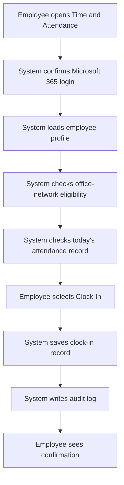
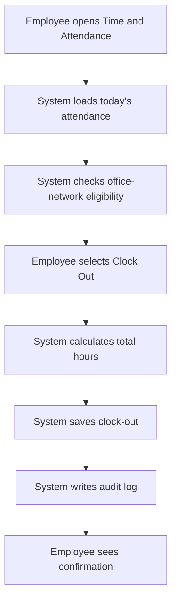
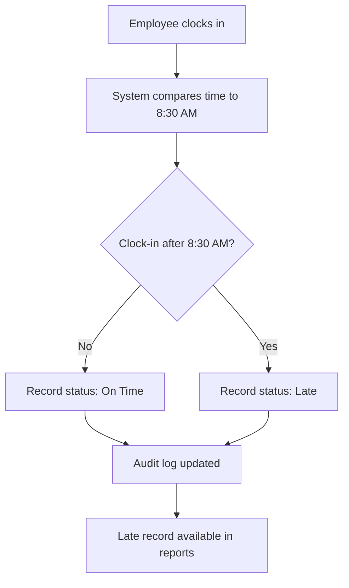

# Time and Attendance Module - Solution Design

## 1. Design Goal

The solution must make daily attendance recording simple for employees while giving supervisors and HR reliable controls for exceptions, reporting, and compliance. The module must feel like a natural part of the existing SCPNG Intranet, not a separate system.

## 2. Primary User Journeys

### 2.1 Employee Clock-In Journey

Blocked states:

- Not signed in.
- Employee profile not found.
- Outside office network.
- Already clocked in.
- SharePoint unavailable.

### 2.2 Employee Clock-Out Journey

Blocked states:

- No active clock-in.
- Already clocked out.
- Outside office network.
- SharePoint unavailable.

### 2.3 Late Reason Journey

Late arrivals do not require approval. The system records the late arrival automatically when clock-in occurs after 8:30 AM.

### 2.4 Missing Attendance Journey

Power Automate detects missing attendance after the configured threshold.

Flow:

1. Scheduled flow runs after attendance deadline.
2. Flow reads active employee list.
3. Flow checks whether each employee has a record for the day.
4. Missing records are created or marked.
5. Employee receives reminder.
6. Supervisor receives notification if unresolved.
7. Employee submits reason.
8. Supervisor approves or rejects.
9. HR can review unresolved records.

Confirmed review rule: missed clock-in and missed clock-out require the employee to submit a reason, supervisor review, and HR visibility. HR can correct records where needed with audit logging.

## 3. Page and Component Design

### 3.1 Employee View

Primary route: `/time-attendance`

Expected sections:

- Current status panel.
- Clock-in/clock-out action area.
- Network eligibility indicator.
- Today's attendance details.
- Pending action alerts.
- Recent attendance history.
- Missed attendance or correction reason form when required.

### 3.2 Supervisor View

Expected sections:

- Team attendance summary.
- Today's late/absent/incomplete records.
- Pending exception approvals.
- Overtime records.
- Employee detail drawer or page.
- Approval/rejection actions with comments.

### 3.3 HR View

Expected sections:

- Organization-wide attendance dashboard.
- Filterable attendance table.
- Exceptions and approvals queue.
- Missing clock-out queue.
- Overtime report.
- Manual correction interface.
- Audit history access.
- Settings link for HR administrators.

### 3.4 Settings View

Expected sections:

- Workday schedule settings.
- Grace period settings fixed to 0 minutes unless policy changes.
- Overtime threshold settings.
- Notification timing.
- Escalation rules.
- Attendance policy groups.
- Network policy reference information.

## 4. Attendance Status Model

Recommended statuses:

| Status | Meaning |
| --- | --- |
| `NotStarted` | No attendance record yet |
| `ClockedIn` | Employee has clocked in but not out |
| `ClockedOut` | Employee completed attendance for the day |
| `Late` | Clock-in occurred after 8:30 AM |
| `Overtime` | Clock-out occurred after 4:00 PM |
| `Absent` | No clock-in after configured absence threshold |
| `MissingClockOut` | Clock-in exists but no clock-out after end-of-day threshold |
| `PendingReason` | Employee must submit explanation for missed attendance or correction case |
| `PendingApproval` | Supervisor/HR review is pending |
| `ExceptionApproved` | Submitted reason was approved |
| `ExceptionRejected` | Submitted reason was rejected |
| `Corrected` | HR manually corrected the record |

## 5. Exception Types

Recommended exception types:

- Late Arrival.
- Overtime.
- Missed Clock-In.
- Missed Clock-Out.
- Early Departure.
- Manual Correction.
- System Error.
- Approved Official Duty.
- Other.

## 6. Notification Design

| Trigger | Recipient | Channel | Owner |
| --- | --- | --- | --- |
| Late clock-in | HR/supervisor report only unless notification is enabled | Report/in-app | UI/Power Automate |
| Overtime recorded | HR/supervisor report only unless notification is enabled | Report/in-app | UI/Power Automate |
| Missing clock-in | Employee, supervisor | Email | Power Automate |
| Missing clock-out | Employee | Email | Power Automate |
| Reason submitted | Supervisor | Email | Power Automate |
| Reason approved | Employee | Email | Power Automate |
| Reason rejected | Employee | Email | Power Automate |
| Approval overdue | Supervisor, HR | Email | Power Automate |
| Daily attendance summary | HR | Email/report | Power Automate |

## 7. Audit Design

Audit log entries should be created for:

- Clock-in.
- Clock-out.
- Failed or blocked attempt where technically available.
- Late status assignment.
- Overtime status assignment.
- Absence status assignment.
- Reason submission.
- Supervisor approval.
- Supervisor rejection.
- HR correction.
- Settings changes.
- Power Automate scheduled updates.

Each audit record should capture:

- Timestamp.
- Actor name and email.
- Employee affected.
- Action type.
- Before value where applicable.
- After value where applicable.
- Source: UI, Power Automate, HR Correction, System.
- Notes or reason.

## 8. Integration With Leave Management

The attendance module should account for approved leave to avoid false absence alerts.

Initial design:

- Power Automate absence detection checks active approved leave for the employee and date.
- If approved leave exists, do not mark as absent.
- If leave is pending, mark as Attendance Requires Review rather than automatic absence where policy requires.

## 9. Integration With Employee Profiles

Employee profile data should provide:

- Employee ID.
- Full name.
- Email.
- Division.
- Unit.
- Supervisor.
- Employment status.
- Work schedule or policy group where available.

If no profile is found, the user should not be allowed to clock in until HR resolves the profile.

## 10. Implementation Readiness Checklist

Before build begins:

- Confirm business rules.
- Office public egress IP confirmed: 124.240.199.154.
- Confirm network policy using internal LAN range 192.168.7.0/24 and public egress IP.
- Confirm VPN blocking policy.
- Confirm SharePoint list schema.
- Power Automate ownership account confirmed: admin@scpng.gov.pg.
- Confirm email sender and templates.
- Confirm HR and supervisor roles.
- Confirm reporting requirements.
- Confirm pilot group.
