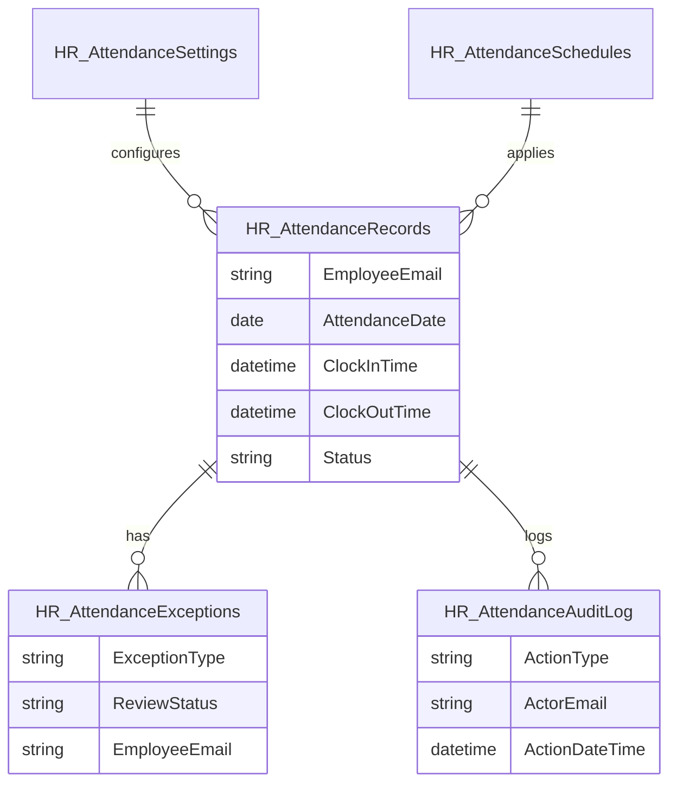

# Time and Attendance Module - SharePoint Schema Design

> Status: Drafted for review  
> Storage target: SharePoint Lists  
> Implementation target: Existing Microsoft Graph / SharePoint service pattern

## 1. Purpose

This document defines the SharePoint Lists required for the Time and Attendance module. The schema is designed to support:

- One attendance record per employee per workday.
- Clock-in and clock-out tracking.
- Automatic late marking after 8:30 AM.
- Mandatory clock-out.
- Overtime tracking after 4:00 PM.
- Office-network validation metadata.
- Missed clock-in and missed clock-out workflows.
- HR reporting and audit history.

The schema must not change existing HR, leave, approval, or intranet access behavior.

## 2. Confirmed Business Rules

| Rule | Confirmed Value |
| --- | --- |
| Workday start | 8:30 AM |
| Workday end | 4:00 PM |
| Grace period | 0 minutes |
| Clock-out required | Yes |
| Overtime threshold | After 4:00 PM |
| Lunch tracking | No |
| Late approval | Not required |
| Remote/VPN attendance | Not allowed |
| Office internal LAN | 192.168.7.0/24 |
| Firewall gateway | 192.168.7.1 |
| Public office egress IP | 124.240.199.154 |

## 3. List Overview

| List | Purpose | Required for Phase 1 |
| --- | --- | --- |
| `HR_AttendanceRecords` | Primary attendance record per employee per date | Yes |
| `HR_AttendanceAuditLog` | Append-style audit trail for attendance actions | Yes |
| `HR_AttendanceSettings` | Configurable module settings and policy values | Yes |
| `HR_AttendanceExceptions` | Missed clock-in/out, absence, correction, and other reason records | Yes |
| `HR_AttendanceSchedules` | Optional schedule/policy assignments by employee or group | Phase 2 optional |

`HR_AttendanceApprovals` is not recommended as a separate Phase 1 list because ordinary late arrivals do not require approval. Approval/review fields can live in `HR_AttendanceExceptions`. A separate approvals list can be added later if exception routing becomes more complex.

## 4. Entity Relationship Summary

## 5. `HR_AttendanceRecords`

Primary attendance list. One item should represent one employee's attendance for one workday.

### 5.1 List Settings

| Setting | Value |
| --- | --- |
| List name | `HR_AttendanceRecords` |
| Description | Daily staff clock-in, clock-out, status, overtime, and network validation records |
| Item uniqueness | Enforced in app/service logic using `EmployeeEmail + AttendanceDateKey` |
| Primary users | Employee self-service, supervisors, HR |
| Expected volume | One item per active employee per workday |

### 5.2 Columns

| Display Name | Internal Name | Type | Required | Notes |
| --- | --- | --- | --- | --- |
| Title | `Title` | Single line text | Yes | Suggested format: `employee-email-yyyy-mm-dd` |
| Attendance ID | `AttendanceID` | Single line text | Yes | App-generated UUID or deterministic key |
| Attendance Date | `AttendanceDate` | Date only | Yes | Workday date |
| Attendance Date Key | `AttendanceDateKey` | Single line text | Yes | `yyyy-mm-dd`; useful for filtering and uniqueness checks |
| Employee ID | `EmployeeID` | Single line text | No | From HR profile where available |
| Employee Name | `EmployeeName` | Single line text | Yes | Snapshot at time of record |
| Employee Email | `EmployeeEmail` | Single line text | Yes | Authenticated Microsoft 365 email |
| Division | `Division` | Single line text | No | Snapshot from HR profile |
| Unit | `Unit` | Single line text | No | Snapshot from HR profile |
| Supervisor Name | `SupervisorName` | Single line text | No | Snapshot from HR profile |
| Supervisor Email | `SupervisorEmail` | Single line text | No | Used for reporting/notifications |
| Clock In Time | `ClockInTime` | Date and time | No | Exact clock-in timestamp |
| Clock Out Time | `ClockOutTime` | Date and time | No | Exact clock-out timestamp |
| Clock In Source | `ClockInSource` | Choice | No | `Intranet`, `PowerAutomate`, `HRCorrection`, `SystemImport` |
| Clock Out Source | `ClockOutSource` | Choice | No | `Intranet`, `PowerAutomate`, `HRCorrection`, `SystemImport` |
| Status | `Status` | Choice | Yes | See status values below |
| Is Late | `IsLate` | Yes/No | No | True when clock-in is after 8:30 AM |
| Late Minutes | `LateMinutes` | Number | No | Minutes after 8:30 AM |
| Is Early Departure | `IsEarlyDeparture` | Yes/No | No | True when clock-out is before 4:00 PM |
| Early Departure Minutes | `EarlyDepartureMinutes` | Number | No | Minutes before 4:00 PM |
| Is Overtime | `IsOvertime` | Yes/No | No | True when clock-out is after 4:00 PM |
| Overtime Minutes | `OvertimeMinutes` | Number | No | Minutes after 4:00 PM |
| Total Minutes | `TotalMinutes` | Number | No | Total minutes between clock-in and clock-out |
| Total Hours | `TotalHours` | Number | No | Decimal hours for reporting |
| Clock Out Required | `ClockOutRequired` | Yes/No | Yes | Default: Yes |
| Network Check Required | `NetworkCheckRequired` | Yes/No | Yes | Default: Yes |
| Network Check Passed | `NetworkCheckPassed` | Yes/No | No | True for accepted clock-in/out actions |
| Network Check Provider | `NetworkCheckProvider` | Single line text | No | Example: `public-ip-lookup` |
| Detected Public IP | `DetectedPublicIP` | Single line text | No | Public IP detected by app/check |
| Expected Office IP | `ExpectedOfficeIP` | Single line text | No | Configured office public IP/range at the time |
| Internal Network Range | `InternalNetworkRange` | Single line text | No | Expected value: `192.168.7.0/24` |
| Device User Agent | `DeviceUserAgent` | Multiple lines text | No | Browser/device metadata |
| Time Zone | `TimeZone` | Single line text | No | Example: `Pacific/Port_Moresby` |
| Is Manually Corrected | `IsManuallyCorrected` | Yes/No | No | True if HR edits record |
| Correction Reason | `CorrectionReason` | Multiple lines text | No | Required for HR correction |
| Correction By | `CorrectionBy` | Single line text | No | HR/admin name/email |
| Correction Date Time | `CorrectionDateTime` | Date and time | No | Timestamp of correction |
| Exception Status | `ExceptionStatus` | Choice | No | `None`, `Pending`, `Approved`, `Rejected`, `Resolved` |
| Notes | `Notes` | Multiple lines text | No | HR/admin notes |

### 5.3 Status Choices

Recommended values for `Status`:

- `NotStarted`
- `ClockedIn`
- `ClockedOut`
- `Late`
- `Absent`
- `MissingClockIn`
- `MissingClockOut`
- `EarlyDeparture`
- `Overtime`
- `Incomplete`
- `Corrected`

Implementation note: a record can be both late and overtime. The boolean fields `IsLate` and `IsOvertime` should support reporting where one `Status` value is not enough.

### 5.4 Recommended Indexes

Create indexes for:

- `EmployeeEmail`
- `EmployeeID`
- `AttendanceDate`
- `AttendanceDateKey`
- `Status`
- `Division`
- `Unit`
- `SupervisorEmail`
- `IsLate`
- `IsOvertime`
- `ExceptionStatus`

### 5.5 Recommended Views

| View | Filter/Sort |
| --- | --- |
| Today Attendance | `AttendanceDate` equals today, sorted by `EmployeeName` |
| My Attendance | Filtered in app by authenticated `EmployeeEmail` |
| Late Today | Today where `IsLate` equals Yes |
| Overtime Today | Today where `IsOvertime` equals Yes |
| Missing Clock-Out | `Status` equals `MissingClockOut` or `Incomplete` |
| HR Monthly Review | Date range, grouped by division and unit |

## 6. `HR_AttendanceExceptions`

Stores reasons and review status for missed clock-in, missed clock-out, absence, early departure, corrections, or other exception cases. Ordinary late arrivals do not require approval, but can still be reported directly from `HR_AttendanceRecords`.

### 6.1 List Settings

| Setting | Value |
| --- | --- |
| List name | `HR_AttendanceExceptions` |
| Description | Attendance exception reasons, review status, and correction requests |
| Primary users | Employees, supervisors, HR |

### 6.2 Columns

| Display Name | Internal Name | Type | Required | Notes |
| --- | --- | --- | --- | --- |
| Title | `Title` | Single line text | Yes | Suggested format: `exception-type-employee-date` |
| Exception ID | `ExceptionID` | Single line text | Yes | App-generated UUID |
| Attendance ID | `AttendanceID` | Single line text | No | Links to `HR_AttendanceRecords.AttendanceID` |
| Attendance Date | `AttendanceDate` | Date only | Yes | Workday date |
| Employee ID | `EmployeeID` | Single line text | No | From HR profile |
| Employee Name | `EmployeeName` | Single line text | Yes | Snapshot |
| Employee Email | `EmployeeEmail` | Single line text | Yes | Authenticated employee |
| Division | `Division` | Single line text | No | Snapshot |
| Unit | `Unit` | Single line text | No | Snapshot |
| Supervisor Email | `SupervisorEmail` | Single line text | No | Routing/reporting |
| Exception Type | `ExceptionType` | Choice | Yes | See values below |
| Reason Category | `ReasonCategory` | Choice | No | See values below |
| Reason Details | `ReasonDetails` | Multiple lines text | No | Employee explanation |
| Review Required | `ReviewRequired` | Yes/No | Yes | Default based on exception type |
| Review Status | `ReviewStatus` | Choice | Yes | `NotRequired`, `Pending`, `Approved`, `Rejected`, `Resolved` |
| Reviewed By Name | `ReviewedByName` | Single line text | No | Supervisor/HR |
| Reviewed By Email | `ReviewedByEmail` | Single line text | No | Supervisor/HR |
| Reviewed Date Time | `ReviewedDateTime` | Date and time | No | Review timestamp |
| Review Comments | `ReviewComments` | Multiple lines text | No | Required on rejection |
| Escalation Status | `EscalationStatus` | Choice | No | `None`, `Pending`, `Escalated`, `Resolved` |
| Escalated To | `EscalatedTo` | Single line text | No | HR/supervisor email |
| Escalated Date Time | `EscalatedDateTime` | Date and time | No | Escalation timestamp |
| Attachment Required | `AttachmentRequired` | Yes/No | No | Future support |
| Has Attachment | `HasAttachment` | Yes/No | No | Future support |

### 6.3 Exception Type Choices

- `MissedClockIn`
- `MissedClockOut`
- `Absent`
- `EarlyDeparture`
- `ManualCorrection`
- `SystemError`
- `OfficialDuty`
- `Other`

### 6.4 Reason Category Choices

- `ForgotToClockIn`
- `ForgotToClockOut`
- `OfficialDuty`
- `SystemIssue`
- `Medical`
- `Transport`
- `ApprovedLeave`
- `Other`

### 6.5 Recommended Indexes

Create indexes for:

- `EmployeeEmail`
- `AttendanceDate`
- `ExceptionType`
- `ReviewStatus`
- `SupervisorEmail`
- `Division`
- `Unit`

## 7. `HR_AttendanceAuditLog`

Append-style audit list for attendance actions. Users should not edit these records through the UI.

### 7.1 List Settings

| Setting | Value |
| --- | --- |
| List name | `HR_AttendanceAuditLog` |
| Description | Audit history for attendance actions, network checks, corrections, and system updates |
| Primary users | HR, administrators, support |

### 7.2 Columns

| Display Name | Internal Name | Type | Required | Notes |
| --- | --- | --- | --- | --- |
| Title | `Title` | Single line text | Yes | Suggested format: `action-employee-timestamp` |
| Audit ID | `AuditID` | Single line text | Yes | App-generated UUID |
| Attendance ID | `AttendanceID` | Single line text | No | Related attendance record |
| Exception ID | `ExceptionID` | Single line text | No | Related exception |
| Action Type | `ActionType` | Choice | Yes | See values below |
| Action Date Time | `ActionDateTime` | Date and time | Yes | Event timestamp |
| Actor Name | `ActorName` | Single line text | No | User/system actor |
| Actor Email | `ActorEmail` | Single line text | No | User/system email |
| Actor Role | `ActorRole` | Choice | No | `Employee`, `Supervisor`, `HR`, `Admin`, `System`, `PowerAutomate` |
| Employee Name | `EmployeeName` | Single line text | No | Affected employee |
| Employee Email | `EmployeeEmail` | Single line text | No | Affected employee |
| Source | `Source` | Choice | Yes | `Intranet`, `PowerAutomate`, `SharePoint`, `HRCorrection`, `System` |
| Old Value | `OldValue` | Multiple lines text | No | JSON/text snapshot where useful |
| New Value | `NewValue` | Multiple lines text | No | JSON/text snapshot where useful |
| Network Check Passed | `NetworkCheckPassed` | Yes/No | No | For attendance actions |
| Detected Public IP | `DetectedPublicIP` | Single line text | No | Public IP observed |
| Details | `Details` | Multiple lines text | No | Human-readable notes |

### 7.3 Action Type Choices

- `ClockIn`
- `ClockOut`
- `ClockInBlockedNetwork`
- `ClockOutBlockedNetwork`
- `LateMarked`
- `OvertimeMarked`
- `MissingClockInMarked`
- `MissingClockOutMarked`
- `ExceptionCreated`
- `ExceptionReviewed`
- `RecordCorrected`
- `SettingsChanged`
- `NotificationSent`
- `SystemJobRun`

### 7.4 Recommended Indexes

Create indexes for:

- `ActionDateTime`
- `ActionType`
- `EmployeeEmail`
- `ActorEmail`
- `AttendanceID`
- `ExceptionID`
- `Source`

## 8. `HR_AttendanceSettings`

Stores configurable settings for the module. This allows HR/admin configuration without hard-coding every policy value.

### 8.1 List Settings

| Setting | Value |
| --- | --- |
| List name | `HR_AttendanceSettings` |
| Description | Time and Attendance policy settings, network settings, and notification configuration |
| Primary users | HR administrators, system administrators |

### 8.2 Columns

| Display Name | Internal Name | Type | Required | Notes |
| --- | --- | --- | --- | --- |
| Title | `Title` | Single line text | Yes | Human-readable setting name |
| Setting Key | `SettingKey` | Single line text | Yes | Unique setting key |
| Setting Value | `SettingValue` | Single line text | No | Simple value |
| Setting Value Long | `SettingValueLong` | Multiple lines text | No | JSON/text for complex values |
| Setting Type | `SettingType` | Choice | Yes | `Time`, `Number`, `Boolean`, `Text`, `Json`, `Email`, `IPRange` |
| Category | `Category` | Choice | Yes | `Policy`, `Network`, `Notification`, `Reporting`, `Security` |
| Is Active | `IsActive` | Yes/No | Yes | Default: Yes |
| Description | `Description` | Multiple lines text | No | Admin notes |
| Last Updated By | `LastUpdatedBy` | Single line text | No | Admin email/name |
| Last Updated Date Time | `LastUpdatedDateTime` | Date and time | No | Timestamp |

### 8.3 Initial Settings

| Setting Key | Value | Type | Category | Notes |
| --- | --- | --- | --- | --- |
| `workday.start.time` | `08:30` | Time | Policy | Official start time |
| `workday.end.time` | `16:00` | Time | Policy | Official end time |
| `late.grace.minutes` | `0` | Number | Policy | No grace period |
| `clockout.required` | `true` | Boolean | Policy | Clock-out mandatory |
| `lunch.tracking.enabled` | `false` | Boolean | Policy | Lunch not tracked |
| `overtime.enabled` | `true` | Boolean | Policy | Overtime after 4:00 PM |
| `attendance.network.required` | `true` | Boolean | Network | Required only for Time and Attendance |
| `attendance.internal.network` | `192.168.7.0/24` | IPRange | Network | Internal LAN reference |
| `attendance.firewall.gateway` | `192.168.7.1` | Text | Network | Local gateway |
| `attendance.office.public.ip` | `124.240.199.154` | IPRange | Network | Confirmed office public/WAN IP |
| `attendance.remote.allowed` | `false` | Boolean | Security | VPN/remote not allowed |
| `late.approval.required` | `false` | Boolean | Policy | Late arrivals recorded only |
| `missing.clockin.review.required` | `true` | Boolean | Policy | Employee reason, supervisor review, HR visibility |
| `missing.clockout.review.required` | `true` | Boolean | Policy | Employee reason, supervisor review, HR visibility |
| `absence.review.required` | `true` | Boolean | Policy | Proposed, needs confirmation |
| `daily.hr.summary.enabled` | `true` | Boolean | Reporting | HR summary with optional ICT support copy |
| `notifications.daily.hr.recipient` | `tmondaya@scpng.gov.pg` | Email | Notification | Thomas Mondaya, Senior HR Officer |
| `notifications.ict.support.copy` | `jsarwom@scpng.gov.pg` | Email | Notification | John Sarwom, ICT/Admin support copy |
| `notifications.overtime.summary.enabled` | `true` | Boolean | Notification | Separate overtime email enabled |

### 8.4 Recommended Indexes

Create indexes for:

- `SettingKey`
- `Category`
- `IsActive`

## 9. `HR_AttendanceSchedules`

Optional Phase 2 list. Use this only if staff have different schedules by employee, division, unit, or policy group. If all staff use 8:30 AM to 4:00 PM, this can be deferred.

### 9.1 Columns

| Display Name | Internal Name | Type | Required | Notes |
| --- | --- | --- | --- | --- |
| Title | `Title` | Single line text | Yes | Schedule name |
| Schedule ID | `ScheduleID` | Single line text | Yes | App-generated ID |
| Applies To Type | `AppliesToType` | Choice | Yes | `AllStaff`, `Division`, `Unit`, `Employee`, `PolicyGroup` |
| Applies To Value | `AppliesToValue` | Single line text | No | Email, division, unit, or group name |
| Start Time | `StartTime` | Single line text | Yes | Example: `08:30` |
| End Time | `EndTime` | Single line text | Yes | Example: `16:00` |
| Grace Minutes | `GraceMinutes` | Number | Yes | Default: `0` |
| Clock Out Required | `ClockOutRequired` | Yes/No | Yes | Default: Yes |
| Lunch Tracking Enabled | `LunchTrackingEnabled` | Yes/No | Yes | Default: No |
| Overtime Enabled | `OvertimeEnabled` | Yes/No | Yes | Default: Yes |
| Effective From | `EffectiveFrom` | Date only | Yes | Start date |
| Effective To | `EffectiveTo` | Date only | No | Optional end date |
| Is Active | `IsActive` | Yes/No | Yes | Default: Yes |

## 10. Permissions Design

Phase 1 will follow existing app/service patterns, with the React app writing attendance records directly to SharePoint through Microsoft Graph. The recommended permission model is:

| List | Employee | Supervisor | HR | Admin |
| --- | --- | --- | --- | --- |
| `HR_AttendanceRecords` | Read own records through app; create/update only through app/workflow path | Read team records through app | Read all, correct records | Full control |
| `HR_AttendanceExceptions` | Create own reasons, read own records | Review team exceptions | Review all exceptions | Full control |
| `HR_AttendanceAuditLog` | No direct access or read own audit only if exposed in app | Read team audit if required | Read all | Full control |
| `HR_AttendanceSettings` | No access | Read if needed | Manage policy settings | Full control |
| `HR_AttendanceSchedules` | No access | Read if needed | Manage schedules | Full control |

Security note: if direct SharePoint permissions cannot safely enforce "own records only" while preserving the existing architecture, enforce visibility in the app and consider Power Automate as the controlled write layer for clock-in and clock-out.

Permission key note: use a new `attendance` resource key for module navigation and basic self-service access. Do not reuse `hr`, because attendance is for all staff while HR Profiles is a narrower HR module.

## 11. Data Retention

Retention needs final HR/legal confirmation. Recommended starting point:

- Attendance records: retain for 7 years.
- Audit logs: retain for 7 years.
- Exceptions/corrections: retain for the same period as the related attendance record.
- Settings history: retain active settings plus audit entries for changes.

## 12. Power Automate Dependencies

The schema supports these flows:

| Flow | Uses Lists |
| --- | --- |
| Missing Clock-In Check | `HR_AttendanceRecords`, `HR_AttendanceSettings`, employee profile source |
| Missing Clock-Out Check | `HR_AttendanceRecords`, `HR_AttendanceSettings` |
| Daily HR Summary | `HR_AttendanceRecords`, `HR_AttendanceExceptions`, `HR_AttendanceSettings` |
| Overtime Summary | `HR_AttendanceRecords`, `HR_AttendanceSettings` |
| Exception Review Notification | `HR_AttendanceExceptions`, `HR_AttendanceAuditLog` |
| Audit Logging Helper | `HR_AttendanceAuditLog` |

## 13. Implementation Notes for SharePoint Provisioning

When implementation begins, add provisioning methods to the existing SharePoint setup service rather than creating a separate setup pattern.

Recommended methods:

- `createAttendanceRecordsList()`
- `createAttendanceExceptionsList()`
- `createAttendanceAuditLogList()`
- `createAttendanceSettingsList()`
- `createAttendanceSchedulesList()`
- `setupTimeAttendanceLists()`
- `seedAttendanceSettings()`

The implementation should follow the existing `createList()` and `ensureColumn()` patterns already used by the system.

## 14. Open Decisions

- Confirm whether production rollout should be all staff at once or by division/unit.
- Confirm whether any future schedule variations require `HR_AttendanceSchedules`.
