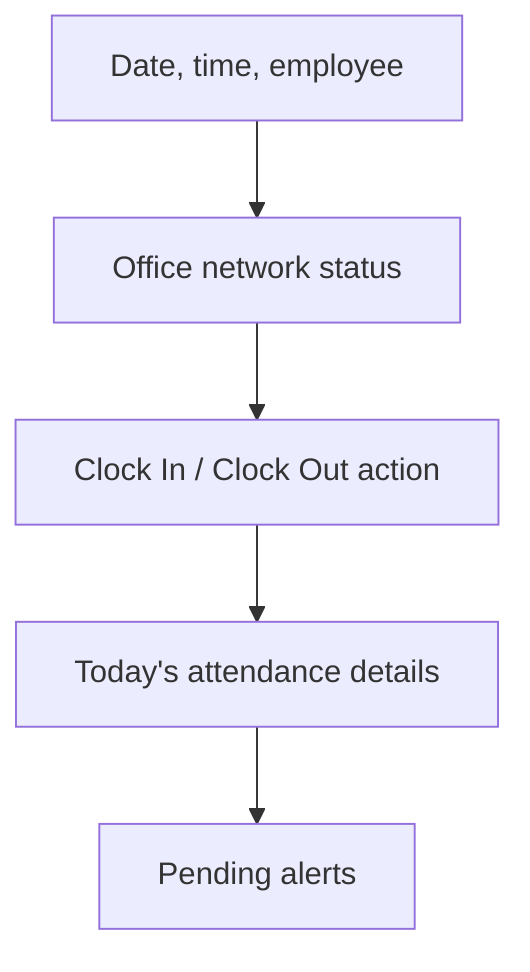

# Time and Attendance Module - UI Design

> Status: Drafted for review  
> UI target: Existing SCPNG Intranet React application  
> Route target: `/time-attendance`  
> Design principle: Use existing intranet patterns, not a separate product style

## 1. Purpose

This document defines the user interface design for the Time and Attendance module. The module must live inside the existing SCPNG Intranet and follow the same patterns already used by HR Profiles, approvals, dashboards, cards, tabs, badges, dialogs, and tables.

The office-network restriction applies only to this module's attendance recording actions. Other intranet modules must remain unchanged.

## 2. Navigation Placement

Add a main navigation item:

| Property | Value |
| --- | --- |
| Label | `Time Attendance` or `Attendance` |
| Route | `/time-attendance` |
| Icon | `Clock`, `Timer`, or `CalendarClock` from `lucide-react` |
| Resource key | `attendance` |
| Visibility | Authenticated users with access to the module |

Recommended initial nav label: `Attendance`.

## 3. Route Structure

Recommended route:

```tsx
<Route
  path="/time-attendance"
  element={
    <ProtectedRoute>
      <TimeAttendance />
    </ProtectedRoute>
  }
/>
```

Inside `TimeAttendance`, use the `OfficeNetworkOnly` check to control clock-in and clock-out actions. This avoids changing authentication behavior for the rest of the app.

Alternative route wrapper:

```tsx
<ProtectedRoute>
  <OfficeNetworkOnly mode="actions-only">
    <TimeAttendance />
  </OfficeNetworkOnly>
</ProtectedRoute>
```

Confirmed UI behavior: users can open the page outside the office and view their own attendance history, but cannot clock in or clock out.

## 4. Page Shell

Use existing layout components:

- `PageLayout`
- `Card`, `CardHeader`, `CardContent`
- `Tabs`, `TabsList`, `TabsTrigger`, `TabsContent`
- `Button`
- `Badge`
- `Dialog`
- `Input`, `Select`, `Textarea`
- `Skeleton`
- `useToast` or existing toast system
- `lucide-react` icons

Recommended top-level tabs:

| Tab | Audience | Purpose |
| --- | --- | --- |
| `Today` | All employees | Clock-in/out, today's status, network eligibility |
| `My History` | All employees | Personal attendance records |
| `Team` | Supervisors | Team attendance and exceptions |
| `HR Dashboard` | HR | Organization-wide reporting and corrections |
| `Settings` | HR admin/admin | Policy and network settings |

Tabs should render based on role/permission. Employees should only see `Today` and `My History`.

## 5. Employee Today View

### 5.1 Purpose

Allow an employee to record attendance for the current day and understand their status.

### 5.2 Layout

Recommended sections:

1. Header row with date, current time, and employee profile.
2. Office network status panel.
3. Primary clock action panel.
4. Today's attendance details.
5. Alerts and pending action area.



### 5.3 Primary Status Card

Display:

- Employee name.
- Division and unit.
- Current date.
- Live local time.
- Attendance status.
- Clock-in time.
- Clock-out time.
- Late minutes.
- Overtime minutes.
- Total hours.

Recommended status badge colors:

| Status | Badge Style |
| --- | --- |
| `NotStarted` | Neutral/gray |
| `ClockedIn` | Blue |
| `ClockedOut` | Green |
| `Late` | Amber |
| `MissingClockIn` | Red |
| `MissingClockOut` | Red |
| `Overtime` | Purple or indigo |
| `Corrected` | Slate |

### 5.4 Clock Action Area

Action states:

| State | Primary Action | Notes |
| --- | --- | --- |
| No record today, office network allowed | `Clock In` | Enabled |
| No record today, outside office network | `Clock In` | Disabled |
| Clocked in, office network allowed | `Clock Out` | Enabled |
| Clocked in, outside office network | `Clock Out` | Disabled |
| Clocked out | No primary clock action | Show completed state |
| Missing profile | No clock action | Show HR profile issue |
| Loading network check | No clock action | Show skeleton/spinner |

Use icons:

- `LogIn` or `Clock` for Clock In.
- `LogOut` or `TimerOff` for Clock Out.
- `RefreshCw` for re-check network.

### 5.5 Clock Confirmation

Before final clock-in or clock-out, show a compact confirmation dialog:

Clock-in confirmation:

- Date.
- Current time.
- Employee name.
- Network status: Office network verified.
- Confirm button: `Confirm Clock In`.

Clock-out confirmation:

- Date.
- Current time.
- Clock-in time.
- Estimated total hours.
- Overtime indicator if after 4:00 PM.
- Confirm button: `Confirm Clock Out`.

## 6. Office Network Wrapper

The UI must include a module-level `OfficeNetworkOnly` wrapper or hook for Time and Attendance.

The wrapper must:

- Run only inside the Time and Attendance module.
- Check the user's public IP against the configured office public IP/range.
- Show a loading state while checking the network.
- Show an office-network-required blocked state if the check fails.
- Disable clock-in and clock-out when the check fails.
- Leave all other intranet modules and routes unchanged.
- Provide a manual `Recheck` button.

Recommended blocked-state copy:

```text
Attendance recording is available only from the SCPNG office network.
Please connect to the office network to clock in or clock out.
```

The blocked state should not sign the user out and should not prevent access to unrelated intranet pages.

### 6.1 Network Status Panel

States:

| State | UI |
| --- | --- |
| Checking | Spinner/skeleton, text: `Checking office network...` |
| Allowed | Green badge: `Office network verified` |
| Blocked | Red/amber alert: `Office network required` |
| Error | Amber alert: `Unable to verify network`; clock actions disabled |
| Public IP missing setting | Admin-facing warning: `Office public IP not configured` |

Display to user:

- Simple result: verified or required.
- Avoid exposing technical details to normal employees unless needed.

Display to HR/admin:

- Detected public IP.
- Expected office public IP/range.
- Internal LAN reference: `192.168.7.0/24`.
- Last checked time.

## 7. My History View

### 7.1 Purpose

Allow employees to review their own attendance records.

### 7.2 Components

- Date range filter.
- Status filter.
- Summary counters.
- Attendance table.
- Detail drawer/dialog.

### 7.3 Table Columns

| Column | Notes |
| --- | --- |
| Date | Attendance date |
| Status | Badge |
| Clock In | Local time |
| Clock Out | Local time |
| Late | Minutes or dash |
| Overtime | Minutes or dash |
| Total Hours | Decimal/time display |
| Exception | None/Pending/Resolved |

### 7.4 Empty States

- No records in selected range.
- Profile not found.
- Unable to load records.

## 8. Team View

### 8.1 Audience

Supervisors and managers.

### 8.2 Purpose

Show attendance status for direct reports and allow review of exceptions where required.

### 8.3 Layout

Recommended sections:

- Team summary counters.
- Filters.
- Today's team attendance table.
- Pending exceptions queue.
- Employee detail dialog/drawer.

### 8.4 Team Summary Counters

Counters:

- Active team members.
- Clocked in.
- Late.
- Missing clock-in.
- Missing clock-out.
- Overtime.
- Pending exceptions.

### 8.5 Team Table Columns

| Column | Notes |
| --- | --- |
| Employee | Name, division/unit if useful |
| Status | Badge |
| Clock In | Time |
| Clock Out | Time |
| Late | Minutes |
| Overtime | Minutes |
| Exception | Status |
| Action | View details/review |

### 8.6 Exception Review UI

Use a dialog similar in spirit to the leave approval review flow.

Fields:

- Employee name.
- Date.
- Exception type.
- Reason category.
- Reason details.
- Attendance times.
- Review comments.

Actions:

- `Approve`
- `Reject`
- `Mark Resolved`

Note: ordinary late arrivals do not appear as approval tasks.

## 9. HR Dashboard View

### 9.1 Audience

HR officers and HR administrators.

### 9.2 Purpose

Provide organization-wide attendance visibility, correction capability, and reporting filters.

### 9.3 Dashboard Sections

- Date selector.
- Summary counters.
- Division/unit breakdown.
- Attendance records table.
- Exceptions queue.
- Overtime table.
- Missing clock-out table.
- Manual correction dialog.

### 9.4 HR Summary Counters

Counters:

- Total active employees.
- On time.
- Late.
- Missing clock-in.
- Missing clock-out.
- Overtime.
- On approved leave if enabled.
- Pending exceptions.

### 9.5 HR Filters

Filters:

- Date range.
- Division.
- Unit.
- Employee.
- Status.
- Exception status.
- Overtime only.
- Late only.

### 9.6 Manual Correction Dialog

HR-only action.

Fields:

- Attendance date.
- Employee.
- Original clock-in.
- Corrected clock-in.
- Original clock-out.
- Corrected clock-out.
- Correction reason.
- Correction notes.

Required behavior:

- Correction reason is mandatory.
- Save creates audit log.
- Original values are preserved in audit record.
- Corrected record is marked `IsManuallyCorrected = true`.

## 10. Settings View

### 10.1 Audience

HR administrators and system administrators.

### 10.2 Purpose

Manage policy and module settings stored in `HR_AttendanceSettings`.

### 10.3 Settings Sections

Policy settings:

- Workday start: `08:30`.
- Workday end: `16:00`.
- Grace period: `0`.
- Clock-out required: enabled.
- Lunch tracking: disabled.
- Overtime: enabled.

Network settings:

- Attendance network required: enabled.
- Internal LAN reference: `192.168.7.0/24`.
- Firewall gateway reference: `192.168.7.1`.
- Office public IP/range: `124.240.199.154`.
- Remote/VPN attendance allowed: disabled.

Notification settings:

- Daily HR summary enabled.
- HR summary recipients.
- Missing clock-in notification.
- Missing clock-out notification.
- Exception review notification.

### 10.4 Settings Change UX

When a sensitive setting changes, show confirmation:

- Office public IP/range.
- Network required toggle.
- Workday start/end.
- Clock-out required.

All settings changes should create audit log entries.

## 11. Component Inventory

Recommended new files when implementation begins:

| File | Purpose |
| --- | --- |
| `src/pages/TimeAttendance.tsx` | Main module page and tabs |
| `src/components/time-attendance/OfficeNetworkOnly.tsx` | Module-only network gate |
| `src/components/time-attendance/AttendanceTodayPanel.tsx` | Employee today view |
| `src/components/time-attendance/ClockActionCard.tsx` | Clock-in/out action area |
| `src/components/time-attendance/AttendanceHistoryTable.tsx` | My history table |
| `src/components/time-attendance/TeamAttendanceDashboard.tsx` | Supervisor view |
| `src/components/time-attendance/HRAttendanceDashboard.tsx` | HR view |
| `src/components/time-attendance/AttendanceSettingsPanel.tsx` | Settings |
| `src/components/time-attendance/AttendanceCorrectionDialog.tsx` | HR corrections |
| `src/components/time-attendance/ExceptionReviewDialog.tsx` | Supervisor/HR review |
| `src/hooks/useTimeAttendance.ts` | React Query/service hook |
| `src/services/timeAttendanceSharePointService.ts` | SharePoint data service |
| `src/types/attendance.ts` | Shared TypeScript types |

## 12. Loading and Error States

Required states:

- Loading employee profile.
- Loading today's attendance.
- Loading history.
- Checking office network.
- SharePoint unavailable.
- Employee profile missing.
- Office public IP not configured.
- Outside office network.
- Duplicate clock-in attempt.
- Duplicate clock-out attempt.
- Save failed.
- Correction failed.

Errors should be concise and actionable.

## 13. Responsive Behavior

Desktop:

- Tabs across the top.
- Summary cards in grid.
- Tables with filters.
- Dialogs for detail actions.

Mobile/tablet:

- Tabs may scroll horizontally.
- Summary cards stack.
- Tables convert to compact rows/cards where practical.
- Clock-in/out action remains prominent.
- Buttons must not overflow.

## 14. Accessibility

Requirements:

- Buttons have clear labels and icons.
- Network status is text plus color, not color alone.
- Dialogs use proper titles and descriptions.
- Form fields have labels.
- Disabled clock actions explain why they are disabled.
- Keyboard navigation works for tabs, dialogs, and actions.

## 15. Implementation Notes

- Use existing design system components before adding new UI primitives.
- Use `date-fns` for date/time formatting where consistent with the codebase.
- Use `lucide-react` icons.
- Keep cards compact and operational, similar to HR/approval dashboards.
- Do not make this a marketing-style landing page.
- Keep the first screen usable: employee should immediately see status and clock action.

## 16. Open UI Decisions

- Final nav label: `Attendance` or `Time Attendance`.
- Whether overtime should show to employees immediately or only in HR/supervisor reports.
- Whether Settings should be a tab inside the module or a separate admin route.
- Final HR summary card labels and report filters.
