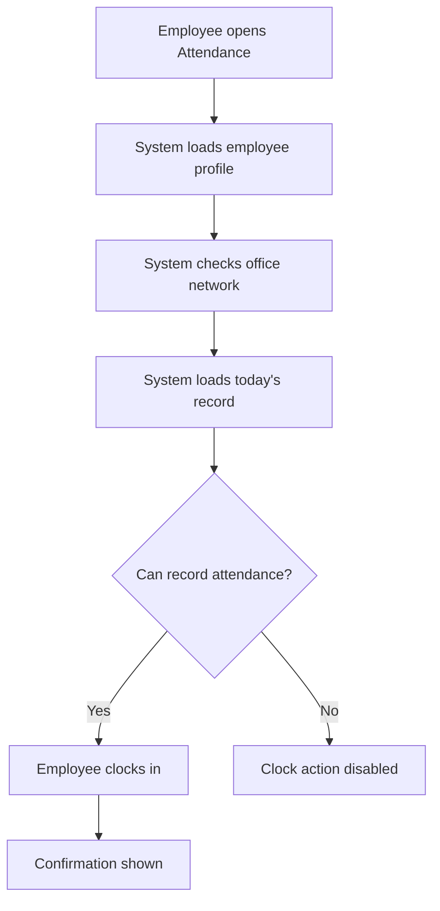
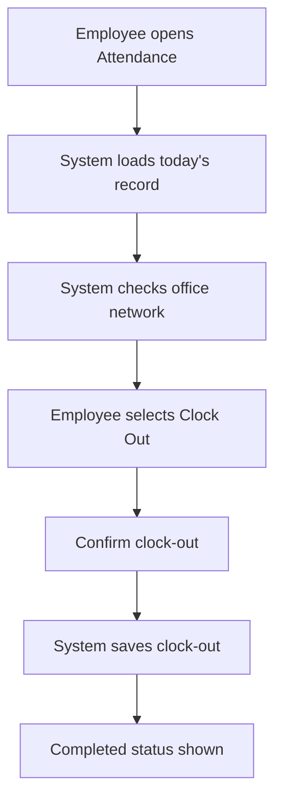

# Time and Attendance Module - UX Design

> Status: Drafted for review  
> UX target: Clear employee self-service, supervisor visibility, HR control  
> Key principle: Only attendance recording is office-network restricted

## 1. Purpose

This document defines the user experience for the Time and Attendance module. It focuses on how employees, supervisors, HR officers, and administrators move through the module, how the system communicates state, and how edge cases are handled.

The experience must be direct and operational. Employees should know immediately whether they can clock in or clock out, why an action is unavailable, and what has been recorded.

## 2. UX Principles

- Keep the first screen useful: current status and clock action must be immediately visible.
- Never block unrelated intranet modules because of attendance network rules.
- Explain disabled attendance actions in plain language.
- Avoid making late arrivals feel like an approval process; late status is recorded automatically.
- Make clock-out hard to forget through status visibility and reminders.
- Make HR corrections deliberate, audited, and clearly separated from normal employee actions.
- Use consistent wording, badges, tables, dialogs, and alerts from the existing intranet.
- Give HR and supervisors fast scanning views rather than long forms.

## 3. Role-Based Experience Summary

| Role | Primary UX Goal |
| --- | --- |
| Employee | Clock in/out, see today's status, view own history |
| Supervisor | See team attendance, review missed attendance issues where required |
| HR Officer | Monitor organization-wide attendance, run reports, correct records |
| HR Administrator | Configure policy, network, notification, and reporting settings |
| System Administrator | Support technical setup, audit, and troubleshooting |

## 4. Employee Journey - First Visit of the Day



### Expected Experience

When the employee opens the page:

- The page shows their name, division, unit, date, and current time.
- The system checks whether they are on the office network.
- The system checks whether they already have a record for today.
- If eligible, `Clock In` is the primary action.
- If not eligible, the action is disabled and the reason is visible.

### Success Message

Recommended message:

```text
Clock-in recorded successfully.
```

Supporting details:

- Time recorded.
- Status: On Time or Late.
- If late, show `Late arrival recorded` without asking for approval.

## 5. Employee Journey - Clock-Out



### Expected Experience

If the employee has clocked in:

- The page shows clock-in time and current status.
- `Clock Out` is prominent.
- The action is enabled only when office network is verified.
- If the current time is after 4:00 PM, the confirmation dialog shows estimated overtime.

### Success Message

Recommended message:

```text
Clock-out recorded successfully.
```

Supporting details:

- Clock-out time.
- Total hours.
- Overtime minutes if applicable.

## 6. Office Network UX

The office network check must feel like an attendance-specific rule, not a full application access problem.

### 6.1 Network States

| State | Employee Experience |
| --- | --- |
| Checking | `Checking office network...` with a spinner/skeleton |
| Verified | Green status: `Office network verified` |
| Not verified | Clock actions disabled, message explains office network is required |
| Check failed | Clock actions disabled, message says network could not be verified |
| Public IP missing | Admin-facing warning; employees see a general unavailable message |

### 6.2 Blocked Copy

Recommended employee copy:

```text
Attendance recording is available only from the SCPNG office network.
Please connect to the office network to clock in or clock out.
```

Recommended admin troubleshooting copy:

```text
Office public IP is not configured. Attendance recording cannot verify office network access.
```

### 6.3 Recheck Behavior

Provide a `Recheck` action that:

- Re-runs the public IP check.
- Shows loading state.
- Updates the network badge.
- Does not refresh or sign out the whole app.

## 7. Late Arrival UX

Late arrival is automatic and report-only unless policy changes.

### Rule

Any clock-in after 8:30 AM is recorded as late.

### Employee Experience

After clock-in:

- The success message appears normally.
- The status card shows `Late`.
- Late minutes are shown.
- No approval prompt appears.
- No reason form is required for ordinary late arrival.

Recommended copy:

```text
Clock-in recorded. This attendance has been marked late because it was recorded after 8:30 AM.
```

## 8. Overtime UX

Overtime is recorded when clock-out occurs after 4:00 PM.

### Employee Experience

Before clock-out:

- Confirmation dialog shows that overtime will be recorded.

After clock-out:

- Status shows completed.
- Overtime minutes are visible if employee-facing overtime display is enabled.

Recommended confirmation copy:

```text
This clock-out is after 4:00 PM. Overtime will be recorded for reporting.
```

Confirmed notification/reporting behavior: overtime is report-visible and a separate overtime summary email is enabled. Employee-facing overtime visibility remains a UI display decision.

## 9. Missing Clock-In UX

Power Automate detects missing clock-in after the configured time.

### Employee Experience

If the employee later opens the page:

- Show today's status as `Missing Clock-In` or `Absent`, depending on final policy wording.
- Explain that no clock-in was recorded.
- If review is required, show a reason submission action.

Recommended copy:

```text
No clock-in was recorded for today. Please submit a reason if required by HR.
```

### Reason Form

Fields:

- Reason category.
- Explanation.
- Optional notes.

Primary action:

- `Submit Reason`

## 10. Missing Clock-Out UX

Power Automate detects missing clock-out after the workday.

### Employee Experience

If the employee did not clock out:

- Show status as `Missing Clock-Out`.
- Show their recorded clock-in time.
- Provide a reason/correction prompt if policy requires.

Recommended copy:

```text
You clocked in today but no clock-out was recorded.
```

If correction is allowed:

```text
Submit a reason or contact HR to correct this record.
```

## 11. Approved Leave UX

Approved leave should prevent false absence marking.

Recommended UX:

- If employee is on approved leave, show `Approved Leave` or exclude them from missing attendance alerts.
- HR dashboard may show a separate count for approved leave if management wants a full daily register.

Open decision: whether approved leave appears as an attendance status or is only used behind the scenes to avoid false absence records.

## 12. Employee History UX

Employees should be able to understand their own attendance without seeing other staff records.

### Filters

- Date range.
- Status.

### Detail View

When opening a record, show:

- Date.
- Clock-in.
- Clock-out.
- Status.
- Late minutes.
- Overtime minutes.
- Total hours.
- Exception status.
- Correction indicator if applicable.

### Empty State

Recommended copy:

```text
No attendance records found for the selected period.
```

## 13. Supervisor UX

Supervisors need quick scanning, not heavy administration.

### Team Dashboard Priorities

Show:

- Who has clocked in.
- Who is late.
- Who is missing clock-in.
- Who is missing clock-out.
- Who has overtime.
- Which exception items need review.

### Exception Review

When review is required:

- Show the employee's reason.
- Show relevant attendance times.
- Require comments on rejection.
- Record the review outcome.

Ordinary late arrival should not appear in the approval queue.

## 14. HR UX

HR needs organization-wide visibility, correction controls, and reporting.

### HR Dashboard Priorities

Show:

- Daily attendance overview.
- Late arrivals.
- Missing clock-in.
- Missing clock-out.
- Overtime.
- Pending exceptions.
- Division/unit breakdown.

### HR Correction UX

Correction must be intentional:

- Open a correction dialog.
- Show current values.
- Require correction reason.
- Save creates audit log.
- Show corrected badge after save.

Recommended warning copy:

```text
This correction will update the attendance record and create an audit entry.
```

## 15. Settings UX

Settings should be clear and protected from accidental changes.

### Sensitive Settings

Require confirmation for:

- Office public IP/range.
- Network check required.
- Workday start/end time.
- Clock-out required.
- Overtime enabled.

### Settings Feedback

After save:

- Show success toast.
- Show last updated by/date.
- Create audit log.

## 16. Error Handling UX

| Error | User Message | Action |
| --- | --- | --- |
| Employee profile missing | `Your employee profile could not be found. Please contact HR.` | Disable clock actions |
| Network check failed | `Unable to verify office network. Please try again.` | Show `Recheck` |
| Outside office network | `Attendance recording is available only from the SCPNG office network.` | Disable clock actions |
| Office public IP not configured | `Attendance network verification is not configured.` | Admin/HR action |
| SharePoint unavailable | `Attendance records could not be loaded. Please try again.` | Retry |
| Duplicate clock-in | `You have already clocked in today.` | Refresh today's status |
| Duplicate clock-out | `You have already clocked out today.` | Refresh today's status |
| Save failed | `Attendance could not be saved. Please try again.` | Retry |

## 17. Confirmation UX

Use confirmation dialogs for:

- Clock-in.
- Clock-out.
- HR correction.
- Settings change.
- Exception rejection.

Avoid confirmation dialogs for:

- Viewing history.
- Changing filters.
- Switching tabs.

## 18. Accessibility UX

Requirements:

- Status uses text and color.
- Disabled buttons include visible reason.
- Dialogs have title and description.
- Forms have labels.
- Error text is close to the relevant action.
- Keyboard users can complete clock-in/clock-out.
- Tables have readable row labels and actions.

## 19. UX Test Scenarios

Test these scenarios during internal testing:

- Employee in office clocks in before 8:30 AM.
- Employee in office clocks in after 8:30 AM and sees late status.
- Employee in office clocks out before 4:00 PM.
- Employee in office clocks out after 4:00 PM and overtime is recorded.
- Employee outside office opens the page and clock actions are disabled.
- Employee outside office can still navigate to other intranet modules.
- Employee profile missing blocks attendance actions.
- Network check fails and user can retry.
- Supervisor reviews a missing clock-out exception.
- HR corrects an attendance record and audit entry is created.
- Settings change creates audit entry.

## 20. Open UX Decisions

- Should overtime be visible to employees immediately?
- Should missing clock-in be labelled `Absent` or `Missing Clock-In` first?
- Should approved leave appear in the daily attendance dashboard as its own status?
- Should missing clock-out correction go to supervisor first or HR directly?
